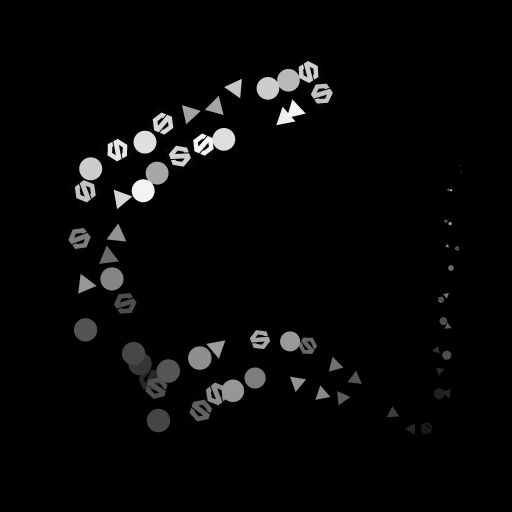

# Dispersión en escala de grises polinomiales

<table>
<tr style="border: 0;">
<td width="33.33%" style="border: 0;" valign="top">

<b>En:</b> Herramientas de spline y trazado > Herramientas de spline

</td>
<td width="100.00%" style="border: 0;" valign="top">

## Descripción

Dibuja el patrón o patrones especificados a lo largo de las splines de entrada en el fondo de entrada.

</td>
</tr>
</table>

El nodo ofrece opciones de personalización profundas para controlar cómo se dispersan los patrones.

Algunos aspectos de la dispersión se pueden controlar utilizando imágenes de otros nodos en el gráfico para avanzar en el aspecto dinámico del resultado.

>[!NOTE]
>
> Vea también [Dispersión en Spline Color](../../../../../../compositing-graphs/nodes-reference-for-com/node-library/spline-paths-tools/spline-tools/scatter-on-spline-color/scatter-on-spline-color.md).

## Conectores de entrada

<b>Fondo </b>*Escala de grises* (Principal)La imagen de escala de grises sobre la que se deben dibujar las splines.

<b>Códigos polinómicos</b> *Color* Coordenadas de los puntos de las splines de entrada codificados en los canales RGBA de una imagen en color:\
Posición <b> R</b> - X\
<b> G</b> - Posición Y\
<b> B</b> - Height\
    <b>A</b> - Datos empaquetados:\
        * Firmar: La spline está cerrada (negativa) o abierta (positiva);\
        * Valor absoluto: Thickness + 1.

<b>Datos de spline</b> *Color* Datos adicionales de las splines de entrada codificadas en los canales RGBA de una imagen en color.\
<b> R</b> - Tangentes X\
<b> G</b> - Tangentes Y\
<b> B</b> - No utilizado\
<b> A</b> - No utilizado

<b>Cantidad de spline</b> *Entero* Número de splines de entrada.

<b>Entrada de patrón #</b> *Escala de grises* Patrón(es) que se debe(n) dispersar a lo largo de las splines.

<b>Mapa de escala</b> *Escala de grises* El mapa que controla la escala de los patrones dispersos. El efecto de este mapa se controla mediante el parámetro &quot;Scale Map Input Multiplier&quot; y se combina con los demás parámetros del grupo &quot;Size&quot;.

<b>Mapa de Height</b> *Escala de grises* El mapa que controla el height de los patrones dispersos. El efecto de este mapa se controla mediante el parámetro &quot;Height Input Multiplier&quot; y se combina con los demás parámetros &quot;Color&quot; del grupo &quot;Color&quot;.

<b>Mapa de máscara</b> *Escala de grises* El mapa que controla la máscara de los patrones dispersos. El efecto de este mapa se controla mediante el parámetro &quot;Umbral del mapa de máscara&quot; y se combina con los demás parámetros &quot;Máscara&quot; del grupo &quot;Color&quot;.

## Conectores de salida

<b>Salida</b> *Escala de grises* Imagen que representa los patrones dispersos a lo largo de la spline o splines de entrada sobre el fondo de entrada.

## Parámetros

<b>Entrada spline</b> *Entero* Método para seleccionar las splines que se deben utilizar para los patrones de dispersión:
* *Todas las splines*: Utilizar todas las splines de la lista de entrada;
* *Una spline*: Utilice sólo la spline especificada de la lista de entrada;
* *Rango de spline*: Utilice sólo las splines del rango especificado de la lista de entrada.

<b>Índice spline</b> *Entero* (disponible cuando &quot;Spline Input&quot; está establecido en &quot;Single Spline&quot;)El índice de lista de la spline que se debe utilizar para patrones de dispersión.

<b>Rango de spline</b> *Integer2* (Disponible cuando &quot;Spline Input&quot; está establecido en &quot;Spline Range&quot;)El intervalo de índices de lista, incluidas las splines que se deben utilizar para los patrones de dispersión.

<b>Modo de Dispersión</b> *Entero* Método de dispersión de los patrones a lo largo de las splines, que afecta a la cantidad de patrones en cada spline:
* Cantidad de forma: La cantidad especificada de patrones espaciados uniformemente se dispersa;
* Espaciado entre formas: El número de patrones se ajusta automáticamente para ajustarse al espaciado par especificado.\
  En ambos casos, el primer y el último motivo se sitúan exactamente al principio y al final de cada spline, respectivamente.

<b>Cantidad de forma</b> *Entero* (disponible cuando &quot;Modo de Dispersión&quot; está establecido en &quot;Cantidad de forma&quot;)Cantidad de patrones espaciados uniformemente dispersos a lo largo de cada spline.

<b>Distribución de formas a lo largo de la spline</b> *Entero* (disponible cuando &quot;Modo de Dispersión&quot; está establecido en &quot;Cantidad de forma&quot;)Método de distribución de los patrones a lo largo de una spline:
* *Desde origen*: El espaciado de los motivos se ve influenciado por las tangentes del punto de spline, donde las formas están más separadas cerca de los puntos con tangentes largas;
* *Uniforme*: Los patrones se espacian uniformemente a lo largo de la spline independientemente de sus tangentes y trayectoria.

<b>Espaciado entre formas</b> *Float* (disponible cuando el &quot;modo de Dispersión&quot; está establecido en &quot;espaciado de forma&quot;)Distancia mínima a lo largo de una spline a la que se deben espaciar los patrones, mientras se sigue colocando el primer y el último patrón en el inicio y el final de cada spline respectivamente.

<b>Inicio</b> *Flotante* Desplaza el punto desde el inicio de una spline donde comienza la dispersión. El valor es la longitud normalizada de cada spline.

<b>Fin</b> *Flotante* Desplaza el punto desde el inicio de una spline donde termina la dispersión. El valor es la longitud normalizada de cada spline.

<b>Tabla dinámica de formas</b> *Float2* Desplaza el giro del patrón X e Y en el espacio de tangente de spline.\
Teniendo en cuenta que el pivote es lo que se coloca en la spline, esto compensa eficazmente los patrones a lo largo o perpendicularmente a la spline.\
Nota: Las posiciones de los puntos de giro afectan al efecto de los parámetros &quot;Escala&quot; y &quot;Rotación (Pivotar)&quot;.

+++Patrón
<b>Patrón</b> *Entero* Trama que debe dispersarse a lo largo de las splines:\
*- Entrada de patrón*: Utilizar los patrones suministrados a las entradas &quot;Pattern Input #&quot;;\
*- Cuadrado;
* Disco;
* Paraboloide;
* Bell;
* gaussiano;
* Espina;
* Pirámide;
* Ladrillo;
* Gradación;
* Ondas;
* Mitad Campana;
* Campana de borde;
* Media luna;
* Cápsula;
* Cono;
* Gradación w. offset;
* Hemisferio.*

<b>Número de entrada de patrón</b> *Entero* (disponible cuando ‘Patrón’ está establecido en ‘Entrada de patrón’)Selecciona el índice del patrón de entrada que debe dispersarse.

<b>Distribución de entrada de patrón</b> *Entero* (disponible cuando &quot;Patrón&quot; se establece en &quot;Entrada de patrón&quot;)Método utilizado para seleccionar los patrones de entrada que se deben dispersar en una spline determinada:\
*- Aleatorio*: se selecciona aleatoriamente un patrón;\
*- A lo largo de la spline*: El índice de patrón aumenta gradualmente a lo largo de la spline;\
*- Índice de patrón*: Realiza un bucle sobre el índice de patrones de entrada a lo largo de cada spline;\
*- Índice de spline*: Realiza un bucle sobre el índice de patrones de entrada de una spline a la siguiente en la lista de splines de entrada.

<b>Variación de la distribución</b> *Float* (disponible cuando ‘Pattern Input Distribution’ está establecido en ‘Along Spline’) aumenta o disminuye aleatoriamente el índice de patrones seleccionado en la spline.

<b>Anular primer patrón</b> *Booleano* Seleccione manualmente el índice del patrón que debe colocarse al principio de cada spline.

<b>Índice de entrada de primer patrón</b> *Entero* (disponible cuando &quot;Anular primer motivo&quot; está establecido en &quot;Verdadero&quot;)El índice del motivo que debe colocarse al principio de cada spline.

<b>Anular último patrón</b> *Booleano* Seleccione manualmente el índice del patrón que debe colocarse al final de cada spline.

<b>Índice de entrada de último patrón</b> *Entero* (disponible cuando &#39;Omitir último patrón&#39; está establecido en &#39;Verdadero&#39;)El índice del patrón que debe colocarse al final de cada spline.

+++

+++Duplicados
<b>Modo de distribución</b> *Entero* Método utilizado para colocar los patrones duplicados:\
*- Lineal*: los duplicados se espacian uniformemente a lo largo de la normal de la spline desde la ubicación original del patrón;\
*- Circular*: los duplicados se organizan a lo largo de un círculo virtual centrado en la spline en la ubicación original del patrón.

<b>Cantidad de duplicados</b> *Entero* Número de patrones duplicados.

<b>Desplazamiento</b> *Float2* (disponible cuando el &quot;modo de distribución&quot; está establecido en &quot;lineal&quot;): aplica un desplazamiento a las posiciones de los duplicados a lo largo de la tangente (paralela) y normal (perpendicular) de la spline.\
Los duplicados de los lados opuestos de la spline se mueven en direcciones opuestas.

<b>Centro de desplazamiento</b> *Float2* (disponible cuando el &quot;modo de distribución&quot; está establecido en &quot;lineal&quot;): aplica un desplazamiento a los duplicados a lo largo de la spline en X (paralelo) e Y (perpendicular).

<b>Ángulo de pliego</b> *Float* (disponible cuando el &quot;modo de distribución&quot; está establecido en &quot;circular&quot;)El arco del círculo virtual a lo largo del cual se distribuyen los duplicados, como el ángulo de ese arco donde 1 es el círculo completo.

<b>Distancia de desplazamiento</b> *Float* (disponible cuando el &quot;modo de distribución&quot; está establecido en &quot;circular&quot;)El radio del círculo virtual a lo largo del cual se distribuyen los duplicados.

<b>Rotación</b> *Float* Rota el círculo virtual a lo largo del cual se distribuyen los duplicados.

<b>Desviar atenuación de inicio/fin</b> *Float2* Factores en la distancia desde el punto medio de la spline hasta su inicio y fin, al aplicar desplazamientos a duplicados.\
Esto significa que los desplazamientos se reducen para los duplicados más cercanos a las extremidades de una spline.

<b>Atenuación de desplazamiento por Thickness</b> *Hacer flotante* Factores en el thickness de la spline al aplicar desplazamientos a duplicados.\
Esto significa que los desplazamientos se reducen para los duplicados en una parte de una spline con un thickness inferior.

+++

+++Tamaño
<b>Modo de tamaño</b> *Integer* Método para establecer el tamaño de los patrones dispersos:\
*- Normal*: El tamaño se controla uniformemente mediante un parámetro global de escala;\
*: usar Thickness de spline*: El tamaño depende del thickness de la spline.

<b>El Thickness Afecta A</b> *Entero* (disponible cuando &quot;Modo de tamaño&quot; está establecido en &quot;Usar Thickness desde spline&quot;) Especifica qué eje de la escala de un patrón debe estar controlado por el thickness de la spline:
* X E Y: El thickness se multiplica por el tamaño en los ejes X e Y;\
  - X: el thickness se multiplica sólo por el tamaño del eje X;
* Y: El thickness se multiplica sólo por el tamaño del eje Y.\
  Cuando no se multiplica, la escala original del motivo es la extensión completa de la imagen.\
  Esto significa que en el modo &quot;X&quot;, el tamaño del eje Y es el tamaño completo de la imagen y debe modificarse mediante el parámetro Tamaño. Lo mismo se aplica al tamaño en el eje X cuando se utiliza el modo &quot;Y&quot;.

<b>Tamaño</b> *Float2* El tamaño original de los patrones en X e Y antes de que otros parámetros realicen otros ajustes.

<b>Aleatorio de tamaño</b> *Float2* Aplica un multiplicador aleatorio hasta el valor especificado para reducir el tamaño de los patrones en X e Y.

<b>Escala de Thickness</b> *Float* (disponible cuando &quot;Modo de tamaño&quot; está establecido en &quot;Usar Thickness desde spline&quot;)Un multiplicador adicional para la escala de los patrones cuando se controla mediante el thickness de la spline.

<b>Escala</b> *Float* (Disponible cuando &#39;Size Mode&#39; está establecido en &#39;Normal&#39;)Un control global para el tamaño de todos los patrones, donde 1 es el tamaño completo de la imagen.\
El escalado se aplica en relación con el pivote de un patrón. La posición de pivote se puede desplazar mediante el parámetro &quot;Shape Pivot&quot;.

<b>Escala aleatoria</b> *Float* Aplica un multiplicador aleatorio hasta el valor especificado para reducir el tamaño de los patrones.

<b>Multiplicador de entrada de mapa de escala</b> *Flotante* Controla la intensidad de la entrada del mapa de escala. Este mapa actúa como un multiplicador para el tamaño actual de los patrones.\
El efecto de este mapa se combina con los demás parámetros del grupo &quot;Tamaño&quot;.

<b>Modo de muestreo de entrada de escala</b> *Espacio de textura* Método para asignar los valores de la escala de asignación a las splines:\
*- Espacio de textura*: Los valores se aplican a las splines donde se colocarían si se colocan en una textura utilizando las coordenadas UV de la textura. Esto aplica efectivamente el valor a las splines &quot;in situ&quot;;\
*- Horizontal a lo largo de la spline*: Los valores se aplican directamente a las coordenadas de las splines codificadas (consulte Entrada de códigos de spline), donde cada fila se aplica a una spline diferente de arriba abajo;\
*- Hora. a lo largo de la spline (rand. desplazamiento X)*: Los valores se aplican directamente a las coordenadas de las splines codificadas (véase la entrada Spline Coords), con un desplazamiento horizontal aleatorio en el mapa de escala para cada spline (es decir, cada fila en Spline Coords);\
*- Hora. a lo largo de la spline (rand. desplazamiento Y)*: Los valores se aplican directamente a las coordenadas de las splines codificadas (consulte Entrada de códigos de spline), con un desplazamiento vertical aleatorio en el mapa de escala para cada spline (es decir, cada fila de códigos de spline).

<b>Iniciar o finalizar atenuación</b> *Float2* Factores en la distancia desde el punto medio de la spline hasta su inicio y fin al escalar los patrones.\
Esto significa que el tamaño se reduce para patrones más cercanos a las extremidades de una spline.

+++

+++Posición
<b>Desplazamiento local</b> *Flotante2* Aplica un desplazamiento a las posiciones de los patrones a lo largo de la tangente (paralela) y normal (perpendicular) de la spline.

<b>Desplazamiento local aleatorio</b> *Float2* Aplica un desplazamiento aleatorio adicional a las posiciones de los patrones a lo largo de la tangente (paralela) y normal (perpendicular) de la spline.

<b>Centro aleatorio de desplazamiento local</b> *Flotante2* Desplaza el centro del desplazamiento aleatorio aplicado por el parámetro Aleatorio de desplazamiento local a lo largo de la tangente (paralela) y normal (perpendicular) de la spline.

<b>Atenuación de inicio/fin del desplazamiento local</b> *Float2* Factores en la distancia desde el punto medio de la spline hasta su inicio y fin al aplicar desplazamientos de posición a los patrones.\
Esto significa que los desplazamientos se reducen para patrones más cercanos a las extremidades de una spline.

<b>Atenuación de desplazamiento local por Thickness</b> *Hacer flotante* Factores en el thickness de la spline al aplicar desplazamientos a patrones.\
Esto significa que los desplazamientos se reducen para los duplicados en una parte de una spline con un thickness inferior.

<b>Desplazamiento en spline</b> *Flotante* Aplica un desplazamiento de posición a los patrones a lo largo de las splines.

<b>Desplazamiento aleatorio en spline</b> *Flotante* Aplica un desplazamiento de posición adicional a los patrones a lo largo de las splines.

+++

+++Rotación
<b>Alinear con tangente</b> *Booleano* Rota los patrones para que coincidan con la dirección de la spline en su ubicación.

<b>Giro (tabla dinámica)</b> *Flotar* Rota los patrones alrededor de sus puntos de giro.\
La posición de pivote se puede desplazar mediante el parámetro &quot;Shape Pivot&quot;.

<b>Rotación aleatoria (dinámica)</b> *Flotador* Aplica una rotación aleatoria adicional a los patrones alrededor de sus puntos de giro.\
La posición de pivote se puede desplazar mediante el parámetro &quot;Shape Pivot&quot;.

<b>Centro aleatorio de rotación (tabla dinámica)</b> *Flotante* Rota alrededor del patrón y pivota el centro de las rotaciones aleatorias aplicadas por el parámetro Rotación aleatoria.

<b>Rotación (centro)</b> *Flotar* Rota los patrones alrededor de su centro.

<b>Rotación aleatoria (central)</b> *Flotador* Aplica una rotación aleatoria adicional a los patrones alrededor de su centro.

<b>Centro aleatorio de rotación (centro)</b> *Float* Rota alrededor del centro del patrón en el centro de las rotaciones aleatorias aplicadas por el parámetro Rotation Random.

+++

+++Color
<b>Modo de fusión</b> *Entero* Método para fusionar los colores de los patrones con el fondo y otros patrones superpuestos:\
*- Máx.*: Utilizar el color más brillante;\
*- Agregar*: Añade los colores juntos.

<b>Color base de la forma</b> *Flotador* Color base de los patrones.

<b>Multiplicador de color base de forma</b> *Flotante* Intensidad del color base de la forma de los patrones.\
Nota: El color de salida es el resultado ponderado de todos los multiplicadores de color.

<b>Multiplicador de Thickness spline</b> *Flotante* Intensidad por la que se multiplica el color de cada motivo respecto al thickness de la spline en su ubicación.\
Nota: El color de salida es el resultado ponderado de todos los multiplicadores de color.

<b>Multiplicador de índice de forma</b> *Flotante* Intensidad por la que se multiplica el color de cada motivo en relación con su índice normalizado.\
Nota: El color de salida es el resultado ponderado de todos los multiplicadores de color.

<b>Modo de Height hemisférico</b> *Entero* (disponible cuando ‘Pattern’ está establecido en ‘Hemisphere’)El efecto del height de la spline en un patrón de hemisferio disperso en él:\
*- Desplazamiento*: el height de la spline se añade al height del hemisferio;\
*- Escala*: el height spline se multiplica contra el height del Hemisferio.

<b>Multiplicador de Height spline</b> *Flotante* Intensidad por la que se multiplica el color de cada motivo respecto al height de la spline en su ubicación.\
Nota: El color de salida es el resultado ponderado de todos los multiplicadores de color.

<b>Multiplicador de escala de forma</b> *Flotante* Intensidad por la que se multiplica el color de cada motivo en relación con su escala.\
Nota: El color de salida es el resultado ponderado de todos los multiplicadores de color.

<b>Luminancia aleatoria</b> *Float* Aplica un multiplicador aleatorio hasta el valor especificado para reducir la luminancia de los patrones.\
Nota: El color de salida es el resultado ponderado de todos los multiplicadores de color.

<b>Multiplicador de entrada de Height</b> *Float* Controla la intensidad de la entrada del mapa de Height. Este mapa actúa como un multiplicador de la luminancia actual de los patrones.\
El efecto de este mapa se combina con los demás parámetros del grupo &quot;Color&quot;.\
Nota: El color de salida es el resultado ponderado de todos los multiplicadores de color.

<b>Modo de muestreo de entrada de mapa de Height</b> *Integer* Método de asignación de los valores de la asignación de Height a las splines:\
*- Espacio de textura*: Los valores se aplican a las splines donde se colocarían si se colocan en una textura utilizando las coordenadas UV de la textura. Esto aplica efectivamente el valor a las splines &quot;in situ&quot;;\
*- Horizontal a lo largo de la spline*: Los valores se aplican directamente a las coordenadas de las splines codificadas (consulte Entrada de códigos de spline), donde cada fila se aplica a una spline diferente de arriba abajo;\
*- Hora. a lo largo de la spline (rand. desplazamiento X)*: Los valores se aplican directamente a las coordenadas de las splines codificadas (véase la entrada Spline Coords), con un desplazamiento horizontal aleatorio en el mapa de escala para cada spline (es decir, cada fila en Spline Coords);\
*- Hora. a lo largo de la spline (rand. desplazamiento Y)*: Los valores se aplican directamente a las coordenadas de las splines codificadas (consulte Entrada de códigos de spline), con un desplazamiento vertical aleatorio en el mapa de escala para cada spline (es decir, cada fila de códigos de spline).

<b>Aleatorio de máscara</b> *Flotante* Ajusta el intervalo de enmascaramiento aleatorio de patrones, donde 0 significa que no hay patrones enmascarados y 1 significa que todos los patrones sí.

<b>Umbral de asignación de máscara</b> Los *valores flotantes* del mapa de máscara por debajo de este valor de umbral se procesan como negros, mientras que los valores por encima del umbral se procesan como blancos.\
Esto significa que se enmascararán todos los patrones de las áreas del mapa de máscara por debajo de este valor.

<b>Modo de muestreo de entrada de mapa de máscara</b> *Entero* Método de asignación de los valores de la asignación de máscara a las splines:\
*- Espacio de textura*: Los valores se aplican a las splines donde se colocarían si se colocan en una textura utilizando las coordenadas UV de la textura. Esto aplica efectivamente el valor a las splines &quot;in situ&quot;;\
*- Horizontal a lo largo de la spline*: Los valores se aplican directamente a las coordenadas de las splines codificadas (consulte Entrada de códigos de spline), donde cada fila se aplica a una spline diferente de arriba abajo;\
*- Hora. a lo largo de la spline (rand. desplazamiento X)*: Los valores se aplican directamente a las coordenadas de las splines codificadas (véase la entrada Spline Coords), con un desplazamiento horizontal aleatorio en el mapa de escala para cada spline (es decir, cada fila en Spline Coords);\
*- Hora. a lo largo de la spline (rand. desplazamiento Y)*: Los valores se aplican directamente a las coordenadas de las splines codificadas (consulte Entrada de códigos de spline), con un desplazamiento vertical aleatorio en el mapa de escala para cada spline (es decir, cada fila de códigos de spline).

<b>Invertir mapa de máscara</b> *Booleano* Invierte los valores del Mapa de máscara usando una operación &quot;Un signo menos&quot; (1 - x).

<b>Invertir máscara</b> *Booleano* Invierte la máscara de los patrones.

+++

<b>Corrección no cuadrada</b> *Booleano* Ajusta la posición de los puntos para conservar la forma de la spline en resoluciones no cuadradas.

## Ejemplos

<table>
<tr style="border: 0;">
<td style="border: 0;" valign="top">

<table>
  <tr>
    <td>
      
       <i>Antes</i>
    </td>
    <td>
      
       <i>Después De</i>
    </td>
  </tr>
</table>

</td>
<td style="border: 0;" valign="top">

<table>
  <tr>
    <td>
      
       <i>Antes</i>
    </td>
    <td>
      
       <i>Después De</i>
    </td>
  </tr>
</table>

</td>
</tr>
</table>

<table>
<tr style="border: 0;">
<td style="border: 0;" valign="top">

</td>
<td style="border: 0;" valign="top">

</td>
</tr>
</table>
