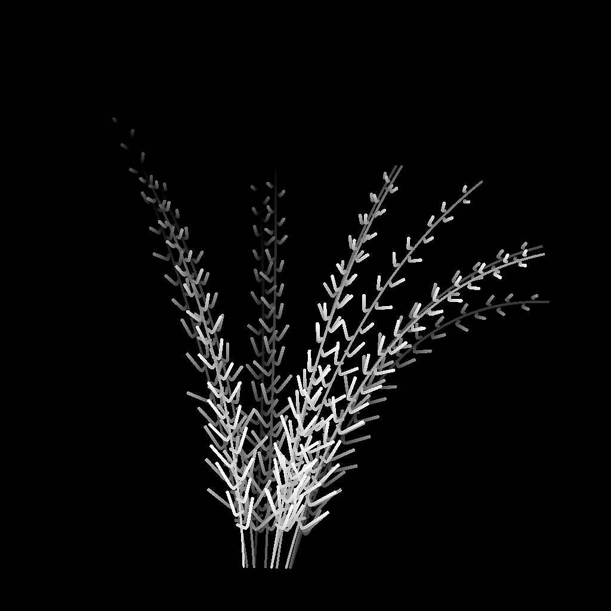

# Splines de dispersión en Splines

<table>
<tr style="border: 0;">
<td width="33.33%" style="border: 0;" valign="top">

<b>En:</b> Herramientas de spline y trazado > Herramientas de spline

</td>
<td width="100.00%" style="border: 0;" valign="top">

## Descripción

Permite colocar splines a lo largo de las splines primarias de entrada.

El nodo ofrece opciones de personalización profundas para controlar cómo se dispersan las splines y permite la dispersión de splines rectas simples o de sus propias splines personalizadas.

El nodo permite crear estructuras complejas para asignar colores e imágenes mediante los nodos [Spline Mapper](../../../../../../compositing-graphs/nodes-reference-for-com/node-library/spline-paths-tools/spline-tools/spline-mapper-grayscale/spline-mapper-grayscale.md), o se usa como esqueleto para colocar formas mediante la Dispersión [en Spline](../../../../../../compositing-graphs/nodes-reference-for-com/node-library/spline-paths-tools/spline-tools/scatter-spline-grayscale/scatter-on-spline-grayscale.md).

</td>
</tr>
</table>

<table>
<tr style="border: 0;">
<td style="border: 0;" valign="top">

### Tutorial

Haz clic en la imagen de la derecha para acceder a nuestro <b>tutorial dedicado</b>, y disfrutar de una visita guiada por las capacidades del nodo y su uso en el contexto de un flujo de trabajo basado en spline.

</td>
<td style="border: 0;" valign="top">

</td>
</tr>
</table>

## Conectores de entrada

|  |  |
| --- | --- |
| <b>Vista previa</b> *Escala de grises* | Vista previa de las splines de entrada como una imagen en escala de grises. |
| <b>Códigos polinómicos</b> *Color* | Las coordenadas de los puntos de las splines padre codificados en los canales RGBA de una imagen en color:  <b>R</b> - Posición X <b>G</b> - Posición Y <b>B</b> - Height <b>A</b> - Datos empaquetados:          - Firma: La spline está cerrada (negativa) o abierta (positiva) - Valor absoluto: THICKNESS + 1 |
| <b>Datos de spline</b> *Color* | Datos adicionales de las splines padre codificadas en los canales RGBA de una imagen en color:  <b>R</b> - Tangentes X <b>G</b> - Tangentes Y <b>B</b> - Tangentes Z <b>A</b> - Sin Usar |
| <b>Cantidad de spline</b> *Entero* | El número de splines padre. |
| <b>Códigos de spline personalizados</b> *Color* | Las coordenadas de los puntos de las splines personalizadas codificadas en los canales RGBA de una imagen en color:  <b>R</b> - Posición X <b>G</b> - Posición Y <b>B</b> - Height <b>A</b> - Datos empaquetados:          - Firma: La spline está cerrada (negativa) o abierta (positiva) - Valor absoluto: THICKNESS + 1 |
| <b>Datos de spline personalizados</b> *Color* | Datos adicionales de las splines personalizadas codificadas en los canales RGBA de una imagen en color:  <b>R</b> - Tangentes X <b>G</b> - Tangentes Y <b>B</b> - Tangentes Z <b>A</b> - Sin Usar |
| <b>Cantidad de spline personalizada</b> *Entero* | Número de splines personalizadas. |
| <b>Mapa de escala</b> *Escala de grises* | Mapa de escala de grises que controla la escala de las splines dispersas.  El efecto de este mapa se controla mediante el parámetro <b>Scale Map Input Multiplier</b> y se combina con los demás parámetros del grupo <b>Size</b>. |
| <b>Mapa de rotación</b> *Escala de grises* | Mapa de escala de grises que controla la rotación de las splines dispersas.  El efecto de este mapa se controla mediante el parámetro <b>Multiplicador de entrada de Mapa de rotación</b> y se combina con los demás parámetros del grupo <b>Rotación</b>. |

## Conectores de salida

|  |  |
| --- | --- |
| <b>Vista previa</b> *Escala de grises* | Vista previa de las splines dispersas como una imagen en escala de grises. |
| <b>Códigos polinómicos</b> *Color* | Las coordenadas de los puntos de las splines dispersas codificadas en los canales RGBA de una imagen en color:  <b>R</b> - Posición X <b>G</b> - Posición Y <b>B</b> - Height <b>A</b> - Datos empaquetados:          - Firma: La spline está cerrada (negativa) o abierta (positiva) - Valor absoluto: THICKNESS + 1 |
| <b>Datos de spline</b> *Color* | Datos adicionales de las splines dispersas codificadas en los canales RGBA de una imagen en color:  <b>R</b> - Tangentes X <b>G</b> - Tangentes Y <b>B</b> - Sin usar <b>A</b> - Sin usar |
| <b>Cantidad de spline</b> *Entero* | Número de splines dispersas. |

## Parámetros

|  |  |
| --- | --- |
| <b>Lado</b> *Entero* | Controla en qué lado o lados de las splines principales se deben dispersar las splines, teniendo en cuenta que &#39;forward&#39; es la dirección de las splines *parent*:   Izquierda Coloque las estrías en el lado izquierdo.   Derecha Coloque las estrías en el lado derecho.   Izquierda + Derecha Coloque las splines en ambos lados.   Izquierda/Derecha: Alterne colocar splines a la izquierda y luego a la derecha de forma alternativa (p. ej., cada otro lado).   Izquierda / Derecha: aleatorio Seleccione el lado de forma aleatoria para cada spline. |
| <b>Modo de cantidad</b> *Entero* | Método de dispersión de las splines a lo largo de las splines padre, que afecta a la cantidad de splines dispersas en cada spline padre:   Cantidad fija por spline La cantidad especificada de splines espaciadas uniformemente se dispersa.   Espaciado La cantidad de splines se ajusta automáticamente para ajustarse al espaciado uniforme especificado.   En ambos casos, la primera y la última spline dispersa se sitúan exactamente al principio y al final de cada spline principal, respectivamente. |
| <b>Cantidad De Spline Por Spline</b> *Entero* | Cantidad de splines espaciadas uniformemente dispersas a lo largo de cada spline principal. |
| <b>Espaciado entre líneas</b> *Flotador* | Distancia mínima a lo largo de las splines padre por la que se deben espaciar las splines, mientras que la primera y la última spline se mantienen en el principio y el final de cada spline padre, respectivamente. |
| <b>Tipo de spline</b> *Entero* | Selecciona el tipo de spline que se debe dispersar en las splines padre:   Recto Una spline simple y recta.   spline personalizada La spline o splines proporcionadas a las entradas <b>Custom Spline</b>. Se admiten varias splines cuando se agregan juntas en una lista. |
| <b>Selección de spline personalizada</b> *Entero* | Cuando se utilizan varias splines personalizadas anexadas juntas en una lista, este parámetro permite seleccionar cómo deben distribuirse estas splines en la dispersión.   Lista completa Todas las splines se distribuyen juntas como un grupo.   Secuencial Cada spline individual se divide en orden, dando vueltas alrededor de la lista.   Aleatorio Se selecciona una spline aleatoria de la lista para cada spline dispersada. |
| <b>Inicio</b> *Flotador* | Desplaza el punto desde el inicio de las splines padre donde comienza la dispersión.  El valor es la longitud normalizada de cada spline padre. |
| <b>Fin</b> *Flotador* | Desplaza el punto desde el inicio de las splines padre donde termina la dispersión.  El valor es la longitud normalizada de cada spline padre. |
| <b>Voltear dirección</b> *Booleano* | Invierte la dirección de las splines dispersas. |
| <b>Modo de simetría izquierdo/derecho</b> *Entero* | Método de simetría aplicado a las splines dispersas a cada lado de las splines padre.   Desactivado No se aplica simetría, las splines se colocan a cada lado utilizando una rotación simple.   Simetría a la izquierda La spline de la izquierda es simétrica a la de la derecha con respecto a la spline principal.   Simetría derecha La spline de la derecha es simétrica a la de la izquierda en relación con la spline principal. |
| <b>Vínculo aleatorio izquierdo/derecho</b> *Booleano* | Controla si las splines de cada lado de la spline padre deben utilizar los mismos valores cuando se utiliza la rotación aleatoria, la escala aleatoria, etc. En otras palabras:   *- False:* cada spline usa valores aleatorios independientes *- True:* ambas splines comparten los mismos valores aleatorios |
| <b>Modo de giro de spline</b> *Entero* | Define el método de colocación del pivote de las splines dispersas, lo que afecta a la rotación y al escalado.   Tenga en cuenta que la tabla dinámica está *siempre colocada en la spline principal* y sus controles afectan a la spline dispersa. En otras palabras: el pivote no se mueve, es la spline dispersada la que se mueve y escala con relación a él.   Posición a lo largo de la spline Mueva el punto de giro a lo largo de la spline dispersada.   Posición absoluta Configura una posición arbitraria para el giro. |
| <b>Posición de pivote a lo largo de la spline</b> *Flotador* | Posición normalizada del pivote a lo largo de la spline dispersada, donde 0 es su inicio y 1 es su final.   Tenga en cuenta que el giro sigue la *dirección* de la spline dispersada y la orientación de la spline puede cambiar para conservar la posición y la rotación de la spline principal con respecto a la spline principal. |
| <b>Posición absoluta de tabla dinámica</b> *Float2* | Posición en el espacio UV del pivote. |
| <b>Corrección no cuadrada</b> *Booleano* | Ajuste las posiciones y el thickness de las splines para conservar su forma en resoluciones que no sean cuadradas.   *Nota:* Al usar splines personalizados, la spline personalizada debe usar la *misma proporción de imagen* que los nodos <b>Splines de Dispersión en splines</b>. |

+++Tamaño

|  |  |
| --- | --- |
| <b>Escala de spline</b> *Flotador* | Un control global para el tamaño de todas las splines, donde 1 es su tamaño original completo.   El escalado se aplica en relación con el pivote de una spline. La posición de pivote se puede desplazar mediante el parámetro <b>Spline Pivot</b>. |
| <b>Aleatoria de escala de spline</b> *Flotador* | Aplica un multiplicador aleatorio hasta el valor especificado para reducir el tamaño de las splines. |
| <b>Multiplicador de entrada de mapa de escala</b> *Flotador* | Controla la intensidad de la entrada <b>Scale Map</b>. Este mapa actúa como un multiplicador para el tamaño actual de los patrones.   El efecto de esta asignación se combina con los demás parámetros del grupo <b>Size</b>. |
| <b>Modo de muestreo de entrada de mapa de escala</b> *Entero* | Método de asignación de los valores de <b>Scale Map</b> a las splines:   Espacio de textura Los valores se aplican a las splines donde se colocarían si se colocan en una textura utilizando las coordenadas UV de la textura. Esto aplica efectivamente el valor a las splines &quot;in place&quot; Horizontal along spline Los valores se aplican directamente a las coordenadas de las splines codificadas (consulte <b>Entrada de códigos de spline</b>), donde cada fila se aplica a una spline diferente de arriba a abajo de Hor. a lo largo de la spline (rand. desplazamiento X) Los valores se aplican directamente a las coordenadas de las splines codificadas (consulte la entrada <b>Spline Coords</b>), con un desplazamiento horizontal aleatorio en el <b>mapa de escala</b> para cada spline (es decir, cada fila en <b>Spline Coords</b>) Hor. a lo largo de la spline (rand. desplazamiento Y) Los valores se aplican directamente a las coordenadas de las splines codificadas (consulte la entrada <b>Spline Coords</b>), con un desplazamiento vertical aleatorio en el <b>mapa de escala</b> para cada spline (es decir, cada fila en <b>Spline Coords</b>) |
| <b>Iniciar o finalizar atenuación</b> *Float2* | Factores en la distancia desde el punto medio de la spline hasta sus <b>iniciales</b> y <b>finales</b> al escalar las splines.   Esto significa que el tamaño disminuye para las splines más cercanas a las extremidades de una spline. |

+++

+++Posición

|  |  |
| --- | --- |
| <b>Desplazamiento local</b> *Float2* | Aplica un desvío a las posiciones de las splines a lo largo de la tangente (paralela) y la normal (perpendicular) de la spline principal. |
| <b>Desplazamiento en rango de spline</b> *Entero* | Permite definir el rango de desvío aplicado a las splines dispersas a lo largo de las splines padre.   Intervalo El intervalo abarca el intervalo *entre* y cada spline dispersada.   spline primaria El intervalo abarca la *longitud completa* de la spline primaria. |
| <b>Desplazamiento en spline</b> *Flotador* | Aplica un desvío de posición a las splines a lo largo de las splines padre. |
| <b>Rango de desplazamiento aleatorio</b> *Entero* | Permite definir el rango de desvío aleatorio aplicado a las splines dispersas a lo largo de las splines padre.   Intervalo El intervalo abarca el intervalo *entre* y cada spline dispersada.   spline primaria El intervalo abarca la *longitud completa* de la spline primaria. |
| <b>Desplazamiento aleatorio en spline</b> *Flotador* | Aplica un desvío de posición adicional a las splines a lo largo de las splines padre. |
| <b>Desplazamiento por Thickness</b> *Flotador* | Aplica un desvío a las splines dispersas a lo largo de la normal de las splines padre, hasta el thickness de las splines padre.   Efectivamente, un valor de 1 le permite colocar las splines dispersas en la *superficie* del envolvente de las splines principales. |

+++

+++Rotación

|  |  |
| --- | --- |
| <b>Alineación de spline personalizada</b> *Entero* | Controla la orientación inicial de las splines personalizadas en las splines padre.   Tangente del primer punto Las splines se orientan según la tangente de su primer punto. En otras palabras, se salen de las splines padre en la dirección definida por su primer punto.   Espacio de imagen Las splines se colocan tal y como aparecen originalmente, sin ningún ajuste adicional de posición u orientación, como si la imagen que las representa se encontrara en la spline principal. |
| <b>Modo de rotación</b> *Entero* | Permite definir la orientación inicial de las splines dispersas.   Desde spline Las splines están orientadas para que coincidan con la *normal* de las splines principales en su ubicación.   Absoluto Todas las splines están orientadas de la *misma manera*, independientemente de la dirección de las splines principales. |
| <b>Rotación</b> *Flotador* | Gira las splines alrededor de sus puntos de giro, en número de vueltas. La posición de pivote se puede desplazar mediante el parámetro <b>Spline Pivot</b>. |
| <b>Aleatorio de rotación</b> *Flotador* | Aplica una rotación aleatoria adicional a las splines alrededor de sus puntos de giro, en número de vueltas. La posición de pivote se puede desplazar mediante el parámetro <b>Spline Pivot</b>. |
| <b>Ángulo izquierdo/derecho</b> *Flotador* | Controla el ángulo de rotación simétrica aplicado a las splines a cada lado de las splines padre, en número de vueltas. |
| <b>Ángulo aleatorio izquierdo/derecho</b> *Flotador* | Añade una cantidad aleatoria de rotación simétrica a las splines de cada lado de las splines padre, en número de vueltas. |
| <b>Multiplicador de entrada de Mapa de rotación</b> *Flotador* | Controla la intensidad de la entrada de <b>Mapa de rotación</b>. Este mapa actúa como un multiplicador para la rotación actual de los patrones.   El efecto de este mapa se combina con los demás parámetros del grupo <b>Rotation</b>. |
| <b>Modo de muestreo de entrada de Mapa de rotación</b> *Entero* | Método de asignación de los valores del <b>Mapa de rotación</b> a las splines:   Espacio de textura Los valores se aplican a las splines donde se colocarían si se colocan en una textura utilizando las coordenadas UV de la textura. Esto aplica el valor a las splines &quot;in place&quot;, Horizontal along spline Los valores se aplican directamente a las coordenadas de las splines codificadas (consulte la entrada <b>Spline Coords</b>), donde cada fila se aplica a una spline diferente de arriba abajo, Hor. a lo largo de la spline (rand. desplazamiento X) Los valores se aplican directamente a las coordenadas de las splines codificadas (consulte la entrada <b>Spline Coords</b>), con un desplazamiento horizontal aleatorio en el <b>Mapa de rotación</b> para cada spline (es decir, cada fila en <b>Spline Coords</b>).   ¡Hor! a lo largo de la spline (rand. desplazamiento Y) Los valores se aplican a las coordenadas de las splines codificadas directamente (consulte la entrada <b>Spline Coords</b>), con un desplazamiento vertical aleatorio en el <b>Mapa de rotación</b> para cada spline (es decir, cada fila en <b>Spline Coords</b>)<b>.</b> |
| <b>La Entrada De Mapa de rotación Afecta A</b> *Entero* | Selecciona el parámetro de rotación que se ve afectado por el <b>Mapa de rotación</b>:   Rotación de spline El mapa afecta a la rotación global de las splines en el sentido de las agujas del reloj.   Ángulo izquierdo/derecho El mapa afecta a la rotación simétrica de las splines <b>Izquierda/Derecha</b>. |

+++

+++Altura

|  |  |
| --- | --- |
| <b>Iniciar modo de Height</b> *Entero* | Método de cálculo del height de inicio de las splines dispersas.   Manual Defina el mismo valor absoluto para todas las splines dispersas.   Desde la spline principal (+ spline personalizada) Utilice el height de la spline principal y, a continuación, añada el height de la spline personalizada mediante el mult de height de inicio de la spline <b>Custom.Parámetro </b>.   Desde spline personalizada Utilice el height de la spline personalizada tal y como está.   *Nota:* Establezca <b>Tipo de spline</b> en &#39;Spline personalizado&#39; y conecte las entradas de <b>Spline personalizado</b> para usar el height de las splines personalizadas. |
| <b>Mult. de Height de inicio de spline personalizada</b> *Flotador* | Controla la contribución del propio height inicial de la spline personalizada al height inicial de las splines dispersas, donde 1 significa que se utiliza el height completo de la spline personalizada.   El height de la spline personalizada se usa de forma diferente según el <b>modo de inicio del Height</b> seleccionado:  *- Desde la spline primaria (+ spline personalizada):* El height se agrega a la spline primaria *- Desde la spline personalizada:* El height se usa directamente |
| <b>Iniciar desplazamiento de Height</b> *Flotador* | Aplica un desvío absoluto al height inicial de la spline dispersada. |
| <b>Iniciar Height</b> *Flotador* | Establece un valor absoluto para el height inicial de la spline dispersada. |
| <b>Finalizar modo de Height</b> *Entero* | Método de cálculo del height final de las splines dispersas.   Manual Defina el mismo valor absoluto para todas las splines dispersas.   Desde la spline principal (+ spline personalizada) Utilice el height de la spline principal y, a continuación, añada el height de la spline personalizada mediante el <b>Mult de Height final de spline personalizada.Parámetro </b>.   Desde spline personalizada Utilice el height de la spline personalizada tal y como está.     *Nota:* Establezca <b>Tipo de spline</b> en spline personalizada y conecte las entradas de <b>spline personalizada</b> para usar el height de las splines personalizadas. |
| <b>Mult. de Height de fin de spline personalizado</b> *Flotador* | Controla la contribución del propio height final de la spline personalizada al height final de las splines dispersas, donde 1 significa que se utiliza el height completo de la spline personalizada.   El height de la spline personalizada se usa de forma diferente según el <b>Modo de Height final</b> seleccionado:  *- Desde la spline primaria (+ spline personalizada):* El height se agrega a la spline primaria *- Desde la spline personalizada:* El height se usa directamente |
| <b>Finalizar desplazamiento de Height</b> *Flotador* | Aplica un desplazamiento absoluto al height final de la spline dispersada. |
| <b>Finalizar Height</b> *Flotador* | Define un valor absoluto para el height final de la spline dispersada. |

+++

+++Grosor

|  |  |
| --- | --- |
| <b>Iniciar modo de Thickness</b> *Entero* | Método de cálculo del thickness de inicio de las splines dispersas.   Manual Defina el mismo valor absoluto para todas las splines dispersas.   Desde spline principal Utilice el thickness de la spline principal.   Desde spline personalizada Utilice el thickness de la spline personalizada.   *Nota:* Establezca <b>Tipo de spline</b> en spline personalizada y conecte las entradas de <b>spline personalizada</b> para usar el thickness de las splines personalizadas. |
| <b>Iniciar multiplicador de Thickness</b> *Flotador* | Ajusta el thickness inicial de las splines dispersas, donde 1 es el thickness completo. |
| <b>Iniciar desplazamiento de Thickness</b> *Flotador* | Aplica un desvío absoluto al thickness inicial de la spline dispersada. |
| <b>Iniciar Thickness</b> *Flotador* | Establece un valor absoluto para el thickness inicial de la spline dispersada. |
| <b>Finalizar modo de Thickness</b> *Entero* | Método de cálculo del thickness final de las splines dispersas.   Manual Defina el mismo valor absoluto para todas las splines dispersas.   Desde spline principal Utilice el thickness de la spline principal.   Desde spline personalizada Utilice el thickness de la spline personalizada.   *Nota:* Establezca <b>Tipo de spline</b> en spline personalizada y conecte las entradas de <b>spline personalizada</b> para usar el thickness de las splines personalizadas. |
| <b>Finalizar multiplicador de Thickness</b> *Flotador* | Ajusta el thickness inicial de las splines dispersas, donde 1 es el thickness completo. |
| <b>Finalizar desplazamiento de Thickness</b> *Flotador* | Aplica un desplazamiento absoluto al thickness final de la spline dispersada. |
| <b>Finalizar Thickness</b> *Flotador* | Define un valor absoluto para el thickness final de la spline dispersada. |

+++

+++Vista previa

|  |  |
| --- | --- |
| <b>Mostrar ayuda de dirección</b> *Booleano* | Muestra un punto al principio de la spline y una punta de flecha al final en la salida <b>Preview</b>. |
| <b>Mostrar sobre de Thickness</b> *Booleano* | Muestra líneas adicionales en los bordes del thickness de la spline. |
| <b>Thickness (px)</b> *Flotador* | Ajusta el thickness de la visualización de la spline en la salida de <b>Preview</b>, en número de píxeles. |
| <b>Cantidad de segmentos</b> *Entero* | Ajusta el número de segmentos utilizados para dibujar la visualización de spline en la salida de <b>Preview</b>. Un valor más alto produce una línea más suave. |
| <b>Intensidad de fondo</b> *Flotador* | Intensidad de la entrada <b>Preview</b> en la visualización de salida de <b>Preview</b>. |

+++

## Ejemplos

<table>
<tr style="border: 0;">
<td style="border: 0;" valign="top">

{zoomable="yes"}

</td>
<td style="border: 0;" valign="top">

{zoomable="yes"}

</td>
</tr>
</table>

<table>
<tr style="border: 0;">
<td style="border: 0;" valign="top">

{zoomable="yes"}

</td>
<td style="border: 0;" valign="top">

{zoomable="yes"}

</td>
</tr>
</table>

## Renderizadores

<table>
<tr style="border: 0;">
<td style="border: 0;" valign="top">

{zoomable="yes"}

</td>
<td style="border: 0;" valign="top">

{zoomable="yes"}

</td>
</tr>
</table>

{zoomable="yes"}
