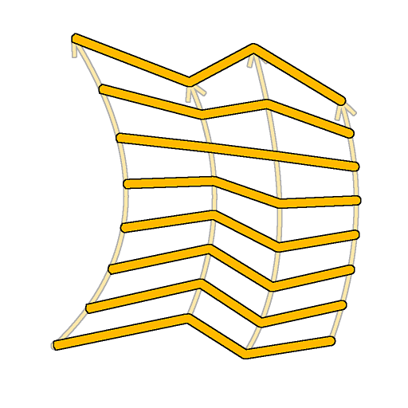

# Puente polinomial (lista)

<table>
<tr style="border: 0;">
<td width="33.33%" style="border: 0;" valign="top">

<b>En:</b> Herramientas de spline y trazado > Herramientas de spline

</td>
<td width="100.00%" style="border: 0;" valign="top">

## Descripción

Genera splines que atraviesan todas las splines de la lista de entrada, a lo largo de estas splines.

Las splines generadas pueden ser lineales (rectas) o curvadas (curvadas).

</td>
</tr>
</table>

>[!TIP]
>
> Las splines generadas van desde la primera spline de la lista hasta la última y atraviesan las splines intermedias siguiendo estrictamente el orden de estas splines en la lista.
> 
> Por lo tanto, debe tener en cuenta el orden en el que se añaden las splines de antemano.

## Entradas

|  |  |
|:---|:---|
| <b>Vista previa</b> <i>Escala de grises</i> | Vista previa de las splines de entrada como una imagen en escala de grises. |
| <b>Códigos polinómicos</b> <i>Color</i> | Las coordenadas de los puntos de las splines de entrada codificados en los canales RGBA de una imagen de color: <b>R</b> - Posición X <b>G</b> - Posición Y <b>B</b> - Height <b>A</b> - Datos empaquetados: - Firmar: La spline está cerrada (negativa) o abierta (positiva); - Valor absoluto: Thickness + 1. |
| <b>Datos de spline</b> <i>Color</i> | Datos adicionales de las splines de entrada codificadas en los canales RGBA de una imagen en color. <b>R</b> - Tangents X <b>G</b> - Tangents Y <b>B</b> - Sin usar <b>A</b> - Sin usar |
| <b>Cantidad de spline</b> <i>Entero</i> | Número de splines de entrada. |

## Salidas

|  |  |
|:---|:---|
| <b>Vista previa</b> <i>Escala de grises</i> | Vista previa de las splines de salida como una imagen en escala de grises. |
| <b>Códigos polinómicos</b> <i>Color</i> | Las coordenadas de los puntos de las splines de salida codificados en los canales RGBA de una imagen en color. <b>R</b> - Posición X <b>G</b> - Posición Y <b>B</b> - Height <b>A</b> - Datos empaquetados: - Firmar: La spline está cerrada (negativa) o abierta (positiva); - Valor absoluto: Thickness + 1. |
| <b>Datos de spline</b> <i>Color</i> | Datos adicionales de las splines de salida codificadas en los canales RGBA de una imagen en color. <b>R</b> - Tangents X <b>G</b> - Tangents Y <b>B</b> - Sin usar <b>A</b> - Sin usar |
| <b>Cantidad de spline</b> <i>Entero</i> | Número de splines de salida. |

## Parámetros

|  |  |
|:---|:---|
| <b>Cantidad de spline de puente</b> <i>Entero</i> | Número de splines generadas a través de las splines de entrada. |
| <b>Tipo de splines de puente</b> <i>Entero</i> | Tipo de spline que se genera:  - Lineal: una spline nítida conectando splines intermedias con trayectorias rectas de principio a fin; - Curva cuadrática: una spline curva conectando splines intermedias con trayectorias suaves de principio a fin.  Nota: Se requieren al menos 3 splines de entrada para calcular una spline de curva cuadrática. |
| <b>Las splines de entrada están cerradas</b> <i>Booleano</i> | Controla si el primer y el último punto de las splines de entrada deben procesarse como un único punto. Esto evita la duplicación de la primera y la última spline de recorrido. |
| <b>Voltear dirección</b> <i>Booleano</i> | Invierte la dirección de la spline. |
| <b>Cerrar división de puente</b> <i>Booleano</i> | Extiende las splines de recorrido para volver a conectarse a la primera spline de la lista de entrada. |
| <b>Desplazamiento de spline de primer puente</b> <i>Float2</i> | Aplica un desvío al inicio de todas las splines recorridas. El valor es la longitud normalizada de las splines de entrada. Las splines generadas que coinciden con el principio o el final de las splines recorridas se dejan allí. |
| <b>Desplazamiento de la última spline de puente</b> <i>Float2</i> | Aplica un desvío al final de todas las splines recorridas. El valor es la longitud normalizada de las splines de entrada. Las splines generadas que coinciden con el principio o el final de las splines recorridas se dejan allí. |
| <b>Rango de desplazamiento aleatorio</b> <i>Entero</i> | Distancia máxima utilizada para el desplazamiento aleatorio aplicado en las splines.  - <i>spline principal:</i> Se utiliza la longitud completa de las splines principales. Puede provocar superposiciones. - <i>Intervalo:</i> Se usa el intervalo entre las splines del puente. Esto mitiga las superposiciones. Esta distancia disminuye a medida que aumenta la cantidad de splines del puente. |
| <b>Iniciar desplazamiento aleatorio</b> <i>Flotador</i> | Un multiplicador para el desplazamiento aleatorio aplicado en la posición inicial de las splines de puente, donde la distancia máxima se especifica mediante el parámetro <b>Rango de desplazamiento aleatorio</b>. |
| <b>Finalizar desplazamiento aleatorio</b> <i>Flotador</i> | Un multiplicador para el desplazamiento aleatorio aplicado en la posición final de las splines de puente, donde la distancia máxima se especifica mediante el parámetro <b>Rango de desplazamiento aleatorio</b>. |
| <b>Desplazamiento aleatorio global</b> <i>Flotador</i> | Un multiplicador para la *cantidad igual* de desplazamiento aleatorio aplicado en *both* la posición inicial y final de las splines de puente, donde la distancia máxima se especifica mediante el parámetro <b>intervalo de desplazamiento aleatorio</b>. |
| <b>Distribución uniforme</b> <i>Booleano</i> | Si es True, los puntos de las splines generadas se espacian uniformemente de principio a fin. |
| <b>Thickness</b> |  |
| <b>Modo de Thickness</b> <i>Entero</i> | Método para adquirir el valor de thickness para las splines de bridge.  - <i>Heredar de splines primarias:</i> Se usa el thickness de las splines principales en las posiciones inicial y final de las splines de bridge - <i>Reemplazar:</i> Se usa el valor arbitrario que especifique en el parámetro <b>Thickness</b> |
| <b>Thickness</b> <i>Flotador</i> | Valor de thickness absoluto aplicado a las splines de puente. |
| <b>Aleatorio de Thickness</b> <i>Flotador</i> | Un multiplicador aleatorio para el thickness de las splines de bridge, donde el parámetro <b>modo de Thickness</b> especifica el thickness inicial al que se aplica este multiplicador. |
| <b>Height</b> |  |
| <b>Modo de Height</b> <i>Entero</i> | Método para adquirir el valor de height para las splines de bridge.  - <i>Heredar de splines primarias:</i> Se usa el height de las splines principales en las posiciones inicial y final de las splines de bridge - <i>Reemplazar:</i> Se usa el valor arbitrario que especifique en el parámetro <b>Height</b> |
| <b>Desplazamiento de Height</b> <i>Flotante</i> | Cantidad de desvío aplicado al height heredado de las splines padre, antes de que ese height se aplique a las splines de puente. |
| <b>Height</b> <i>Flotante</i> | Valor de height absoluto aplicado a las splines de puente. |
| <b>Aleatorio de Height</b> <i>Flotante</i> | Una cantidad aleatoria de ajuste en el height de las splines de bridge, donde ese ajuste depende del parámetro <b>modo de Height</b> seleccionado:  - <i>Heredar de splines principales:</i> El valor es un multiplicador para el height heredado. - <i>Anular:</i> El valor es un desplazamiento agregado al height. |
| <b>Corrección no cuadrada</b> <i>Booleano</i> | Ajuste la posición y el thickness de los puntos para conservar la forma de la spline en resoluciones que no sean cuadradas. Esto también afecta a la distribución uniforme. |
| <b>Vista previa</b> |  |
| <b>Mostrar ayuda de dirección</b> <i>Booleano</i> | Muestra un punto al principio de la spline y una punta de flecha al final en la salida de previsualización. |
| <b>Mostrar sobre de Thickness</b> <i>Booleano</i> | Muestra líneas adicionales en los bordes del thickness de la spline. |
| <b>Cantidad de segmentos</b> <i>Entero</i> | Ajusta el número de segmentos utilizados para dibujar la visualización de spline en la salida de previsualización. Un valor más alto produce una línea más suave. |
| <b>Thickness (px)</b> <i>Flotador</i> | Ajusta el thickness de la visualización de la spline en píxeles en la salida de previsualización. |
| <b>Intensidad de vista previa en segundo plano</b> <i>Flotador</i> | Intensidad de la visualización de previsualización. |

## Ejemplos

<table>
<tr style="border: 0;">
<td style="border: 0;" valign="top">

<table>
  <tr>
    <td>
      
       <i>Antes</i>
    </td>
    <td>
      
       <i>Después De</i>
    </td>
  </tr>
</table>

</td>
<td style="border: 0;" valign="top">

</td>
</tr>
</table>

