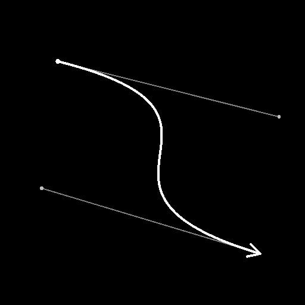

# Spline (cúbico)

<table>
<tr style="border: 0;">
<td width="33.33%" style="border: 0;" valign="top">

<b>En:</b> Herramientas de spline y trazado > Herramientas de spline

</td>
<td width="100.00%" style="border: 0;" valign="top">

## Descripción

Genera una única spline entre dos puntos <b>p1 </b> y <b>p2</b> en ubicaciones arbitrarias.

La trayectoria de la spline está controlada por la tangente ‘out’ de <b>p1</b> y la tangente ‘in’ de <b>p2</b>.

</td>
</tr>
</table>

## Entradas

|  |  |
|:---|:---|
| <b>Vista previa</b> <i>Escala de grises</i> | Vista previa de las splines de entrada como una imagen en escala de grises. |
| <b>Códigos polinómicos</b> <i>Color</i> | Las coordenadas de los puntos de las splines de entrada codificados en los canales RGBA de una imagen de color: <b>R</b> - Posición X <b>G</b> - Posición Y <b>B</b> - Height <b>A</b> - Datos empaquetados: - Firmar: La spline está cerrada (negativa) o abierta (positiva); - Valor absoluto: Thickness + 1. |
| <b>Datos de spline</b> <i>Color</i> | Datos adicionales de las splines de entrada codificadas en los canales RGBA de una imagen en color. <b>R</b> - Tangents X <b>G</b> - Tangents Y <b>B</b> - Sin usar <b>A</b> - Sin usar |
| <b>Cantidad de spline</b> <i>Entero</i> | Número de splines de entrada. |

## Salidas

|  |  |
|:---|:---|
| <b>Vista previa</b> <i>Escala de grises</i> | Vista previa de las splines de salida como una imagen en escala de grises. |
| <b>Códigos polinómicos</b> <i>Color</i> | Las coordenadas de los puntos de las splines de salida codificados en los canales RGBA de una imagen en color. <b>R</b> - Posición X <b>G</b> - Posición Y <b>B</b> - Height <b>A</b> - Datos empaquetados: - Firmar: La spline está cerrada (negativa) o abierta (positiva); - Valor absoluto: Thickness + 1. |
| <b>Datos de spline</b> <i>Color</i> | Datos adicionales de las splines de salida codificadas en los canales RGBA de una imagen en color. <b>R</b> - Tangents X <b>G</b> - Tangents Y <b>B</b> - Sin usar <b>A</b> - Sin usar |
| <b>Cantidad de spline</b> <i>Entero</i> | Número de splines de salida. |

## Parámetros

|  |  |
|:---|:---|
| <b>Voltear dirección</b> <i>Booleano</i> | Invierte la dirección de la spline. |
| <b>Anexar spline de entrada</b> <i>Booleano</i> | Agrega la spline generada al final de la lista de splines conectadas a las entradas <b>Spline</b>. |
| <b>Corrección no cuadrada</b> <i>Booleano</i> | Ajuste la posición y el thickness de los puntos para conservar la forma de la spline en resoluciones que no sean cuadradas. Esto también afecta a la distribución uniforme. |
| <b>Height</b> |  |
| <b>Iniciar Height</b> <i>Flotador</i> | Ajusta el height del punto p1, donde un valor inferior significa una ubicación más baja o más profunda. Esto afecta al height de la spline en p1. |
| <b>Finalizar Height</b> <i>Flotador</i> | Ajusta el height del punto p2, donde un valor inferior significa una ubicación más baja o más profunda. Esto afecta al thickness de la spline en p2. |
| <b>Height de tangente automática</b> <i>Booleano</i> | Define automáticamente el height de las tangentes polinomiales para que se interpolen linealmente desde el Height Inicio hasta el Height Final. |
| <b>Height de tangentes p1</b> <i>Flotante</i> (disponible cuando &quot;Height de tangente automática&quot; es True) | Ajusta el height de la tangente p1 point &#39;out&#39; donde un valor inferior significa una ubicación más baja o más profunda. Esto afecta al height a lo largo de la spline a medida que se aleja de p1. |
| <b>p2 Height Tangent</b> <i>Flotante</i> (disponible cuando &quot;Height de tangente automática&quot; es True) | Ajusta el height de la tangente p2 point &#39;in&#39; donde un valor inferior significa una ubicación más baja o más profunda. Esto afecta al height a lo largo de la spline a medida que se aleja de p2. |
| <b>Thickness</b> |  |
| <b>Iniciar Thickness</b> <i>Flotador</i> | Ajusta el thickness del punto p1. Esto afecta al thickness de la spline en p1. Nota: El thickness se utiliza en nodos Spline específicos. |
| <b>Finalizar Thickness</b> <i>Flotador</i> | Ajusta el thickness del punto p2. Esto afecta al thickness de la spline en p2. Nota: El thickness se utiliza en nodos Spline específicos. |
| <b>Thickness de tangente automática</b> <i>Booleano</i> | Establece automáticamente el thickness de las tangentes polinomiales para que se interpolen linealmente desde el Thickness Inicio hasta el Thickness Final. Nota: El thickness se utiliza en nodos Spline específicos. |
| <b>Thickness de tangentes p1</b> <i>Flotante</i> (disponible cuando &quot;Thickness de tangente automática&quot; es True) | Ajusta el thickness de la tangente p1 point &#39;out&#39;. Esto afecta al thickness a lo largo de la spline a medida que se aleja de p1. Nota: El thickness se utiliza en nodos Spline específicos. |
| <b>p2 Thickness Tangent</b> <i>Flotante</i> (disponible cuando &quot;Thickness de tangente automática&quot; es True) | Ajusta el thickness de la tangente p2 point &#39;in&#39;. Esto afecta al thickness a lo largo de la spline a medida que se aleja de p2. Nota: El thickness se utiliza en nodos Spline específicos. |
| <b>Coordenadas de puntos</b> |  |
| <b>p1</b> <i>Float2</i> | Establece la posición del punto p1 en el espacio de textura. |
| <b>p1 Tangente</b> <i>Float2</i> | Establece la posición del control de tangente p1 point &#39;out&#39; en el espacio de textura. |
| <b>p2</b> <i>Float2</i> | Establece la posición del punto p2 en el espacio de textura. |
| <b>p2 Tangente</b> <i>Float2</i> | Establece la posición del control de tangente del punto p2 &#39;in&#39; en el espacio de textura. |
| <b>Vista previa</b> |  |
| <b>Mostrar tangentes</b> <i>Booleano</i> | Muestra la tangente del punto p1 &#39;out&#39; y el punto p2 &#39;in&#39; en la salida de previsualización. |
| <b>Mostrar ayuda de dirección</b> <i>Booleano</i> | Muestra un punto al principio de la spline y una punta de flecha al final en la salida de previsualización. |
| <b>Cantidad de segmentos</b> <i>Entero</i> | Ajusta el número de segmentos utilizados para dibujar la visualización de spline en la salida de previsualización. Un valor más alto produce una línea más suave. |
| <b>Thickness (px)</b> <i>Flotador</i> | Ajusta el thickness en píxeles de la visualización de la spline en la salida de previsualización. |

## Ejemplos

<table>
<tr style="border: 0;">
<td style="border: 0;" valign="top">

</td>
<td style="border: 0;" valign="top">

</td>
</tr>
</table>

<table>
<tr style="border: 0;">
<td style="border: 0;" valign="top">

</td>
<td style="border: 0;" valign="top">

</td>
</tr>
</table>
