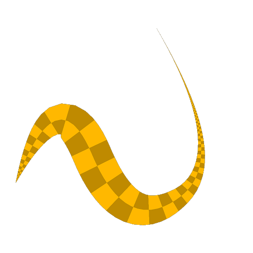
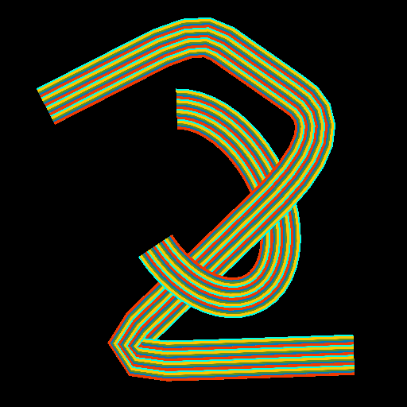
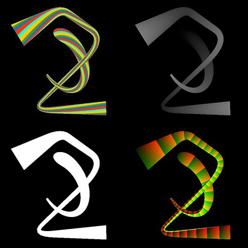

# Color del asignador de spline

<table>
<tr style="border: 0;">
<td width="33.33%" style="border: 0;" valign="top">

<b>En:</b> Herramientas de spline y trazado > Herramientas de spline

</td>
<td width="100.00%" style="border: 0;" valign="top">

## Descripción

Asigna una imagen de color de entrada a una forma simple estirada a lo largo de las splines de entrada.

La forma primitiva puede ser un plano, medio cilindro o cilindro. Los cilindros se pueden girar a lo largo de la spline para deformar la imagen asignada en consecuencia.

</td>
</tr>
</table>

El nodo emite la imagen asignada como una imagen en color, así como otra información como el height, UV (es decir, coordenadas de imagen) y una máscara de ID para seleccionar cada spline asignada de forma independiente.

>[!IMPORTANT]
>
> El resultado puede incluir artefactos no deseados fuera del envolvente de la spline cuando se utilizan valores de thickness muy bajos. Se trata de un problema conocido.

>[!NOTE]
>
> Consulte también [Escala de grises del asignador de spline](../../../../../../compositing-graphs/nodes-reference-for-com/node-library/spline-paths-tools/spline-tools/spline-mapper-grayscale/spline-mapper-grayscale.md).

## Conectores de entrada

<b>Códigos polinómicos</b> *Color* Coordenadas de los puntos de las splines de entrada codificados en los canales RGBA de una imagen en color:\
Posición <b> R</b> - X\
<b> G</b> - Posición Y\
<b> B</b> - Height\
    <b>A</b> - Datos empaquetados:\
        * Firmar: La spline está cerrada (negativa) o abierta (positiva);\
        * Valor absoluto: Thickness + 1.

<b>Datos de spline</b> *Color* Datos adicionales de las splines de entrada codificadas en los canales RGBA de una imagen en color.\
<b> R</b> - Tangentes X\
<b> G</b> - Tangentes Y\
<b> B</b> - No utilizado\
<b> A</b> - No utilizado

<b>Cantidad de spline</b> *Entero* Número de splines de entrada.

<b>Mapa de color</b> *Color* Imagen de color de entrada que se debe asignar a lo largo de las splines de entrada.

<b>Mapa de Height</b> *Escala de grises* Asignación de height de escala de grises de entrada que se debe asignar a lo largo de las splines de entrada.

<b>Twist curve</b> *Escala de grises* Imagen que describe una curva utilizando los valores de su primera fila de píxeles.\
Cuando el parámetro <b>Shape</b> se establece en *Half-Cylinder* o *Cylinder*, esta entrada se utiliza para controlar la torsión de las coordenadas UV alrededor de la forma. Su impacto se controla mediante el parámetro <b>Twist UVs Curve Multiplier</b>.\
La curva proporciona un perfil para la cantidad de rotación a lo largo de la spline, donde el primer píxel de la fila es la rotación al principio de la spline y el último es la rotación al final. El valor de escala de grises representa un número de vueltas.\
Puede utilizar un nodo [Curve](../../../../../../compositing-graphs/nodes-reference-for-com/atomic-nodes/curve/curve.md) para crear la curva.

## Conectores de salida

<b>Color</b> *Color* El resultado de asignar la imagen de color de entrada a través de las splines de entrada, como una imagen de color.

<b>Height</b> *Escala de grises* El resultado de asignar la imagen del Height de entrada a través de las splines de entrada, como una imagen en escala de grises.

<b>UV</b> *Color* Los UV (es decir, las coordenadas) de la asignación a través de las splines de entrada, codificados en una imagen en color.

<b>ID</b> *Escala de grises* Máscara de las imágenes asignadas a lo largo de las splines de entrada, donde los valores blancos se incrementan en 1 de una spline a la siguiente para que cada forma se pueda seleccionar de forma independiente.

## Parámetros

<b>Cantidad de segmentos</b> *Entero* Las splines se simplifican en segmentos antes de que las coordenadas de la imagen las atraviesen.\
Una mayor cantidad de segmentos produce una asignación más fluida a lo largo de las curvas.

<b>UV de escala automática</b> *Booleano* Ajusta la escala de las coordenadas automáticamente para conservar una imagen cuadrada al asignarla a lo largo de las splines.<b></b>

<b>Escala de UV</b> *Float2* Ajusta la escala de las coordenadas asignadas en X (horizontal) e Y (verticalmente).\
Los valores más altos dan como resultado una imagen en mosaico más densa.<b></b>

<b>Modo</b> *Entero* Método de selección de las splines a lo largo de las cuales se debe asignar la imagen:\
*- Dibujar lista de spline*: Se utilizan todas las splines de la lista de entrada;\
*: dibujar una spline*: Sólo se utiliza la spline con el índice especificado;\
*- Dibujar rango de spline*: Sólo se utilizan las splines cuyo índice se incluye en el rango especificado.

<b>Dibujar índice de spline</b> *Entero* (disponible cuando &#39;Mode&#39; está establecido en &#39;Draw Single Spline&#39;) El índice de la spline a lo largo de la cual se debe asignar la imagen.

<b>Dibujar rango de spline</b> *Entero2* (disponible cuando &quot;Modo&quot; está establecido en &quot;Dibujar rango de spline&quot;)Intervalo de índices de las splines a lo largo de las cuales se debe asignar la imagen.

<b>Inicio</b> *Float* Desplaza el inicio de la parte de la spline que se debe asignar.\
El valor representa la longitud normalizada de la spline.

<b>Fin</b> *Float* Desplaza el final de la parte de la spline que se debe asignar.\
El valor representa la longitud normalizada de la spline.

<b>Modo de Thickness</b> *Integer* Método para establecer el thickness de la imagen asignada:\
*- Manual*: Establezca el thickness explícitamente con un valor arbitrario;\
*- Desde spline*: Utilice el thickness de la spline.

<b>Thickness</b> *Float* (Disponible cuando &#39;Modo de Thickness&#39; está establecido en &#39;Manual&#39;)El valor arbitrario para el thickness de la imagen asignada a lo largo de las splines.<b></b>

<b>Multiplicador de Thickness</b> *Float* (Disponible cuando &#39;Modo de Thickness&#39; está establecido en &#39;Desde spline&#39;)Un multiplicador global para el thickness de la imagen asignada a lo largo de las splines, cuando ese thickness está controlado por el de las splines.

<b>Forma</b> *Entero* Forma primitiva utilizada para asignar coordenadas de imagen a lo largo de las splines:\
*- Plano*: Las coordenadas se asignan a un plano plano plano;\
*- Medio cilindro*: Las coordenadas se asignan a un medio cilindro cuyo eje del círculo base sigue la dirección de la spline;\
*- Cilindro*: Las coordenadas se asignan a un cilindro cuyo eje del círculo base sigue la dirección de la spline.<b></b>

<b>Multiplicador de Height del cilindro</b> *Float* (Disponible cuando &#39;Shape&#39; está establecido en &#39;Half Cylinder&#39; o &#39;Cylinder&#39;)Un multiplicador para la intensidad de la contribución de height del cilindro en la salida de Height.\
Los ajustes de height son acumulativos.

<b>Desplazamiento del Height del cilindro</b> *Flotador* (disponible cuando &quot;Forma&quot; está establecido en &quot;Medio cilindro&quot; o &quot;Cilindro&quot;) \
Desplaza el centro del perfil de forma Cilindro o Medio cilindro desde la superficie de la spline hasta un diámetro debajo de la superficie.

<b>Intensidad de giro UV</b> *Flotador* (disponible cuando ‘Shape’ está establecido en ‘Half Cylinder’ o ‘Cylinder’)El giro de las coordenadas de imagen alrededor del cilindro, en número de vueltas.\
La torsión consiste en girar el cilindro sólo al final de la spline. A continuación, la rotación se interpola a lo largo de la spline.

<b>Multiplicador de curvas UV de giro</b> *Flotador* (disponible cuando &quot;Shape&quot; está establecido en &quot;Half Cylinder&quot; o &quot;Cylinder&quot;)Un multiplicador para la intensidad de la contribución de la entrada de Twist curve al retorcido del cilindro.\
La curva proporciona un perfil para la cantidad de rotación a lo largo de la spline, donde el primer píxel de la fila es la rotación al principio de la spline y el último es la rotación al final. El valor de escala de grises representa un número de vueltas.

<b>Desplazamiento de curva de giro UV</b> *Float* (Disponible cuando &quot;Shape&quot; está establecido en &quot;Half Cylinder&quot; o &quot;Cylinder&quot;) Aplica un desplazamiento global a los valores de rotación proporcionados por el Twist curve, en número de vueltas.

<b>Multiplicador de Height spline</b> *Flotante* Ajusta la intensidad de la contribución del Height polinómico a la salida del Height.\
Los ajustes de height son acumulativos.<b></b>

<b>Multiplicador de Height de entrada</b> *Flotante* Ajusta la intensidad de la contribución de la entrada del mapa de Height a la salida del Height.\
Los ajustes de height son acumulativos.<b></b>

<b>Color de fondo</b> *Float4* Color de fondo en la salida de color.

<b>Corrección no cuadrada </b>*Booleano* Ajusta la posición y el thickness de los puntos para conservar la forma de la spline en resoluciones no cuadradas.\
Esto también afecta a la distribución uniforme.

## Ejemplos

<table>
<tr style="border: 0;">
<td style="border: 0;" valign="top">

<table>
  <tr>
    <td>
      
       <i>Antes</i>
    </td>
    <td>
      
       <i>Después De</i>
    </td>
  </tr>
</table>

</td>
<td style="border: 0;" valign="top">

</td>
</tr>
</table>

<table>
<tr style="border: 0;">
<td style="border: 0;" valign="top">

</td>
<td style="border: 0;" valign="top">

</td>
</tr>
</table>
