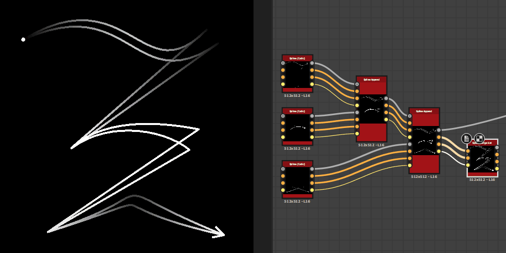

# Lista de combinación de spline

<table>
<tr style="border: 0;">
<td style="border: 0;" valign="top">

<table>
<tr style="border: 0;">
<td width="33.33%" style="border: 0;" valign="top">

<b>En:</b> Herramientas de spline y trazado > Herramientas de spline

</td>
<td width="100.00%" style="border: 0;" valign="top">

## Descripción

Fusiona todas las splines de la lista de entrada en una única spline.

</td>
</tr>
</table>

## Conectores de entrada

<b>Códigos polinómicos</b> *Color* Coordenadas de los puntos de las splines de entrada codificados en los canales RGBA de una imagen en color:\
Posición <b> R</b> - X\
<b> G</b> - Posición Y\
<b> B</b> - Height\
    <b>A</b> - Datos empaquetados:\
        * Firmar: La spline está cerrada (negativa) o abierta (positiva);\
        * Valor absoluto: Thickness + 1.

<b>Datos de spline</b> *Color* Datos adicionales de las splines de entrada codificadas en los canales RGBA de una imagen en color.\
<b> R</b> - Tangentes X\
<b> G</b> - Tangentes Y\
<b> B</b> - No utilizado\
<b> A</b> - No utilizado

<b>Cantidad de spline</b> *Entero* Número de splines de entrada.

## Conectores de salida

<b>Vista previa</b> *Escala de grises* Vista previa de las splines combinadas como una imagen en escala de grises.

<b>Códigos polinómicos</b> *Color* Coordenadas de los puntos de las splines combinadas codificadas en los canales RGBA de una imagen en color.\
    Posición <b>R</b> - X\
    <b>G</b> - Posición Y\
    <b>B</b> - Height\
    <b>A</b> - Datos empaquetados:\
        * Firmar: La spline está cerrada (negativa) o abierta (positiva);\
        * Valor absoluto: Thickness + 1.

<b>Datos de spline</b> *Color* Datos adicionales de las splines combinadas codificadas en los canales RGBA de una imagen en color.\
    <b>R</b> - Tangentes X\
    <b>G</b> - Tangentes Y\
    <b>B</b> - Sin usar\
    <b>A</b> - Sin usar

<b>Cantidad de spline</b> *Entero* Número de splines combinadas.

## Parámetros

<b>Umbral de distancia de spline cerrado</b> *Flotante* Distancia en el espacio de textura por debajo de la cual se procesan dos extremidades de una misma spline como un solo punto que cierra esa spline.\
Esto evita superposiciones al dispersar formas o asignar imágenes a lo largo de las splines.

+++Vista previa
<b>Cantidad de segmentos</b> *Entero* Ajusta el número de segmentos utilizados para dibujar la visualización de la spline en la salida de la vista previa.\
Un valor más alto produce una línea más suave.

<b>Mostrar ayuda de dirección</b> *Booleano* Muestra un punto al principio de la spline y una punta de flecha al final en la salida de vista previa.

<b>Mostrar sobre de Thickness</b> *Booleano*\
Muestra líneas adicionales en los bordes del thickness de la spline.

<b>Thickness (px)</b> *Flotante* Ajusta el thickness de la visualización de la spline en píxeles en la salida de la vista previa.

+++

## Ejemplos

<table>
<tr style="border: 0;">
<td style="border: 0;" valign="top">

<table>
  <tr>
    <td>
      
       <i>Antes</i>
    </td>
    <td>
      
       <i>Después De</i>
    </td>
  </tr>
</table>

</td>
<td style="border: 0;" valign="top">

<table>
  <tr>
    <td>
      
       <i>Antes</i>
    </td>
    <td>
      
       <i>Después De</i>
    </td>
  </tr>
</table>

</td>
</tr>
</table>

</td>
<td style="border: 0;" valign="top">

</td>
<td style="border: 0;" valign="top">

</td>
</tr>
</table>
