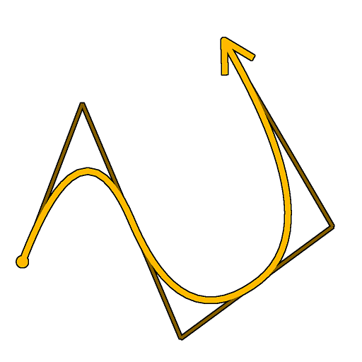

# Spline (poli cuadrático)

<table>
<tr style="border: 0;">
<td style="border: 0;" valign="top">

<table>
<tr style="border: 0;">
<td width="33.33%" style="border: 0;" valign="top">

<b>En:</b> Herramientas de spline y trazado > Herramientas de spline

</td>
<td width="100.00%" style="border: 0;" valign="top">

## Descripción

Genera una spline en varios puntos. La cantidad y las ubicaciones de estos puntos pueden ser arbitrarias o recopilarse a partir de un nodo [Lista de puntos](../../../../../../compositing-graphs/nodes-reference-for-com/node-library/spline-paths-tools/spline-tools/point-list/point-list.md).

</td>
</tr>
</table>

La trayectoria de la spline se puede suavizar alejándola de sus puntos intermediarios, en el sentido de que cada punto intermediario es el punto de encuentro de las tangentes &quot;out&quot; e &quot;in&quot; de sus vecinos.

## Conectores de entrada

<b>Vista previa</b> *Escala de grises* Vista previa de las splines de entrada como una imagen en escala de grises.

<b>Códigos polinómicos</b> *Color* Coordenadas de los puntos de las splines de entrada codificados en los canales RGBA de una imagen en color:\
Posición <b> R</b> - X\
<b> G</b> - Posición Y\
<b> B</b> - Height\
<b> A</b> - Datos empaquetados:\
        * Firmar: La spline está cerrada (negativa) o abierta (positiva);\
        * Valor absoluto: Thickness + 1.

<b>Datos de spline</b> *Color* Datos adicionales de las splines de entrada codificadas en los canales RGBA de una imagen en color.\
<b> R</b> - Tangentes X\
<b> G</b> - Tangentes Y\
<b> B</b> - No utilizado\
<b> A</b> - No utilizado

<b>Cantidad de spline</b> *Entero* Número de splines de entrada.

<b>Vista previa de puntos </b>*Escala de grises* Vista previa de los puntos como una imagen en escala de grises.

<b>Lista de puntos de entrada</b> *Color* (disponible cuando &quot;Usar lista de puntos de entrada&quot; es True)\
Una lista de puntos codificados en los canales RGBA de una imagen en color:\
    Posición <b>R</b> - X\
    <b>G</b> - Posición Y\
    <b>B</b> - Height\
    <b>A</b> - Datos empaquetados:\
        * Parte entera: Smoothness;\
        * Parte fraccional: Thickness.

<b>Número de punto</b> *Entero* (disponible cuando &quot;Usar lista de puntos de entrada&quot; es True)\
El número de puntos.

>[!IMPORTANT]
>
> Los conectores <b>Point List</b> y <b>Point Number</b> son *incompatibles* con los conectores <b>Spline Code</b>, <b>Spline Data</b> y <b>Spline Amount</b>, ya que se basan en datos diferentes.

## Conectores de salida

<b>Vista previa</b> *Escala de grises* Vista previa de las splines de salida como una imagen en escala de grises.

<b>Códigos polinómicos</b> *Color* Coordenadas de los puntos de las splines de salida codificados en los canales RGBA de una imagen en color.\
    Posición <b>R</b> - X\
    <b>G</b> - Posición Y\
    <b>B</b> - Height\
    <b>A</b> - Datos empaquetados:\
        * Firmar: La spline está cerrada (negativa) o abierta (positiva);\
        * Valor absoluto: Thickness + 1.

<b>Datos de spline</b> *Color* Datos adicionales de las splines de salida codificadas en los canales RGBA de una imagen en color.\
    <b>R</b> - Tangentes X\
    <b>G</b> - Tangentes Y\
    <b>B</b> - Sin usar\
    <b>A</b> - Sin usar

<b>Cantidad de spline</b> *Entero* Número de splines de salida.

## Parámetros

<b>Importe de puntos</b> *Entero* Número arbitrario de puntos utilizado para crear la spline.

<b>Modo de conexión de spline de entrada</b> *Integer* Método utilizado para conectar las splines de entrada:\
*- Automático:* El final de la última spline de entrada está conectado al inicio de la spline generada y el final de la spline generada está conectado al inicio de la primera spline de entrada;\
*- Manual:* Puede especificar qué splines de entrada deben conectarse a las extremidades de la spline generada y en qué parte de las splines de entrada deben aterrizar estas conexiones.

<b>Cerrar spline</b> *Booleano* Controla si el punto final de la spline debe estar conectado a su punto inicial.\
El suavizado aplicado a la spline en los puntos inicial y final se especifica mediante los valores de Smoothness de esos puntos.

<b>Voltear dirección</b> *Booleano*\
Invierte la dirección de la spline.

<b>Usar lista de puntos de entrada</b> *Boolean* Usar la lista de puntos suministrados a los conectores de entrada Lista de puntos de entrada y Número de punto en lugar de una lista arbitraria de puntos.\
Un nodo [Point List](../../../../../../compositing-graphs/nodes-reference-for-com/node-library/spline-paths-tools/spline-tools/point-list/point-list.md) puede proporcionar la lista de puntos.

<b>Conectar inicio a spline de entrada</b> *Booleano* Si es True, el inicio de la spline generada se conecta al último punto de la última spline de las splines de entrada.

<b>Iniciar índice de spline de conexión</b> *Entero* (disponible cuando &quot;Modo de conexión de spline de entrada&quot; está establecido en &quot;Manual&quot; y &quot;Inicio de conexión a spline de entrada&quot; está establecido en &quot;Verdadero&quot;)El índice de la spline de entrada que debe conectarse al inicio de la spline generada.

<b>Iniciar posición de conexión</b> *Float* (Disponible cuando &quot;Input Spline Connection Mode&quot; está establecido en &quot;Manual&quot; y &quot;Connect Start to Input Spline&quot; está establecido en &quot;True&quot;)Posición en la spline de entrada seleccionada donde debe aterrizar la conexión con el inicio de la spline generada.\
Este valor es la longitud normalizada de la spline de entrada seleccionada.

<b>Conectar extremo a spline de entrada</b> *Booleano* Si es True, el final de la spline generada se conecta al primer punto de la primera spline de las splines de entrada.

<b>Finalizar índice de spline de conexión</b> *Entero* (disponible cuando &quot;Modo de conexión de spline de entrada&quot; está establecido en &quot;Manual&quot; y &quot;Conectar extremo a spline de entrada&quot; está establecido en &quot;Verdadero&quot;)El índice de la spline de entrada que debe conectarse al final de la spline generada.

<b>Finalizar posición de conexión</b> *Float* (Disponible cuando &quot;Input Spline Connection Mode&quot; está establecido en &quot;Manual&quot; y &quot;Connect End to Input Spline&quot; está establecido en &quot;True&quot;)Posición en la spline de entrada seleccionada en la que debe aterrizar la conexión con el extremo de la spline generada.\
Este valor es la longitud normalizada de la spline de entrada seleccionada.

<b>Distribución uniforme</b> *Booleano*\
Si es True, los puntos de la spline se espacian uniformemente de principio a fin.

<b>Anexar spline de entrada</b> *Booleano*\
Agrega la spline generada al final de la lista de splines conectadas a las entradas <b>Spline</b>.

<b>Corrección no cuadrada </b>*Booleano* Ajusta la posición y el thickness de los puntos para conservar la forma de la spline en resoluciones no cuadradas.\
Esto también afecta a la distribución uniforme.

<b>Ajuste de Smoothness global</b> *Flotante* Aplica un desplazamiento uniforme al valor de smoothness de todos los puntos.\
El valor de smoothness resultante se fija al rango [0;1].

+++Propiedades de puntos
<b>Propiedades de p#</b> *Float3* Establece las propiedades del punto p#.\
*- Height:* Ajusta el height del punto en el que un valor inferior significa una ubicación más baja o más profunda;\
*- Smoothness:* Desplaza el inicio del suavizado de la spline en p#, donde un valor de 0 da como resultado una trayectoria dura y 1 en una completamente suave;\
*- Thickness:* Ajusta el thickness de la spline en p#. El thickness se utiliza en nodos Spline específicos.

+++

+++Puntos y coordenadas
<b>p#</b> *Float2* Establece la posición del punto p# en el espacio de textura.

+++

+++Vista previa
<b>Mostrar tangentes</b> *Booleano* Muestra las tangentes de los puntos p1 y p3 a p2 en la salida de vista previa.

<b>Mostrar ayuda de dirección</b> *Booleano* Muestra un punto al principio de la spline y una punta de flecha al final en la salida de vista previa.

<b>Mostrar sobre de Thickness</b> *Booleano*\
Muestra líneas adicionales en los bordes del thickness de la spline.

<b>Mostrar etiqueta de puntos</b> *Booleano*\
Para cada punto, muestra el nombre del punto junto a él en la salida &quot;Vista previa&quot;.

<b>Tamaño de etiqueta de puntos</b> *Float* (disponible cuando &#39;Mostrar etiqueta de puntos&#39; está establecido en &#39;True&#39;)\
El tamaño de la etiqueta para cada punto en el espacio de textura, donde 0,1 es una décima parte del ancho de la textura.

<b>Mostrar puntos</b> *Booleano*\
Muestra los puntos de control de la spline.

<b>Tamaño de puntos</b> *Float* (disponible cuando &#39;Mostrar puntos&#39; está establecido en &#39;True&#39;)\
El radio de los puntos en el espacio de textura, donde 0,1 es una décima parte del ancho de la textura.

<b>Cantidad de segmentos</b> *Entero* Ajusta el número de segmentos utilizados para dibujar la visualización de la spline en la salida de la vista previa.\
Un valor más alto produce una línea más suave.

<b>Thickness (px)</b> *Flotante* Ajusta el thickness de la visualización de la spline en píxeles en la salida de la vista previa.

+++

## Ejemplos

<table>
<tr style="border: 0;">
<td style="border: 0;" valign="top">

<table>
  <tr>
    <td>
      
       <i>Antes</i>
    </td>
    <td>
      
       <i>Después De</i>
    </td>
  </tr>
</table>

</td>
<td style="border: 0;" valign="top">

</td>
</tr>
</table>

</td>
<td style="border: 0;" valign="top">

</td>
<td style="border: 0;" valign="top">

</td>
</tr>
</table>
