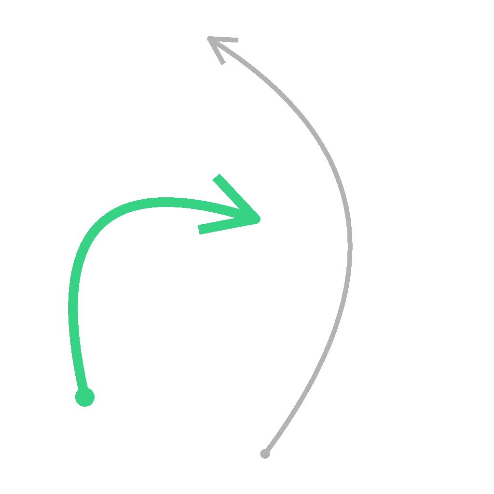

# Selección de spline

<table>
<tr style="border: 0;">
<td width="33.33%" style="border: 0;" valign="top">

<b>En:</b> Herramientas de spline y trazado > Herramientas de spline

</td>
<td width="100.00%" style="border: 0;" valign="top">

## Descripción

Selecciona splines en la lista de entrada según los criterios especificados y genera una nueva lista que incluye sólo las splines seleccionadas.

Las splines seleccionadas también se pueden recortar.

</td>
</tr>
</table>

## Entradas

|  |  |
|:---|:---|
| <b>Vista previa</b> <i>Escala de grises</i> | Vista previa de las splines de entrada como una imagen en escala de grises. |
| <b>Códigos polinómicos</b> <i>Color</i> | Las coordenadas de los puntos de las splines de entrada codificadas en los canales RGBA de una imagen en color: <b>R</b> - Posición X <b>G</b> - Posición Y <b>B</b> - Height <b>A</b> - Datos empaquetados:  - Firma: La spline está cerrada (negativa) o abierta (positiva);  - Valor absoluto: Thickness + 1. |
| <b>Datos de spline</b> <i>Color</i> | Datos adicionales de las splines de entrada codificadas en los canales RGBA de una imagen en color. <b>R</b> - Tangents X <b>G</b> - Tangents Y <b>B</b> - Sin usar <b>A</b> - Sin usar |
| <b>Cantidad de spline</b> <i>Entero</i> | Número de splines de entrada. |

## Salidas

|  |  |
|:---|:---|
| <b>Vista previa</b> <i>Escala de grises</i> | Vista previa de las splines de salida como una imagen en escala de grises. |
| <b>Códigos polinómicos</b> <i>Color</i> | Las coordenadas de los puntos de las splines de salida codificadas en los canales RGBA de una imagen en color. <b>R</b> - Posición X <b>G</b> - Posición Y <b>B</b> - Height <b>A</b> - Datos empaquetados:  - Firma: La spline está cerrada (negativa) o abierta (positiva);  - Valor absoluto: Thickness + 1. |
| <b>Datos de spline</b> <i>Color</i> | Datos adicionales de las splines de salida codificadas en los canales RGBA de una imagen en color. <b>R</b> - Tangents X <b>G</b> - Tangents Y <b>B</b> - Sin usar <b>A</b> - Sin usar |
| <b>Cantidad de spline</b> <i>Entero</i> | Número de splines de salida. |

## Parámetros

|  |  |
|:---|:---|
| <b>Modo de selección</b> <i>Entero</i> | Método de selección de las splines en la lista de entrada: - <i>Primero</i>: Selecciona la primera spline de la lista; - <i>Last</i>: Selecciona la última spline de la lista; - <i>Index</i>: Selecciona la spline con el índice especificado; - <i>Range</i>: Selecciona las splines cuyos índices se incluyen en el rango especificado. |
| <b>Índice spline</b> <i>Entero</i> | (Disponible cuando &quot;Modo de selección&quot; se define en &quot;Índice&quot;) El índice de la spline que debe seleccionarse. |
| <b>Inicio del intervalo</b> <i>Entero</i> | (Disponible cuando &quot;Modo de selección&quot; se define en &quot;Rango&quot;) El índice más bajo del rango de splines seleccionadas. |
| <b>Fin de intervalo</b> <i>Entero</i> | (Disponible cuando &quot;Modo de selección&quot; se define en &quot;Rango&quot;) El índice más alto del rango de splines seleccionadas. |
| <b>Inicio</b> <i>Flotador</i> | Desplaza el inicio de la parte de la spline que se debe seleccionar. Esto recorta la spline de manera efectiva. El valor representa la longitud normalizada de la spline. |
| <b>Fin</b> <i>Flotador</i> | Desplaza el extremo de la parte de la spline que se debe seleccionar. Esto recorta la spline de manera efectiva. El valor representa la longitud normalizada de la spline. |
| <b>Vista previa</b> |  |
| <b>Cantidad de segmentos</b> <i>Entero</i> | Ajusta el número de segmentos utilizados para dibujar la visualización de spline en la salida de vista previa. Un valor más alto produce una línea más suave. |
| <b>Mostrar ayuda de dirección</b> <i>Booleano</i> | Muestra un punto al principio de la spline y una punta de flecha al final en la salida de previsualización. |
| <b>Mostrar sobre de Thickness</b> <i>Booleano</i> | Muestra líneas adicionales en los bordes del thickness de la spline. |
| <b>Thickness (px)</b> <i>Flotador</i> | Ajusta el thickness de la visualización de la spline en píxeles en la salida de previsualización. |

## Ejemplos

<table>
<tr style="border: 0;">
<td style="border: 0;" valign="top">

<table>
  <tr>
    <td>
      
       <i>Antes</i>
    </td>
    <td>
      
       <i>Después De</i>
    </td>
  </tr>
</table>

</td>
<td style="border: 0;" valign="top">

<table>
  <tr>
    <td>
      
       <i>Antes</i>
    </td>
    <td>
      
       <i>Después De</i>
    </td>
  </tr>
</table>

</td>
</tr>
</table>

<table>
<tr style="border: 0;">
<td style="border: 0;" valign="top">

</td>
<td style="border: 0;" valign="top">

</td>
</tr>
</table>
