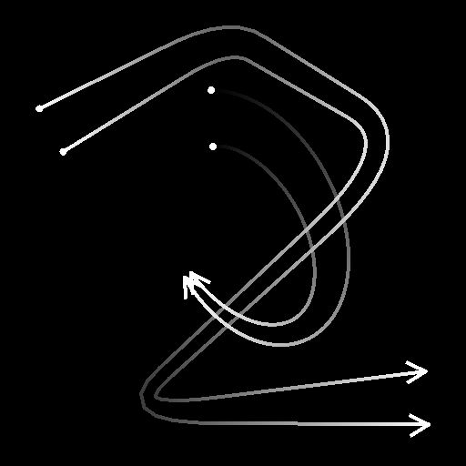

# Selección de spline

<table>
<tr style="border: 0;">
<td style="border: 0;" valign="top">

<table>
<tr style="border: 0;">
<td width="33.33%" style="border: 0;" valign="top">

<b>En:</b> Herramientas de spline y trazado > Herramientas de spline

</td>
<td width="100.00%" style="border: 0;" valign="top">

## Descripción

Selecciona splines en la lista de entrada según los criterios especificados y genera una nueva lista que incluye sólo las splines seleccionadas.

Las splines seleccionadas también se pueden recortar.

</td>
</tr>
</table>

## Conectores de entrada

<b>Vista previa</b> *Escala de grises* Vista previa de las splines de entrada como una imagen en escala de grises.

<b>Códigos polinómicos</b> *Color* Coordenadas de los puntos de las splines de entrada codificados en los canales RGBA de una imagen en color:\
Posición <b> R</b> - X\
<b> G</b> - Posición Y\
<b> B</b> - Height\
    <b>A</b> - Datos empaquetados:\
        * Firmar: La spline está cerrada (negativa) o abierta (positiva);\
        * Valor absoluto: Thickness + 1.

<b>Datos de spline</b> *Color* Datos adicionales de las splines de entrada codificadas en los canales RGBA de una imagen en color.\
<b> R</b> - Tangentes X\
<b> G</b> - Tangentes Y\
<b> B</b> - No utilizado\
<b> A</b> - No utilizado

<b>Cantidad de spline</b> *Entero* Número de splines de entrada.

## Conectores de salida

<b>Vista previa</b> *Escala de grises* Vista previa de las splines de salida como una imagen en escala de grises.

<b>Códigos polinómicos</b> *Color* Coordenadas de los puntos de las splines de salida codificados en los canales RGBA de una imagen en color.\
    Posición <b>R</b> - X\
    <b>G</b> - Posición Y\
    <b>B</b> - Height\
    <b>A</b> - Datos empaquetados:\
        * Firmar: La spline está cerrada (negativa) o abierta (positiva);\
        * Valor absoluto: Thickness + 1.

<b>Datos de spline</b> *Color* Datos adicionales de las splines de salida codificadas en los canales RGBA de una imagen en color.\
    <b>R</b> - Tangentes X\
    <b>G</b> - Tangentes Y\
    <b>B</b> - Sin usar\
    <b>A</b> - Sin usar

<b>Cantidad de spline</b> *Entero* Número de splines de salida.

## Parámetros

<b>Modo de selección</b> *Integer* Método para seleccionar las splines en la lista de entrada:\
*- Primero*: Selecciona la primera spline de la lista;\
*- Último*: Selecciona la última spline de la lista;\
*- Índice*: Selecciona la spline con el índice especificado;\
*- Intervalo*: Selecciona las splines cuyos índices se incluyen en el rango especificado.

<b>Índice spline</b> *Entero* (disponible cuando &quot;Modo de selección&quot; está establecido en &quot;Índice&quot;)El índice de la spline que debe seleccionarse.

<b>Inicio del intervalo</b> *Entero* (disponible cuando &quot;Modo de selección&quot; está establecido en &quot;Rango&quot;)El índice más bajo del rango de splines seleccionadas.

<b>Fin de intervalo</b> *Entero* (disponible cuando &quot;Modo de selección&quot; está establecido en &quot;Rango&quot;)El índice más alto del rango de splines seleccionadas.<b></b>

<b>Inicio</b> *Flotante* Desplaza el inicio de la parte de la spline que se debe seleccionar. Esto recorta la spline de manera efectiva.\
El valor representa la longitud normalizada de la spline.

<b>Fin</b> *Flotante* Desplaza el final de la parte de la spline que se debe seleccionar. Esto recorta la spline de manera efectiva.\
El valor representa la longitud normalizada de la spline.

+++Vista previa
<b>Cantidad de segmentos</b> *Entero* Ajusta el número de segmentos utilizados para dibujar la visualización de la spline en la salida de la vista previa.\
Un valor más alto produce una línea más suave.

<b>Mostrar ayuda de dirección</b> *Booleano* Muestra un punto al principio de la spline y una punta de flecha al final en la salida de vista previa.

<b>Mostrar sobre de Thickness</b> *Booleano*\
Muestra líneas adicionales en los bordes del thickness de la spline.

<b>Thickness (px)</b> *Flotante* Ajusta el thickness de la visualización de la spline en píxeles en la salida de la vista previa.

+++

## Ejemplos

<table>
<tr style="border: 0;">
<td style="border: 0;" valign="top">

<table>
  <tr>
    <td>
      
       <i>Antes</i>
    </td>
    <td>
      
       <i>Después De</i>
    </td>
  </tr>
</table>

</td>
<td style="border: 0;" valign="top">

<table>
  <tr>
    <td>
      
       <i>Antes</i>
    </td>
    <td>
      
       <i>Después De</i>
    </td>
  </tr>
</table>

</td>
</tr>
</table>

<table>
<tr style="border: 0;">
<td style="border: 0;" valign="top">

</td>
<td style="border: 0;" valign="top">

</td>
</tr>
</table>

</td>
<td style="border: 0;" valign="top">

</td>
<td style="border: 0;" valign="top">

</td>
</tr>
</table>
