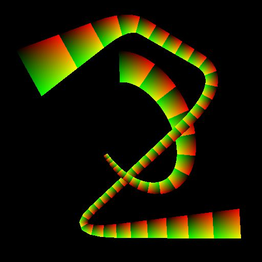

# Escala de grises del asignador UV

<table>
<tr style="border: 0;">
<td width="33.33%" style="border: 0;" valign="top">

<b>En:</b> Herramientas de spline y trazado > Herramientas de spline

</td>
<td width="100.00%" style="border: 0;" valign="top">

## Descripción

Asigna la imagen de escala de grises de entrada mediante las coordenadas proporcionadas en la entrada UV.

</td>
</tr>
</table>

>[!NOTE]
>
> Consulte también [Color del asignador UV](../../../../../../compositing-graphs/nodes-reference-for-com/node-library/spline-paths-tools/spline-tools/uv-mapper-color/uv-mapper-color.md).

## Entradas

|  |  |
|:---|:---|
| <b>UV</b> <i>Color</i> | Coordenadas de imagen codificadas en los canales rojo (U) y verde (V) de una imagen en color. |
| <b>Entrada</b> <i>Color</i> | La imagen en escala de grises que debe asignarse a las coordenadas proporcionadas en la entrada UV. |

## Salidas

|  |  |
|:---|:---|
| <b>Salida</b> <i>Color</i> | El resultado de asignar la imagen de entrada utilizando las coordenadas UV de entrada, como una imagen en escala de grises. |

## Ejemplos

<table>
<tr style="border: 0;">
<td style="border: 0;" valign="top">

<table>
  <tr>
    <td>
      
       <i>Antes</i>
    </td>
    <td>
      
       <i>Después De</i>
    </td>
  </tr>
</table>

</td>
<td style="border: 0;" valign="top">

<table>
  <tr>
    <td>
      
       <i>Antes</i>
    </td>
    <td>
      
       <i>Después De</i>
    </td>
  </tr>
</table>

</td>
</tr>
</table>

