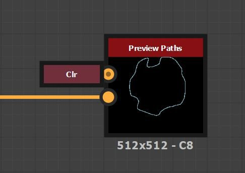

# Uso de trazados y Herramientas de spline

El conjunto de herramientas Trazado y splines es un conjunto de nodos que permite crear y editar formas y curvas que no dependen de la resolución y que se utilizan para dibujar, asignar y dispersión imágenes.

## Información general

### ¿Qué son los trazados y las splines?

<b>Los trazados</b> son una serie de puntos conectados en líneas rectas.

Las <b>splines</b> son curvas suaves cuyas trayectorias están moldeadas por puntos de control y tangentes de esos puntos.\
Cada punto también controla los atributos de height y thickness de una spline, que se utilizan para controlar la asignación, deformación y dispersión de imágenes.

Cada uno puede crear formas cerradas o abiertas.

<table>
<tr style="border: 0;">
<td width="100.00%" style="border: 0;" valign="top">

### Salida de nodo

Los nodos generan imágenes que contienen <b>datos codificados</b> que representan rutas y splines.

Por ejemplo, la imagen de la derecha representa la salida de imagen de un nodo [Paths Polygon](../../../../../compositing-graphs/nodes-reference-for-com/node-library/spline-paths-tools/path-tools/paths-polygon/paths-polygon.md).

</td>
<td width="33.33%" style="border: 0;" valign="top">

</td>
</tr>
</table>

Por lo tanto, las imágenes que producen no se pueden utilizar directamente como elemento gráfico. Es necesario que otros nodos del conjunto de herramientas los procesen para convertirlos en un resultado gráfico que pueda utilizarse con el resto de los nodos disponibles para los gráficos de Substance.

Mientras trabaja con trazados y splines, puede obtener una vista previa de estos objetos asignados en una imagen mediante el nodo dedicado [Vista previa de trazados](../../../../../compositing-graphs/nodes-reference-for-com/node-library/spline-paths-tools/path-tools/preview-paths/preview-paths.md) para trazados y la salida dedicada <b>Vista previa</b> para splines.

<table>
<tr style="border: 0;">
<td width="100.00%" style="border: 0;" valign="top">

### interacción de vista 2D

Un número significativo de nodos en el conjunto de herramientas ofrecen la capacidad de realizar ediciones directamente en el [vista 2D](../../../../../interface/2d-view/2d-view.md) mediante herramientas de control. Estos gizmos incluyen el gizmo de posición y la matriz de transformación.

Por ejemplo, los nodos de generación de splines como [Spline (Cubic)](../../../../../compositing-graphs/nodes-reference-for-com/node-library/spline-paths-tools/spline-tools/spline-cubic/spline-cubic.md) o [Spline (Poly Quadratic)](../../../../../compositing-graphs/nodes-reference-for-com/node-library/spline-paths-tools/spline-tools/spline-poly-quadratic/spline-poly-quadratic.md) le permiten mover los puntos de control de las splines. En el caso de las rutas, [Quad Transforme en Path](../../../../../compositing-graphs/nodes-reference-for-com/node-library/spline-paths-tools/path-tools/quad-transform-on-path/quad-transform-on-path.md) tiene controles similares cuando se selecciona.

</td>
<td width="33.33%" style="border: 0;" valign="top">

</td>
</tr>
</table>

### Rendimiento

Las rutas y las herramientas de spline requieren cálculos intensivos, por lo que debe tener en cuenta un par de opciones para garantizar el mejor rendimiento y capacidad de respuesta al trabajar con el conjunto de herramientas:

1. El conjunto de herramientas hace un uso extensivo de las características de <b>Substance Engine</b> que se ejecutan mucho más rápido en la GPU. Por lo tanto, utilice la versión de GPU del motor para su sistema: <b>Direct3D</b> (Windows) o <b>OpenGL</b> (macOS).\
   Puede cambiar de motor pulsando la tecla <b>F9</b> o yendo a <b>Herramientas > Cambiar motor...</b> en la barra de menú principal.
1. A continuación, recomendamos encarecidamente desactivar la <b>edición en contexto</b> en la sección <b>Graph</b> de [Preferences](../../../../../interface/preferences-window/preferences-window.md) (Ve a <b>Edit > Preferences...</b> en la barra de menú principal para acceder a esta ventana).\
   La edición en contexto permite abrir nodos de instancia en el contexto del gráfico del host, lo que es muy práctico, pero tiene el efecto secundario de aumentar exponencialmente los cálculos necesarios para la caché de imágenes del conjunto de herramientas.

Observará una mejora significativa del rendimiento al cambiar cualquiera de estas dos configuraciones al estado recomendado.

## Herramientas de Ruta

### Generación de trazados

El [Polígono de trazados](../../../../../compositing-graphs/nodes-reference-for-com/node-library/spline-paths-tools/path-tools/paths-polygon/paths-polygon.md) genera un trazado con la forma de un polígono con el radio y número de lados especificados.

También se pueden extraer rutas de una imagen en escala de grises mediante el nodo [Mask to Paths](../../../../../compositing-graphs/nodes-reference-for-com/node-library/spline-paths-tools/path-tools/mask-to-paths/mask-to-paths.md).\
Esta es actualmente la única forma de producir formas complejas, y te permite aprovechar toda la biblioteca de [nodos de gráficos Substance](../../../../../compositing-graphs/nodes-reference-for-com/nodes-reference-for-substance-compositing-graphs.md) para producir las formas que eventualmente se convertirán en trazados.

{width="600px"}

### Edición de trazados

[Transformar ruta de acceso 2D](../../../../../compositing-graphs/nodes-reference-for-com/node-library/spline-paths-tools/path-tools/path-2d-transform/path-2d-transform.md), [Deformar rutas de acceso](../../../../../compositing-graphs/nodes-reference-for-com/node-library/spline-paths-tools/path-tools/paths-warp/paths-warp.md) y [Transformar cuatro en ruta de acceso](../../../../../compositing-graphs/nodes-reference-for-com/node-library/spline-paths-tools/path-tools/quad-transform-on-path/quad-transform-on-path.md) te permiten editar la forma de las rutas de acceso.

También puede quitar rutas no deseadas seleccionando rutas por índice o por longitud, usando el nodo [Paths Select](../../../../../compositing-graphs/nodes-reference-for-com/node-library/spline-paths-tools/path-tools/paths-select/paths-select.md).

Se puede realizar un procesamiento más complejo en cada punto de una ruta con la ayuda del nodo [Paths Vertex Processor](../../../../../compositing-graphs/nodes-reference-for-com/node-library/spline-paths-tools/path-tools/paths-vertex-processor/paths-vertex-processor.md). Existe una [versión más sencilla](../../../../../compositing-graphs/nodes-reference-for-com/node-library/spline-paths-tools/path-tools/paths-vertex-processor-1/paths-vertex-processor-simple.md) para realizar ajustes más sencillos.

<table>
<tr style="border: 0;">
<td width="100.00%" style="border: 0;" valign="top">

### Nodo de rutas de previsualización

La vista previa del resultado de los nodos Paths se realiza mediante el nodo dedicado [Preview Paths](../../../../../compositing-graphs/nodes-reference-for-com/node-library/spline-paths-tools/path-tools/preview-paths/preview-paths.md).\
Este nodo no tiene resultados. Haga doble clic en LMB en el nodo para mostrar la vista previa en el [vista 2D](../../../../../interface/2d-view/2d-view.md).

Los trazados independientes tienen un color único en la previsualización para diferenciarlos fácilmente.

</td>
<td width="33.33%" style="border: 0;" valign="top">

</td>
</tr>
</table>

### Trazados a spline

Puede aprovechar todo el conjunto de herramientas dedicado a las splines con rutas, convirtiendo las rutas en splines mediante el nodo [Paths to Spline](../../../../../compositing-graphs/nodes-reference-for-com/node-library/spline-paths-tools/path-tools/paths-to-spline/paths-to-spline.md).

Tenga en cuenta que las splines son curvas, por lo que no pueden conservar la nitidez de los trazados. Se espera un cierto suavizado de las formas al convertir trazados en splines.

Una combinación muy útil para aprovechar el conjunto de herramientas de splines a través de trazados es la siguiente:

<b>Máscara > Máscara a trazados > Trazados a spline</b>

### Especificaciones de formato de trazado

El nodo Rutas de acceso de previsualización es necesario porque los nodos Rutas de acceso generan los datos de las rutas de acceso codificadas en una imagen en color.\
Esta codificación sigue una especificación descrita en la página [Especificaciones de formato de trazados](../../../../../compositing-graphs/nodes-reference-for-com/node-library/spline-paths-tools/path-tools/paths-format-spe/paths-format-specifications.md).

Puede usar esta especificación para producir sus propios nodos con este formato y aprovechar al máximo los nodos [Paths Vertex Processor](../../../../../compositing-graphs/nodes-reference-for-com/node-library/spline-paths-tools/path-tools/paths-vertex-processor/paths-vertex-processor.md).

## Herramientas de Spline

### Generación de splines

Las splines se pueden generar mediante nodos como [Spline Circle](../../../../../compositing-graphs/nodes-reference-for-com/node-library/spline-paths-tools/spline-tools/spline-circle/spline-circle.md), [Spline (Cubic)](../../../../../compositing-graphs/nodes-reference-for-com/node-library/spline-paths-tools/spline-tools/spline-cubic/spline-cubic.md) o [Spline (Poly Quadratic)](../../../../../compositing-graphs/nodes-reference-for-com/node-library/spline-paths-tools/spline-tools/spline-poly-quadratic/spline-poly-quadratic.md). Estos nodos permiten dibujar una spline de una trayectoria arbitraria utilizando distintos controles en función del nodo.

Alternativamente, las splines se pueden extraer de las rutas usando el nodo [Rutas a spline](../../../../../compositing-graphs/nodes-reference-for-com/node-library/spline-paths-tools/path-tools/paths-to-spline/paths-to-spline.md).\
Tenga en cuenta que las splines son curvas, por lo que no pueden conservar la nitidez de los trazados. Se espera un cierto suavizado de las formas al convertir trazados en splines.

Una combinación muy útil para aprovechar el conjunto de herramientas de splines a través de trazados es la siguiente:

<b>Máscara > Máscara a trazados > Trazados a spline</b>

Las splines también pueden ayudarle a generar más splines. Por ejemplo, el [Puente polinómico (2 splines)](../../../../../compositing-graphs/nodes-reference-for-com/node-library/spline-paths-tools/spline-tools/spline-bridge-2-splines/spline-bridge-2-splines.md) y el [Puente polinómico (lista)](../../../../../compositing-graphs/nodes-reference-for-com/node-library/spline-paths-tools/spline-tools/spline-bridge-list/spline-bridge-list.md) generan splines que atraviesan una lista de splines en orden.

### Edición de splines

[Transformar spline 2D](../../../../../compositing-graphs/nodes-reference-for-com/node-library/spline-paths-tools/spline-tools/spline-2d-transform/spline-2d-transform.md) y [Deformar spline](../../../../../compositing-graphs/nodes-reference-for-com/node-library/spline-paths-tools/spline-tools/spline-warp/spline-warp.md) te permiten editar la forma de las splines.

También puede quitar splines no deseadas seleccionando rutas por índice, así como recortar splines, usando el nodo [Spline Select](../../../../../compositing-graphs/nodes-reference-for-com/node-library/spline-paths-tools/spline-tools/spline-select/spline-select.md).

Además de su trayectoria, las propiedades de height y thickness de las splines se pueden ajustar posteriormente mediante el [Height de muestra de spline](../../../../../compositing-graphs/nodes-reference-for-com/node-library/spline-paths-tools/spline-tools/spline-sample-height/spline-sample-height.md) y el [Thickness de muestra de spline](../../../../../compositing-graphs/nodes-reference-for-com/node-library/spline-paths-tools/spline-tools/spline-sample-thickness/spline-sample-thickness.md).

Por último, las splines independientes se pueden combinar en una sola spline gracias al nodo [Spline Merge List](../../../../../compositing-graphs/nodes-reference-for-com/node-library/spline-paths-tools/spline-tools/spline-merge-list/spline-merge-list.md).

### Incorporación de splines

A medida que crea y edita splines, es posible que necesite combinar varias splines para ajustarlas o utilizarlas todas a la vez.

Es importante tener en cuenta que las splines se almacenan y procesan como una <b>lista ordenada</b>.

La combinación de splines se realiza mediante el nodo [Spline Append](../../../../../compositing-graphs/nodes-reference-for-com/node-library/spline-paths-tools/spline-tools/spline-append/spline-append.md). La adición es el acto de agregar algo al final de una entidad ordenada. De hecho, el nodo combina dos listas de splines agregando el segundo conjunto al final del primer conjunto.

Por lo tanto, es muy importante tener en cuenta el orden en el que se añaden las splines juntas.

Esto afecta a los nodos que necesitan combinar splines, como [Puente spline (lista)](../../../../../compositing-graphs/nodes-reference-for-com/node-library/spline-paths-tools/spline-tools/spline-bridge-list/spline-bridge-list.md), [Asignador de puente spline](../../../../../compositing-graphs/nodes-reference-for-com/node-library/spline-paths-tools/spline-tools/spline-bridge-mapper-gra/spline-bridge-mapper-grayscale.md) y [Lista de combinación spline](../../../../../compositing-graphs/nodes-reference-for-com/node-library/spline-paths-tools/spline-tools/spline-merge-list/spline-merge-list.md).

### Entradas y salidas polinomiales

Las splines se pasan de un nodo a otro mediante un grupo de conectores:

* <b>Códigos polinómicos </b>*Color* Coordenadas de los puntos de las splines de entrada codificados en los canales RGBA de una imagen en color.
* <b>Datos de spline </b>*Color* Datos adicionales de las splines de entrada codificadas en los canales RGBA de una imagen en color.
* <b>Cantidad de spline </b>*Entero* El número de splines de entrada.

Cada conector de salida del nodo de origen debe estar conectado al conector de entrada del nombre coincidente en el nodo de destino.

Para agilizar estas conexiones, puedes usar <b>Material</b> o <b>Material compacto</b> [modos de creación de vínculos](../../../../../interface/the-graph-view/link-creation-modes/link-creation-modes.md). Esto permite conectar los tres conectores de spline en una sola operación.

<table>
<tr style="border: 0;">
<td style="border: 0;" valign="top">

### Previsualización de salida

La mayoría de los nodos ofrecen una salida de <b>Preview</b> que procesa las splines de una imagen para que puedas hacerte una idea de cuáles son sus trayectorias y propiedades.

Esta vista previa se puede ajustar en los parámetros del nodo, mediante los parámetros del grupo <b>Preview</b>.

</td>
<td style="border: 0;" valign="top">

</td>
</tr>
</table>

<table>
<tr style="border: 0;">
<td width="100.00%" style="border: 0;" valign="top">

### Procesar como segmentos

Las splines son curvas sin resolución inherente, lo que significa que se pueden aumentar o reducir indefinidamente, con el único límite para representarlas con precisión, que es la precisión utilizada para almacenar sus datos.

Para dibujar una spline como píxeles, el conjunto de herramientas las simplifica en líneas o segmentos dibujados a lo largo de la trayectoria de las splines.

</td>
<td width="33.33%" style="border: 0;" valign="top">

</td>
</tr>
</table>

Esto significa que puede ser necesario prestar atención al número de segmentos utilizados para dibujar una spline en una imagen, ya que ese número puede ser demasiado bajo para dibujar curvas suaves o demasiado alto y desperdiciado para la resolución de destino.

Los nodos que dibujan splines en una imagen tienen un parámetro <b>Cantidad de segmentos</b> que le permite controlar esa cantidad de segmentos. Un valor más alto produce curvas más suaves a costa del rendimiento.

### Creación de imágenes desde splines

Cuando haya terminado de crear y editar splines, se pueden utilizar para producir imágenes que puedan aprovechar el resto de los nodos de gráficos del Substance.

Existen tres formas principales de utilizar las splines para generar gráficos:

* Procese la spline usando su forma y propiedades con el nodo [Spline Render](../../../../../compositing-graphs/nodes-reference-for-com/node-library/spline-paths-tools/spline-tools/spline-render/spline-render.md) o [Spline Fill](../../../../../compositing-graphs/nodes-reference-for-com/node-library/spline-paths-tools/spline-tools/spline-fill/spline-fill.md);
* Asigne imágenes a lo largo de las splines con nodos de asignación como [Spline Mapper](../../../../../compositing-graphs/nodes-reference-for-com/node-library/spline-paths-tools/spline-tools/spline-mapper-grayscale/spline-mapper-grayscale.md), [Spline Bridge Mapper](../../../../../compositing-graphs/nodes-reference-for-com/node-library/spline-paths-tools/spline-tools/spline-bridge-mapper-gra/spline-bridge-mapper-grayscale.md) y [Spline Flow Mapper](../../../../../compositing-graphs/nodes-reference-for-com/node-library/spline-paths-tools/spline-tools/spline-flow-mapper/spline-flow-mapper.md);
* Patrones de dispersión a lo largo de las splines con la Dispersión [en el nodo Spline](../../../../../compositing-graphs/nodes-reference-for-com/node-library/spline-paths-tools/spline-tools/scatter-spline-grayscale/scatter-on-spline-grayscale.md).
