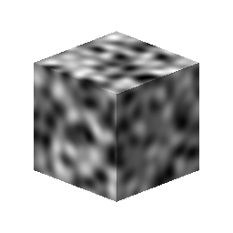

# Ruido simple en 3D

<table>
<tr style="border: 0;">
<td style="border: 0;" valign="top">

{width="128px"}

## Ruido simple en 3D

**En:** *Generadores De Texturas**/Ruidos*

**Intermedio**

</td>
<td style="border: 0;" valign="top">

## Descripción

Genera un ruido de procedimiento cuando se conecta un mapa de posición al horno en la ranura de entrada. Está diseñado para su uso únicamente con el motor de GPU.\
Similar a [Ruido 3D Perlin](../../../../../../compositing-graphs/nodes-reference-for-com/node-library/texture-generators/noises/3d-perlin-noise/3d-perlin-noise.md), pero más rápido y sencillo, para los casos en los que el rendimiento y la velocidad importan.

Este ruido se puede probar con [Cube 3D GBuffers](https://support.allegorithmic.com/documentation/display/SDDOC/Cube+3D+GBuffers) como entrada en lugar de un mapa con bake real (como se muestra en la imagen de ejemplo siguiente).

## Parámetros

* **Escala**: *0.0 - 64.0*\
  Establezca la escala global del efecto.
* **Tamaño**: *0.0 - 2.0* Realice escalas no uniformes en los ejes X, Y y Z por separado.

## Imágenes de ejemplo

</td>
</tr>
</table>
