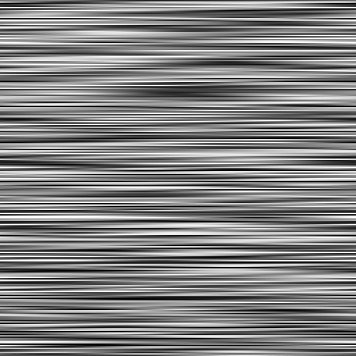
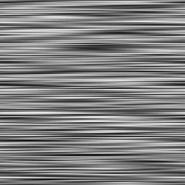

# Ruido anisotrópico

<table>
<tr style="border: 0;">
<td style="border: 0;" valign="top">

<table>
<tr style="border: 0;">
<td width="33.33%" style="border: 0;" valign="top">

{width="200px"}

<b>En:</b> Generadores de texturas > Ruidos

</td>
<td width="100.00%" style="border: 0;" valign="top">

## Descripción

Pila horizontal o vertical de bandas de colores aleatorios que se desvanecen entre sí.

La cantidad de tiras es ajustable, al igual que el smoothness de sus transiciones.

</td>
</tr>
</table>

<table>
<tr style="border: 0;">
<td style="border: 0;" valign="top">

### Salidas

</td>
<td style="border: 0;" valign="top">

### Parámetros

</td>
<td style="border: 0;" valign="top">

### Ejemplos

</td>
</tr>
</table>

## Salidas

|  |  |
| --- | --- |
| <b>Salida</b> *Escala de grises* | El ruido generado como un mapa de bits en escala de grises. |

## Parámetros

|  |  |
| --- | --- |
| <b>X amount</b> Integer | Cantidad de bandas en el eje X. |
| <b>Cantidad Y</b> Entero | Cantidad de bandas en el eje Y. |
| <b>Cantidad Y por resolución</b> Booleano | Si su valor es True, el número de bandas del eje Y será igual al tamaño de imagen de dicho eje. |
| Booleano <b>Rotate</b> | Rota el ruido 90 grados. |
| Flotador <b>Smoothness</b> | Cantidad de atenuación entre las tiras, donde 0 es sin atenuación y 1 es atenuación en toda su longitud. |
| <b>Interpolación de Smoothness</b> Float | La ponderación de los dos métodos de interpolación aplicados para desvanecer las tiras, donde 0 es lineal y 1 es gaussiano. |
| Flotador <b>Disorder</b> | Desplaza los ingredientes del ruido.   Se puede utilizar para animar el ruido. |
| <b>Velocidad del desorden</b> Flotador | Ajusta la distancia de desplazamiento aplicada por el parámetro <b>Disorder</b>.   Se puede utilizar para controlar la velocidad del desplazamiento al animar el ruido. |
| <b>Expansión no cuadrada</b> Boolean | En imágenes no cuadradas, mantiene el cuadrado del mosaico generado y expande la generación de ruido a los límites de la imagen. |

## Ejemplos

<table>
<tr style="border: 0;">
<td style="border: 0;" valign="top">

{zoomable="yes"}

</td>
<td style="border: 0;" valign="top">

{zoomable="yes"}

</td>
</tr>
</table>

</td>
<td style="border: 0;" valign="top">

</td>
<td style="border: 0;" valign="top">

</td>
</tr>
</table>
