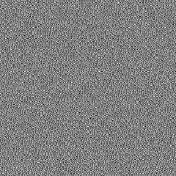

# Blue Noise Fast

<table>
<tr style="border: 0;">
<td style="border: 0;" valign="top">

{width="128px"}

## Blue Noise Fast

**En:** *Generadores De Texturas**/Ruidos*

**Simple**

</td>
<td style="border: 0;" valign="top">

## Descripción

Un ruido simple, rápido y a escala de píxeles.

## Parámetros

* **Rotación**: *0.0 - 1.0* Gira los cálculos internos del efecto. Esto puede cambiar bastante el aspecto visual del ruido: cuanto más alejado esté el efecto de 1, menor será la escala de píxeles y se presentarán las &quot;ondas&quot; más visibles.

## Imágenes de ejemplo

</td>
</tr>
</table>
