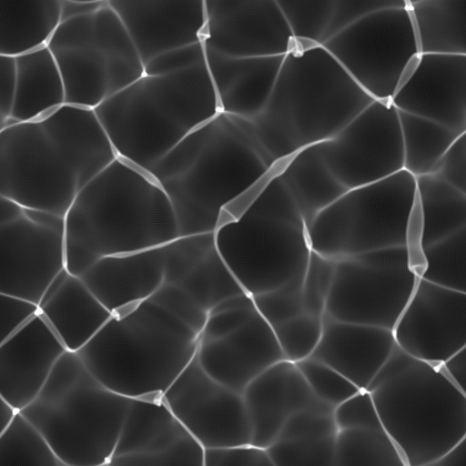

# Cáustico

<table>
<tr style="border: 0;">
<td width="41.60%" style="border: 0;" valign="top">

{width="128px"}

**En:** *Generadores De Texturas**/Ruidos*

**Complejo**

</td>
<td width="58.30%" style="border: 0;" valign="top">

## Descripción

Genera cáusticos proyectados basados en un mapa de height y una dirección de la luz.Tanto en la versión en escala de grises como en la de color, las diferencias son sutiles, pero la versión en color añade efectos de dispersión de color. La luz se proyecta desde un único punto, no se utiliza ningún mapa de entorno.

</td>
</tr>
</table>

## Parámetros

* **Espacio de color de salida**: *Raw, sRGB*\
  Establecer el espacio de color de salida.
* **Tamaño de cuadrícula de fotones**: *Auto, 512, 1024, 2048, 4096*\
  Establece la calidad ajustando el tamaño de la cuadrícula, pero de forma predeterminada la entrada coincidente. Se puede utilizar para acelerar el cálculo.
* **Escala de Height de superficie**: *0.0 - 1.0*\
  Multiplicador para determinar la interpretación del height.
* **Posición del Height de superficie**: *0.0 - 1.0*\
  Ajuste la distancia de la superficie de refracción a la proyección.
* **IOR de superficie**: *1.0 - 2.0*\
  Defina el índice de refracción; en la versión de color, esto añade más dispersión de color.
* **Tamaño del fotón**: *1.0 - 50.0*\
  El tamaño del fotón afecta a la nitidez del efecto.
* **Dispersión**: *0.0 - 0.01 (solo versión de color)*\
  Afecta solo a la dispersión del color. No es visible cuando el IOR es bajo.
* **Vibración**: *0.0 - 1.0*\
  Añada vibraciones irregulares a las partículas de fotones fundidos.
* **Posición de la luz**:\
  Mueve la posición de la luz. También se realiza mediante un gizmo en la vista 2D.
* **Color de fondo**: *(Valor de color) (Solo versión de color)*\
  Cambiar el color de fondo. Limitado al negro en la versión en escala de grises.
* **Expansión no cuadrada**: *Falso/Verdadero*\
  Active la compensación de aplastamiento y estiramiento con proporciones que no sean de cuadrados.

## Imágenes de ejemplo

| 

 |
| --- |
|  |
