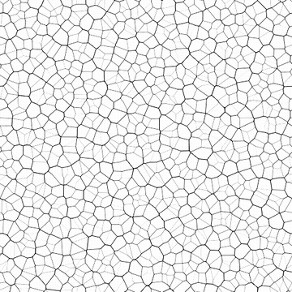
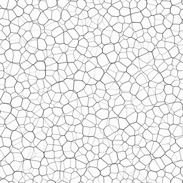

# CELDAS 3

<table>
<tr style="border: 0;">
<td style="border: 0;" valign="top">

<table>
<tr style="border: 0;">
<td width="33.33%" style="border: 0;" valign="top">

{width="200px"}

<b>En:</b> Generadores de texturas > Ruidos

</td>
<td width="100.00%" style="border: 0;" valign="top">

## Descripción

Una variación de los <b>Celdas</b> ruidos de pared.

La intersección de discos produce células con paredes delgadas de suavidad desigual.

Consulte también: [Celdas 1](../../../../../../compositing-graphs/nodes-reference-for-com/node-library/texture-generators/noises/cells-1/cells-1.md), [Celdas 2](../../../../../../compositing-graphs/nodes-reference-for-com/node-library/texture-generators/noises/cells-2/cells-2.md), [Celdas 4](../../../../../../compositing-graphs/nodes-reference-for-com/node-library/texture-generators/noises/cells-4/cells-4.md)

</td>
</tr>
</table>

<table>
<tr style="border: 0;">
<td style="border: 0;" valign="top">

### Salidas

</td>
<td style="border: 0;" valign="top">

### Parámetros

</td>
<td style="border: 0;" valign="top">

### Ejemplos

</td>
</tr>
</table>

## Salidas

|  |  |
| --- | --- |
| <b>Salida</b> *Escala de grises* | El ruido generado como un mapa de bits en escala de grises. |

## Parámetros

|  |  |
| --- | --- |
| Entero <b>Scale</b> | Subdivisión de la cuadrícula utilizada para generar los mosaicos de ruido.    Un valor más alto provoca que se dibujen más mosaicos y que el ruido sea más denso. |
| Flotador <b>Dureza</b> | Definición de las paredes de celdas, donde un valor más alto produce paredes más definidas y nítidas. |
| Booleano <b>Invert</b> | Invierte los valores de escala de grises del resultado de la imagen. |
| Flotador <b>Disorder</b> | Desplaza los ingredientes del ruido.    Se puede utilizar para animar el ruido. |
| <b>Velocidad del desorden</b> Flotador | Ajusta la distancia de desplazamiento aplicada por el parámetro <b>Disorder</b>.    Se puede utilizar para controlar la velocidad del desplazamiento al animar el ruido. |
| Flotador <b>anisotropía de desorden</b> | Controla el intervalo de direcciones del desplazamiento aplicado por el parámetro <b>Disorder</b>, donde un valor más alto produce una dirección más estrecha y definida.    La dirección se controla mediante el parámetro <b>Ángulo de anisotropía de desorden</b>. |
| <b>Ángulo de anisotropía del desorden</b> Flotante | Controla la dirección del desplazamiento aplicado por el parámetro <b>Disorder</b> cuando el parámetro &#39;Disorder anisotropía&#39; no es cero. |
| <b>Tamaño de patrón</b> Float2 | Un multiplicador para el tamaño de un disco disperso en su celda., donde 1.0 es la extensión completa de la celda. |
| <b>Escala de patrón</b> Float | Un multiplicador para <b>Pattern size</b>, donde 1.0 es el tamaño completo. |
| Flotador <b>Ángulo</b> | El ángulo utilizado para establecer la dirección de los discos, en número de vueltas y comenzando desde la derecha horizontal. |
| Flotador <b>Ángulo aleatorio</b> | Cantidad máxima de variación aleatoria aplicada al valor <b>Angle</b>, en número de vueltas. |
| <b>Desplazamiento del azulejo</b> Float2 | Controla la posición de la parte del plano infinito utilizada para procesar el ruido. |
| <b>Expansión no cuadrada</b> Boolean | En imágenes no cuadradas, mantiene el cuadrado del mosaico generado y expande la generación de ruido a los límites de la imagen. |

## Ejemplos

<table>
<tr style="border: 0;">
<td style="border: 0;" valign="top">

{zoomable="yes"}

</td>
<td style="border: 0;" valign="top">

{zoomable="yes"}

</td>
</tr>
</table>

<table>
<tr style="border: 0;">
<td style="border: 0;" valign="top">

{zoomable="yes"}

</td>
<td style="border: 0;" valign="top">

{zoomable="yes"}

</td>
</tr>
</table>

</td>
<td style="border: 0;" valign="top">

</td>
<td style="border: 0;" valign="top">

</td>
</tr>
</table>
