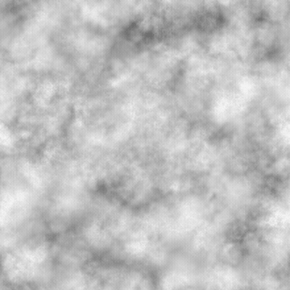

# Clouds 2

<table>
<tr style="border: 0;">
<td width="33.33%" style="border: 0;" valign="top">

{width="200px"}

<b>En:</b> Generadores de texturas > Ruidos

</td>
<td width="100.00%" style="border: 0;" valign="top">

## Descripción

Variación de los ruidos aproximados de <b>Nubes</b>.

Consulte también: [Nubes 1](../../../../../../compositing-graphs/nodes-reference-for-com/node-library/texture-generators/noises/clouds-1/clouds-1.md), [Nubes 3](../../../../../../compositing-graphs/nodes-reference-for-com/node-library/texture-generators/noises/clouds-3/clouds-3.md)

</td>
</tr>
</table>

## Salidas

|  |  |
|:---|:---|
| <b>Salida</b> <i>Escala de grises</i> | El ruido generado como un mapa de bits en escala de grises. |

## Parámetros

|  |  |
|:---|:---|
| <b>Escala</b> <i>Entero</i> | Subdivisión de la cuadrícula utilizada para generar los mosaicos de ruido.    Un valor más alto provoca que se dibujen más mosaicos y que el ruido sea más denso. |
| <b>Desorden</b> <i>Flotador</i> | Desplaza los ingredientes del ruido.    Se puede utilizar para animar el ruido. |
| <b>Velocidad del desorden</b> <i>Flotador</i> | Ajusta la distancia de desplazamiento aplicada por el parámetro <b>Disorder</b>.    Se puede utilizar para controlar la velocidad del desplazamiento al animar el ruido. |
| <b>anisotropía de desorden</b> <i>Flotador</i> | Controla el intervalo de direcciones del desplazamiento aplicado por el parámetro <b>Disorder</b>, donde un valor más alto produce una dirección más estrecha y definida.    La dirección se controla mediante el parámetro <b>Ángulo de anisotropía de desorden</b>. |
| <b>ángulo de anisotropía de desorden</b> <i>Flotador</i> | Controla la dirección del desplazamiento aplicado por el parámetro <b>Disorder</b>, cuando el parámetro <b>Disorder anisotropía</b> no es cero. |
| <b>Desplazamiento de mosaico</b> <i>Float2</i> | Controla la posición de la parte del plano infinito utilizada para procesar el ruido. |
| <b>Expansión no cuadrada</b> <i>Booleano</i> | En imágenes no cuadradas, mantiene el cuadrado del mosaico generado y expande la generación de ruido a los límites de la imagen. |

## Ejemplos

<table>
<tr style="border: 0;">
<td style="border: 0;" valign="top">

{zoomable="yes"}

</td>
<td style="border: 0;" valign="top">

{zoomable="yes"}

</td>
</tr>
</table>

<table>
<tr style="border: 0;">
<td style="border: 0;" valign="top">

{zoomable="yes"}

</td>
<td style="border: 0;" valign="top">

{zoomable="yes"}

</td>
</tr>
</table>
