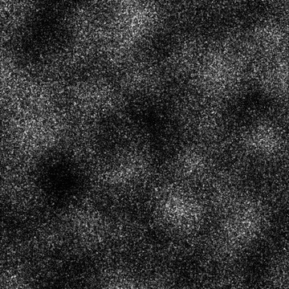

# DIRT 1

<table>
<tr style="border: 0;">
<td width="33.33%" style="border: 0;" valign="top">

{width="200px"}

<b>En:</b> Generadores de Textura > Ruidos

</td>
<td width="100.00%" style="border: 0;" valign="top">

## Descripción

Variación de los ruidos granulados del <b>Dirt</b>.

Consulte también: [Dirt 2](../../../../../../compositing-graphs/nodes-reference-for-com/node-library/texture-generators/noises/dirt-2/dirt-2.md), [Dirt 3](../../../../../../compositing-graphs/nodes-reference-for-com/node-library/texture-generators/noises/dirt-3/dirt-3.md), [Dirt 4](../../../../../../compositing-graphs/nodes-reference-for-com/node-library/texture-generators/noises/dirt-4/dirt-4.md), [Dirt 5](../../../../../../compositing-graphs/nodes-reference-for-com/node-library/texture-generators/noises/dirt-5/dirt-5.md), [degradado de Dirt](../../../../../../compositing-graphs/nodes-reference-for-com/node-library/texture-generators/noises/dirt-gradient/dirt-gradient.md)

</td>
</tr>
</table>

## Salidas

|  |  |
|:---|:---|
| <b>Salida</b> <i>Escala de grises</i> | El ruido generado como un mapa de bits en escala de grises. |

## Parámetros

|  |  |
|:---|:---|
| <b>Escala</b> <i>Entero</i> | Subdivisión de la cuadrícula utilizada para generar los mosaicos de ruido.    Un valor más alto provoca que se dibujen más mosaicos y que el ruido sea más denso. |
| <b>Desorden</b> <i>Flotante</i> | Desplaza los ingredientes del ruido.    Se puede utilizar para animar el ruido. |
| <b>Velocidad del desorden</b> <i>Flotante</i> | Ajusta la distancia de desplazamiento aplicada por el parámetro <b>Disorder</b>.    Se puede utilizar para controlar la velocidad del desplazamiento al animar el ruido. |
| <b>anisotropía de desorden</b> <i>Flotante</i> | Controla el intervalo de direcciones del desplazamiento aplicado por el parámetro <b>Disorder</b>, donde un valor más alto produce una dirección más estrecha y definida.    La dirección está controlada por el parámetro <b>ángulo de anisotropía de desorden</b>. |
| <b>ángulo de anisotropía de desorden</b> <i>Flotante</i> | Controla la dirección del desplazamiento aplicado por el parámetro <b>Disorder</b>, cuando el parámetro <b>Disorder anisotropía</b> no es cero. |
| <b>Desplazamiento de mosaico</b> <i>Flotante2</i> | Controla la posición de la parte del plano infinito utilizada para procesar el ruido. |
| <b>Expansión no cuadrada</b> <i>Booleano</i> | En imágenes no cuadradas, mantiene el cuadrado del mosaico generado y expande la generación de ruido a los límites de la imagen. |

## Ejemplos

<table style="table-layout:fixed">
    <tr style="border: 0;">
        <td style="border: 0;">
            
        </td>
        <td style="border: 0;">
            
        </td>
        <td style="border: 0;">
            
        </td>
    </tr>
    <tr style="border: 0;">
        <td style="border: 0;">
            
        </td>
        <td style="border: 0;"></td>
        <td style="border: 0;"></td>
    </tr>
</table>
