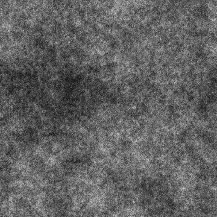

# SUMA FRACTAL 1

<table>
<tr style="border: 0;">
<td width="33.33%" style="border: 0;" valign="top">

{width="200px"}

<b>En:</b> Generadores de texturas > Ruidos

</td>
<td width="100.00%" style="border: 0;" valign="top">

## Descripción

Una variación de los <b>ruidos de Suma fractal</b>.

Consulte también: [base de Sumas fractal](../../../../../../compositing-graphs/nodes-reference-for-com/node-library/texture-generators/noises/fractal-sum-base/fractal-sum-base.md), [Suma fractal 2](../../../../../../compositing-graphs/nodes-reference-for-com/node-library/texture-generators/noises/fractal-sum-2/fractal-sum-2.md), [Suma fractal 3](../../../../../../compositing-graphs/nodes-reference-for-com/node-library/texture-generators/noises/fractal-sum-3/fractal-sum-3.md), [Suma fractal 4](../../../../../../compositing-graphs/nodes-reference-for-com/node-library/texture-generators/noises/fractal-sum-4/fractal-sum-4.md)

</td>
</tr>
</table>

## Salidas

|  |  |
|:---|:---|
| <b>Salida</b> <i>Escala de grises</i> | El ruido generado como un mapa de bits en escala de grises. |

## Parámetros

|  |  |
|:---|:---|
| <b>Desorden</b> <i>Flotador</i> | Desplaza los ingredientes del ruido.    Se puede utilizar para animar el ruido. |
| <b>Velocidad del desorden</b> <i>Flotador</i> | Ajusta la distancia de desplazamiento aplicada por el parámetro <b>Disorder</b>.    Se puede utilizar para controlar la velocidad del desplazamiento al animar el ruido. |
| <b>Expansión no cuadrada</b> <i>Booleano</i> | En imágenes no cuadradas, mantiene el cuadrado del mosaico generado y expande la generación de ruido a los límites de la imagen. |

## Ejemplos

<table>
<tr style="border: 0;">
<td style="border: 0;" valign="top">

{zoomable="yes"}

</td>
<td style="border: 0;" valign="top">

{zoomable="yes"}

</td>
</tr>
</table>
