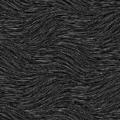

# Piel 2

<table>
<tr style="border: 0;">
<td style="border: 0;" valign="top">

{width="128px"}

## Piel 2

**En:** *Generadores De Texturas**/Ruidos*

**Simple**

</td>
<td style="border: 0;" valign="top">

## Descripción

Esto genera un tipo de ruido ondulado parecido al de un pelo.

## Parámetros

* **Escala**: *1 - 8*\
  Establece la escala global del efecto.
* Escala de **ondas**: *0.0 - 1.0*\
  Modifica la escala de las ondas, más grande significa menos repeticiones.
* Rotación de **ondas**: *0.0 - 1.0*\
  Gira más las olas. Este valor probablemente debería mantenerse bajo, ya que los resultados pueden ser extremos.
* **Expansión no cuadrada**: *Falso/Verdadero*\
  Permite la compensación de aplastamiento y estiramiento con proporciones no cuadradas.

## Imágenes de ejemplo

</td>
</tr>
</table>
