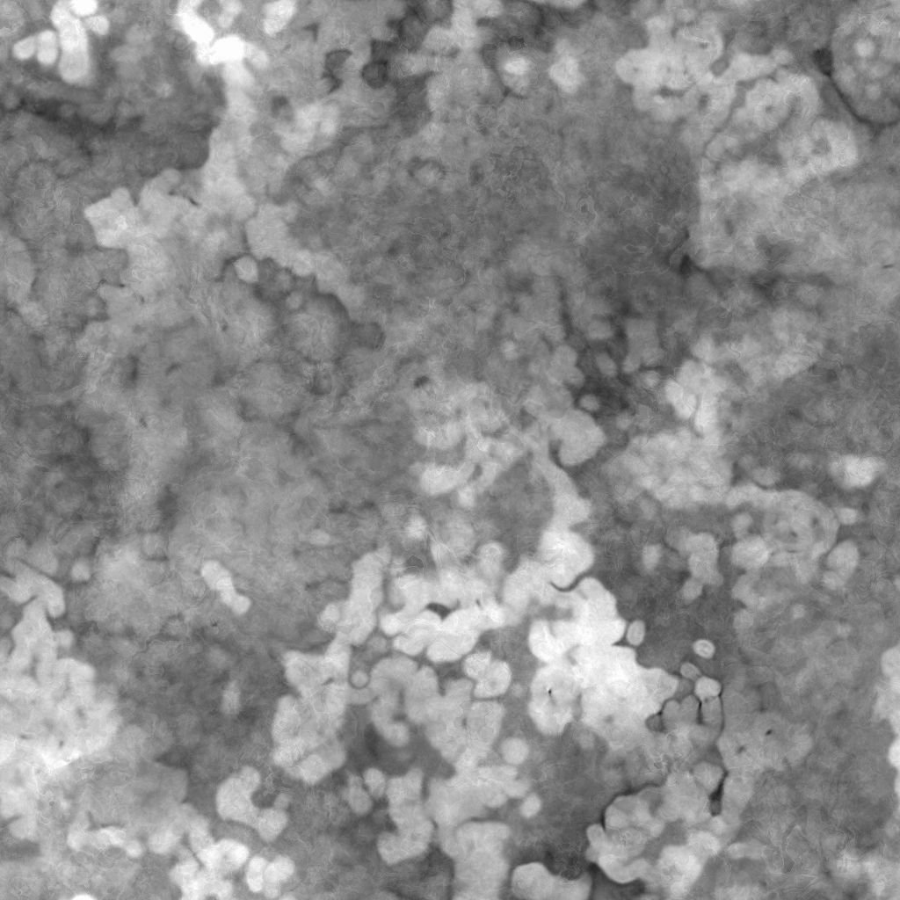

# Suciedad galvánica grande

<table>
<tr style="border: 0;">
<td width="41.60%" style="border: 0;" valign="top">

{width="200px"}

**En:** *Generadores De Texturas**/Ruidos*

**Simple**

</td>
<td width="58.30%" style="border: 0;" valign="top">

## Descripción

El nodo **Suciedad Galvanic Large** genera un mapa de suciedades similar al patrón de acero galvanizado.

</td>
</tr>
</table>

## Parámetros

* **Equilibrio** *Flotante* Ajusta el equilibrio entre los valores oscuros y brillantes.
* **Contraste** *Flotante* Ajusta el contraste de la imagen.
* **Invertir** *Boolean* Invierte el resultado de la imagen mediante una operación `1-x`.
* **Expansión no cuadrada** *Booleano* Habilita la compensación de aplastamiento y estiramiento con proporciones no cuadradas.
* Avanzadas
  * **Intensidad de deformación** *Flotante* Ajusta la intensidad del efecto de deformación principal.
  * **Opacidad de detalle de reborde** *Flotante* Ajusta la opacidad de las crestas más brillantes.
  * **Intensidad de enfoque** *Flotante* Ajusta la intensidad del efecto de enfoque global.

## Imágenes de ejemplo

<table>
<tr style="border: 0;">
<td style="border: 0;" valign="top">

{width="256px"}

</td>
<td style="border: 0;" valign="top">

{width="256px"}

</td>
</tr>
</table>
