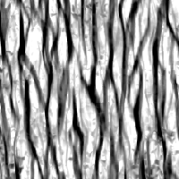

# Mapa de suciedades 005

<table>
<tr style="border: 0;">
<td style="border: 0;" valign="top">

{width="128px"}

## Mapa de suciedades 005

**En:** *Generadores De Texturas**/Ruidos*

**Intermedio**

</td>
<td style="border: 0;" valign="top">

## Descripción

Esto genera un mapa de ruido complejo y combinado. Puede ser muy útil como procedimiento detallado, pero tenga en cuenta que estos son muy intensivos en rendimiento y, por lo tanto, más lentos de generar.

## Parámetros

* **Saldo**: *0.0 - 1.0*\
  Cambia el equilibrio del resultado entre blanco o negro, como un ajuste de brillo.
* **Contraste**: *0.0 - 1.0*\
  Ajusta el contraste del resultado.
* **Trastorno**: *0.0 - 1.0*\
  Desplaza la fase del ruido para introducir pequeñas variaciones.
* **Invertir**: *Falso/Verdadero*\
  Invierte el resultado.
* **Patrón de pincel**: *0.0 - 1.0*\
  Añade una máscara alrededor de los bordes para cuando se usa como pincel alfa.
* **Expansión no cuadrada**: *Falso/Verdadero*\
  Permite la compensación de aplastamiento y estiramiento con proporciones no cuadradas.

## Imágenes de ejemplo

</td>
</tr>
</table>
