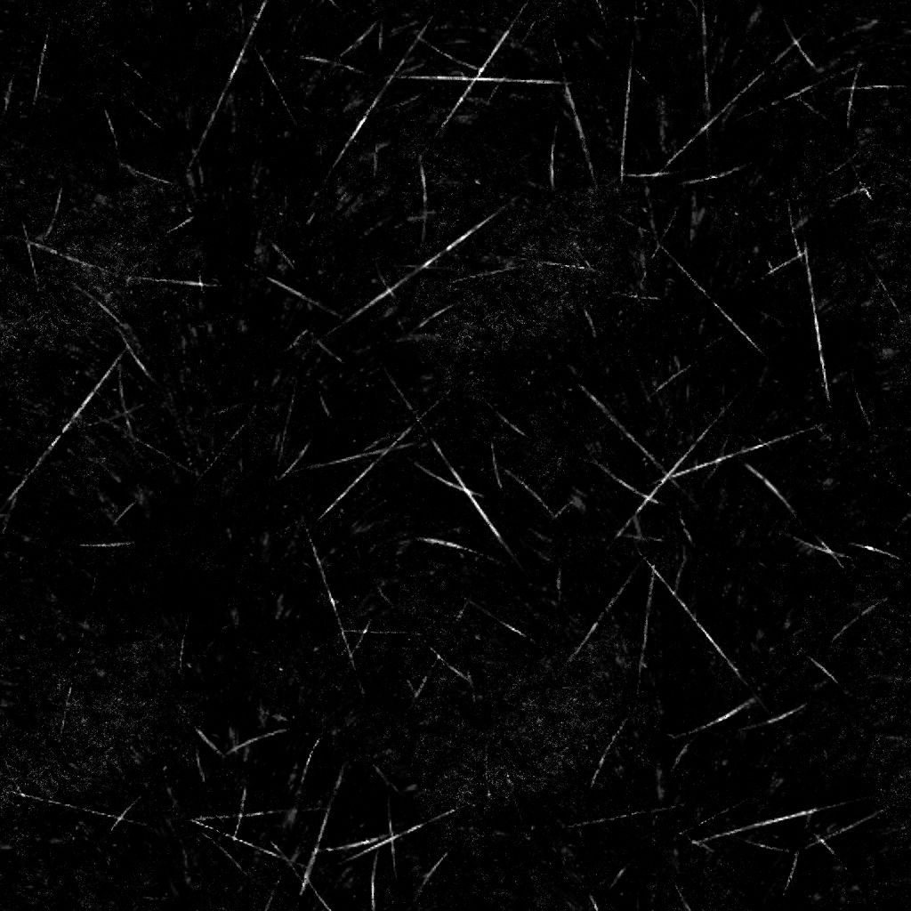

# Scratches de suciedades Rough

<table>
<tr style="border: 0;">
<td width="41.60%" style="border: 0;" valign="top">

{width="200px"}

**En:** *Generadores De Texturas* */Ruidos*

**Simple**

</td>
<td width="58.30%" style="border: 0;" valign="top">

## Descripción

El nodo **Suciedad Scratches Rough** genera un mapa de suciedades similar a una superficie polvorienta apenas arañada.

</td>
</tr>
</table>

## Parámetros

* **Equilibrio** *Flotante* Ajusta el equilibrio entre los valores oscuros y brillantes.
* **Contraste** *Flotante* Ajusta el contraste de la imagen.
* **Invertir** *Boolean* Invierte el resultado de la imagen mediante una operación `1-x`.
* **Expansión no cuadrada** *Booleano* Habilita la compensación de aplastamiento y estiramiento con proporciones no cuadradas.
* Avanzadas
  * **Cantidad de arañazos** *Flotante* Ajusta la cantidad de arañazos en la superficie.
  * **Mosaico de muestras** *Entero* Ajusta la cantidad de mosaico aplicado a los arañazos.
  * **Desenfoque por rascado** *Flotante* Ajusta el desenfoque de los rasguños.
  * **Anchura de rascado** *Flotante* Ajusta la anchura de los rasguños.
  * **Longitud de rasguño** *Flotante* Ajusta la longitud de los rasguños.
  * **Enmascaramiento de arañazos** *Flotante* Ajusta la intensidad de la máscara aplicada en partes de los arañazos.
  * **Suciedad de rasguños** *Flotador* Ajusta la suciedad de los rasguños, lo que rompe su nitidez y continuidad.
  * **Doble rasguño** *Flotante* Ajusta la opacidad de un segundo rasguño aplicado junto a cada rasguño con un ligero efecto de deformación.
  * **Intensidad de manchas de rayado** *Flotador* Ajusta la intensidad de las manchas dañadas aplicadas junto con las rayaduras.
  * **Mosaico de manchas de rayado** *Entero* Ajusta el mosaico de las manchas dañadas.
  * **Intensidad del Dust** *Flotante* Ajusta la intensidad de la superposición del dust.
  * **Mosaico de Dust** *Entero* Ajusta el mosaico de la superposición de dust.
  * **Intensidad de enfoque** *Flotante* Ajusta la intensidad del efecto de enfoque global.

## Imágenes de ejemplo

<table>
<tr style="border: 0;">
<td style="border: 0;" valign="top">

{width="256px"}

</td>
<td style="border: 0;" valign="top">

{width="256px"}

</td>
</tr>
</table>
