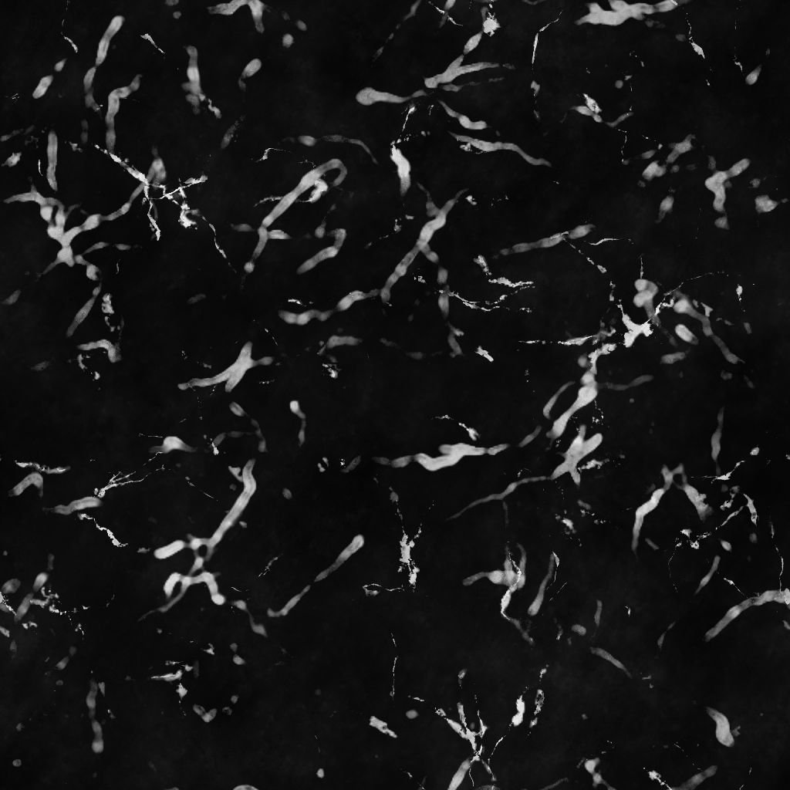

# Suciedad salpicaduras Polvoriento

<table>
<tr style="border: 0;">
<td width="33.33%" style="border: 0;" valign="top">

{width="200px"}

<b>En:</b> Generadores de Textura > Ruidos

</td>
<td width="100.00%" style="border: 0;" valign="top">

## Descripción

El nodo **Suciedad Splashes Dusty** genera un mapa de suciedades similar a salpicaduras de líquido en una superficie sucia.

</td>
</tr>
</table>

## Parámetros

|  |  |
|:---|:---|
| <b>Saldo</b> <i>Flotador</i> | Ajusta el equilibrio entre los valores oscuros y brillantes. |
| <b>Contraste</b> <i>Flotador</i> | Ajusta el contraste de la imagen. |
| <b>Invertir</b> <i>Booleano</i> | Invierte el resultado de la imagen mediante una operación `1-x`. |
| <b>Expansión no cuadrada</b> <i>Booleano</i> | Permite la compensación de aplastamiento y estiramiento con proporciones no cuadradas. |
| <b>Avanzado</b> |  |
| <b>Cantidad de salpicaduras</b> <i>Flotador</i> | Ajusta la cantidad de salpicaduras en la superficie. |
| <b>Distorsión de salpicaduras</b> <i>Flotador</i> | Ajusta la intensidad del efecto de deformación aplicado a las salpicaduras. |
| <b>Relación de salpicaduras/Dirt</b> <i>Flotador</i> | Ajusta la *proporción* de dirt y salpicaduras en la superficie. |
| <b>Difusión de Dirt</b> <i>Flotador</i> | Ajusta la extensión del dirt. |

## Ejemplos

<table style="table-layout:fixed">
    <tr style="border: 0;">
        <td style="border: 0;">
            
        </td>
        <td style="border: 0;">
            
        </td>
        <td style="border: 0;"></td>
    </tr>
</table>
