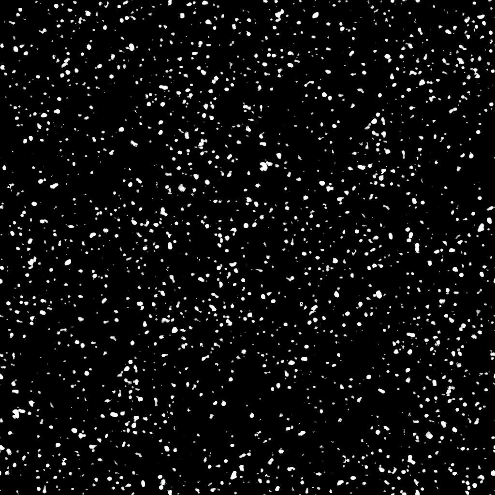

# Puntos de suciedad

<table>
<tr style="border: 0;">
<td width="33.33%" style="border: 0;" valign="top">

{width="200px"}

<b>En:</b> Generadores de Textura > Ruidos

</td>
<td width="100.00%" style="border: 0;" valign="top">

## Descripción

El nodo **Puntos de Suciedad** genera un mapa de suciedades similar a los puntos salpicados finos.

</td>
</tr>
</table>

## Parámetros

|  |  |
|:---|:---|
| <b>Saldo</b> <i>Flotador</i> | Ajusta el equilibrio entre los valores oscuros y brillantes. |
| <b>Contraste</b> <i>Flotador</i> | Ajusta el contraste de la imagen. |
| <b>Invertir</b> <i>Booleano</i> | Invierte el resultado de la imagen mediante una operación `1-x`. |
| <b>Expansión no cuadrada</b> <i>Booleano</i> | Permite la compensación de aplastamiento y estiramiento con proporciones no cuadradas. |
| <b>Avanzado</b> |  |
| <b>Detalles</b> <i>Flotador</i> | Ajusta la cantidad de puntos *deformados* y divididos en puntos más finos. |
| <b>Cobertura</b> <i>Flotador</i> | Ajusta la cobertura de los puntos de la imagen. |
| <b>Contraste de cobertura</b> <i>Flotador</i> | Ajusta el contraste de la *máscara* utilizada para controlar la cobertura de las manchas de la imagen. |

## Ejemplos

<table style="margin-top: 32px; margin-bottom: 32px">
    <tr style="border: 0">
        <td style="border: 0; background: transparent">
            
        </td>
        <td style="border: 0; background: transparent">
            
        </td>
    </tr>
</table>
