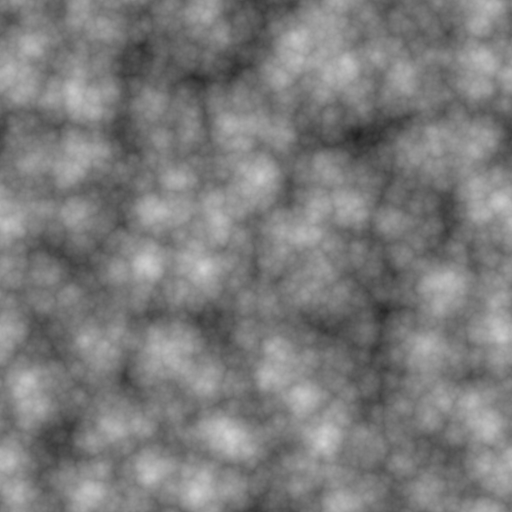
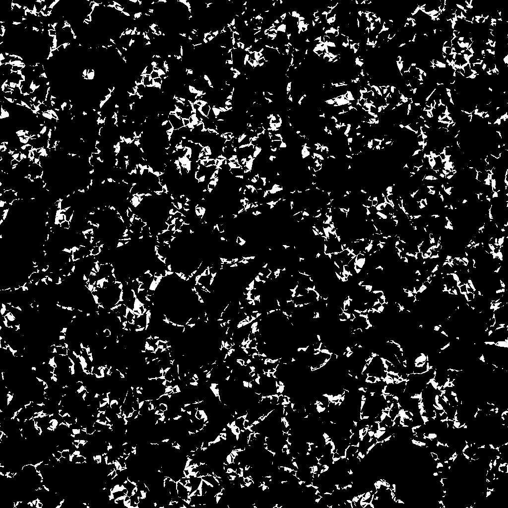

# Fractal de Voronoi

<table>
<tr style="border: 0;">
<td width="41.60%" style="border: 0;" valign="top">

{width="200px"}

**En:** *Generadores De Texturas* */Ruidos*

**Intermedio**

</td>
<td width="58.30%" style="border: 0;" valign="top">

## Descripción

El nodo **Voronoi Fractal** genera un ruido *fractal* 3D Voronoi asignado a una imagen 2D mediante una *proyección ortográfica descendente en Z*.

Este nodo se puede probar con [Cube GBuffers](../../../../../../compositing-graphs/nodes-reference-for-com/node-library/texture-generators/patterns/cube-3d-gbuffers/cube-3d-gbuffers.md) como entrada en lugar de un mapa con bake real (como se muestra en la imagen de ejemplo siguiente).

>[!WARNING]
>
> Este ruido está destinado a utilizarse únicamente con el *motor de GPU* (es decir, **Direct** o **OpenGL**). Vaya a **Herramientas > Cambiar motor...** o presione la tecla **F9** para seleccionar el motor deseado.

</td>
</tr>
</table>

## Parámetros

* **Invertir** *Booleano*\
  Invierte la imagen de salida.
* **Escala** *Flotante*\
  Controla la escala del ruido fractal Voronoi.\
  *Nota*: Cuando **Tiling** está habilitado en *cualquier eje*, el ajuste de escala es *stepped*. Esto es de esperar.
* **Tamaño** *Float3*\
  Controla el tamaño del ruido fractal Voronoi en los ejes **X**, **Y** y **Z**. Los valores no uniformes dan como resultado un efecto de *estiramiento o aplastamiento*.\
  *Nota*: Cuando **Mosaico** está habilitado en *cualquier eje*, el ajuste de tamaño es *escalonado*. Esto es de esperar.
* **Desplazamiento** *Flotador*\
  Aplica un desplazamiento a la *posición* del ruido fractal Voronoi en los ejes **X**, **Y** y **Z**.
* **Desorden** *Float3*\
  Intensidad del *desplazamiento aleatorio* aplicado a cada punto del ruido en los ejes **X**, **Y** y **Z**.
* **Intensidad de Distorsión** *Float*\
  Controla la intensidad de un *efecto de deformación* aplicado al ruido fractal de Voronoi.
* **Multiplicador de escala de Distorsión** *Float*\
  Controla la escala del *patrón de deformación* utilizado en el efecto de deformación controlado por la **Intensidad de Distorsión**.
* **Nivel Mínimo** *Entero*\
  Nivel mínimo de *repetición* usado en el patrón fractal. Un rango mínimo/máximo más amplio da como resultado un *patrón más enriquecido* con variaciones en rangos de frecuencia más amplios.
* **Nivel máximo** *Entero*\
  Nivel máximo de *repetición* usado en el patrón fractal. Un rango mínimo/máximo más amplio da como resultado un *patrón más enriquecido* con variaciones en rangos de frecuencia más amplios.
* **Rugosidad** *Flotante*\
  Controla el *equilibrio* entre los *niveles de repetición* bajos y altos en el patrón fractal.\
  *Nota*: Un valor de **0** da como resultado un resultado que está *fuera de línea* con otros valores bajos que lo siguen. Esto es de esperar.\
  *Nota 2*: Este parámetro solo está disponible cuando el parámetro **Blend Mode** está establecido en *Add*.
* **Lacunaridad** *Flotante*\
  Controla cómo el patrón fractal aplicado *rellena el espacio*. Un valor *superior* provoca *menos brechas* en el patrón y un ruido *más denso*.
* **Opacidad global** *Float*\
  Controla el *intervalo* de los valores fractales de ruido de Perlin de 0.
* **Curva redondeada** *Flotante*\
  Redondea la *pendiente* alrededor de cada punto del ruido para que sea *convexa*.\
  *Nota*: Este parámetro no está disponible cuando el parámetro **Style** está establecido en *Edge*.
* **Escala de distancia** *Flotante*\
  Ajusta la *distancia del degradado* alrededor de cada punto del ruido.
* **Modo de distancia** *Entero*\
  Establece el método para *calcular el degradado de distancia* alrededor de cada punto del ruido:
  * *Euclidean*
  * *Manhattan*
  * *Chebyshev*
  * *Minkowski*
* **Número de Minkowski** *Flotador*\
  El orden *p* de la distancia de Minkowski. Si dividimos el gradiente de distancia en cuadrantes, este número afecta a estos cuadrantes de la siguiente manera:
  * p es *exactamente* 1: Recto
  * p es *inferior* a 1: Cóncavo
  * p es *mayor* que 1: Convexo\
    Valores interesantes:\
    *- 1.0*: Distancia a Manhattan\
    *- 2.0*: Distancia euclidiana\
    *- Infinito*: Distancia de Chebyshev\
    *Nota*: Este parámetro solo está disponible cuando el parámetro **Distance Mode** está establecido en *Minkowski*.
* **Modo de fusión** *Entero*\
  Establece el método para fusionar los valores de *celdas superpuestas* en el espacio:
  * *Agregar*: Agregar los valores
  * *Máx.*: Conservar el valor *más alto*
  * *Min*: Mantener el valor *más bajo*
* **Estilo** *Entero* Establece el método *que representa los datos* del ruido fractal Voronoi, teniendo en cuenta que el ruido se basa en un conjunto de puntos en el espacio:
  * *F1*: la distancia al *punto más cercano* en el espacio
  * *F2*: la distancia al *segundo punto más cercano* en el espacio
  * *F2-F1*- *F1\* F2 *-* F1/F2 *-* Edge *: el* borde entre cada celda* del ruido en el espacio
  * *Color aleatorio*: asignar un *color plano aleatorio* a cada celda del ruido en el espacio
* **Thickness Edge** *Float* Ajusta el thickness de los bordes detectados entre las celdas del ruido fractal Voronoi. Los bordes se detectan en los ejes X, Y y Z, por lo que algunos grosores pueden aumentar más rápido que otros dependiendo de la *profundidad* de las celdas.\
  *Nota*: Este parámetro solo está disponible cuando el parámetro **Style** está establecido en *Edge*.
* **Modo de inicialización de color aleatorio** *Integer*\
  Establece el método de *adquisición* de la semilla aleatoria para la selección de color por celda:
  * *Raíz aleatoria global*: Use la inicialización *heredada* por el nodo
  * *Raíz manual*: Usar una semilla *discreta*\
    *Nota*: Este parámetro solo está disponible cuando el parámetro **Style** está establecido en *Random color*.
* **Raíz de color aleatoria** *Entero*\
  La semilla aleatoria discreta que debe utilizarse para la selección de color por celda.\
  *Nota*: Este parámetro solo está disponible cuando el parámetro **Style** está establecido en *Random color* y el parámetro **Random Color Seed Mode** está establecido en *Manual Seed*.
* **Habilitar Mosaico** *Booleano*\
  Ajusta el ruido fractal de Voronoi para que el patrón resultante *se repita* en los ejes X, Y y Z.

## Imágenes de ejemplo

<table>
<tr style="border: 0;">
<td style="border: 0;" valign="top">

{width="512px"}

</td>
<td style="border: 0;" valign="top">

{width="512px"}

</td>
<td style="border: 0;" valign="top">

{width="256px"}

</td>
<td style="border: 0;" valign="top">

{width="256px"}

</td>
<td style="border: 0;" valign="top">

{width="256px"}

</td>
<td style="border: 0;" valign="top">

{width="256px"}

</td>
<td style="border: 0;" valign="top">

{width="256px"}

</td>
<td style="border: 0;" valign="top">

{width="256px"}

</td>
</tr>
</table>
