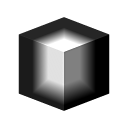

# Máscara de volumen 3D

<table>
<tr style="border: 0;">
<td width="33.33%" style="border: 0;" valign="top">

{width="256px"}

<b>En:</b> Generador > Patrón

</td>
<td width="100.00%" style="border: 0;" valign="top">

## Descripción

El nodo **Máscara de volumen 3D** genera una representación de una *forma primitiva* basada en el mapa de entrada **Posición**.

</td>
</tr>
</table>

## Entradas

|  |  |
|:---|:---|
| <b>Posición</b> <i>Color</i> | El mapa que describe las *coordenadas de espacio 3D* en las que se representa la primitiva.  Las coordenadas **X/Y/Z** se asignan a los canales **R/G/B**, respectivamente. |

## Parámetros

|  |  |
|:---|:---|
| <b>Forma</b> <i>Entero</i> | Forma primitiva que se debe representar:  - *Cubo* - *Cilindro* - *Esfera* |
| <b>Escala</b> <i>Flotador</i> | Define la escala *global* de la primitiva, aplicada *uniformemente* en todos los ejes. |
| <b>Tamaño</b> <i>Float3</i> | Define el tamaño de la forma en cada eje. |
| <b>Entrada de posición</b> <i>Entero</i> | El método de *que representa el espacio* mediante la entrada **Position**:  - *UV Position*: Utilice un *mapa UV*. Las coordenadas X/Y (U/V) se asignan a los canales R/G, respectivamente. Se supone que el eje Z es el vector *orthogonal forward*. - *Posición del espacio mundial*: Utilice un *mapa de posición* para asignar el primitivo en el espacio 3D. Las coordenadas X/Y/Z se asignan a los canales R/G/B respectivamente. |
| <b>Posición UV</b> <i>Float2</i> | Posición del primitivo en el espacio UV.  *Nota*: Este parámetro solo está disponible cuando el parámetro **Position Input** está establecido en *UV Position*. |
| <b>Posición</b> <i>Float3</i> | Posición de lo primitivo en el espacio de entorno.  *Nota*: Este parámetro solo está disponible cuando el parámetro **Position Input** está establecido en *World Space Position*. |
| <b>Rotación</b> <i>Float3</i> | Define el giro de la forma en el espacio de entorno. |
| <b>Ancho de calado</b> <i>Flotador</i> | Ajusta la anchura del *degradado* desde la superficie del primitivo hacia adentro. |

## Ejemplos

<table style="margin-top: 32px; margin-bottom: 32px">
    <tr style="border: 0">
        <td style="border: 0; background: transparent">
            
        </td>
        <td style="border: 0; background: transparent">
            
        </td>
        <td style="border: 0; background: transparent">
            
        </td>
        <td style="border: 0; background: transparent">
            
        </td>
    </tr>
</table>
