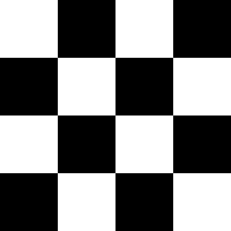

# Checker 1

<table>
<tr style="border: 0;">
<td width="33.33%" style="border: 0;" valign="top">

{width="128px"}

<b>En:</b> Generadores de Textura > Patrones

</td>
<td width="100.00%" style="border: 0;" valign="top">

## Descripción

Patrón Checker muy simple. El mosaico se establece deliberadamente bajo para que sea lo más genérico posible.

Es un patrón útil para los casos de prueba, debido a su evidente contraste y azulejos.

</td>
</tr>
</table>

## Parámetros

|  |  |
|:---|:---|
| <b>Mosaico</b> <i>1 - 16</i> | Define la cantidad de veces que el resultado debe aparecer en mosaico. |
| <b>Rotar 45 Grados</b> <i>Falso/Verdadero</i> | Gira el patrón completo 45 grados. |
| <b>Expansión no cuadrada</b> <i>Falso/Verdadero</i> | Permite la compensación de aplastamiento y estiramiento con proporciones no cuadradas. |

## Ejemplos

<table style="margin-top: 32px; margin-bottom: 32px">
    <tr style="border: 0">
        <td style="border: 0; background: transparent">
            
        </td>
    </tr>
</table>
