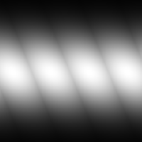

# Fibras 1

<table>
<tr style="border: 0;">
<td style="border: 0;" valign="top">

{width="128px"}

## Fibras 1

**En:** *Generadores De Texturas**/Patrones*

**Simple**

</td>
<td style="border: 0;" valign="top">

## Descripción

Patrón de fibra simple. Se puede usar en [Substance 3D Designer](https://www.adobe.com/es/products/substance3d-designer.html) para obtener mapas de altura y detalles de cuerda, malla o tela.

## Parámetros

* **Mosaico**: *1 - 16*\
  Define la cantidad de veces que el resultado debe aparecer en mosaico.
* **Expansión no cuadrada**: *Falso/Verdadero*\
  Permite la compensación de aplastamiento y estiramiento con proporciones no cuadradas.

## Imágenes de ejemplo

</td>
</tr>
</table>
