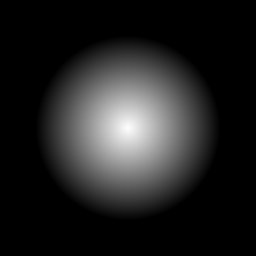

# Degradado radial

<table>
<tr style="border: 0;">
<td width="33.33%" style="border: 0;" valign="top">

{width="128px"}

<b>En:</b> Generadores de Textura > Patrones

</td>
<td width="100.00%" style="border: 0;" valign="top">

## Descripción

De forma similar a [Gradient Circular](../../../../../../compositing-graphs/nodes-reference-for-com/node-library/texture-generators/patterns/gradient-circular/gradient-circular.md), crea una transición de degradado en escala de grises definida por dos puntos personalizados de forma radial. La transición va de a a b, definida por el punto central y el radio. Ten en cuenta que los resultados no siempre se segmentarán.

</td>
</tr>
</table>

## Parámetros

|  |  |
|:---|:---|
| <b>Forma</b> <i>Cono, Hemisferio</i> | Determina el perfil de transición. El cono es una transición lineal nítida, el hemisferio es suave y redondeado en el centro. |
| <b>Punto 1</b> | Punto central del degradado. Empieza en blanco. |
| <b>Punto 2</b> | Punto de radio para determinar la extensión del degradado. Termina en negro. |
| <b>Expansión no cuadrada</b> <i>Falso/Verdadero</i> | Active la compensación de aplastamiento y estiramiento con proporciones que no sean de cuadrados. |
