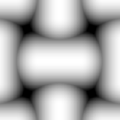

# Malla 2

<table>
<tr style="border: 0;">
<td style="border: 0;" valign="top">

{width="128px"}

## Malla 2

**En:** *Generadores De Texturas**/Patrones*

**Simple**

</td>
<td style="border: 0;" valign="top">

## Descripción

Patrón de malla simple con bloques de grasa. Se puede utilizar para crear mapas de height y de detalle.

## Parámetros

* **Mosaico**: *1 - 16*\
  Define la cantidad de veces que el resultado debe aparecer en mosaico.
* **Rotar 45 Grados**: *False/True* Rota el resultado.
* **Expansión no cuadrada**: *Falso/Verdadero*\
  Permite la compensación de aplastamiento y estiramiento con proporciones no cuadradas.

## Imágenes de ejemplo

</td>
</tr>
</table>
