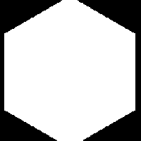

# Polígono 1

<table>
<tr style="border: 0;">
<td width="33.33%" style="border: 0;" valign="top">

{width="128px"}

<b>En:</b> Generadores de Textura > Patrones

</td>
<td width="100.00%" style="border: 0;" valign="top">

## Descripción

Genera una forma de polígono, con muchas opciones de ajuste. Consulte [Polígono 2](../../../../../../compositing-graphs/nodes-reference-for-com/node-library/texture-generators/patterns/polygon-2/polygon-2.md) para obtener una versión más sencilla.

</td>
</tr>
</table>

## Parámetros

|  |  |
|:---|:---|
| <b>Lados</b> <i>3 - 32</i> | Establece la cantidad de lados que debe tener el polígono. |
| <b>Explotar</b> <i>0.0 - 1.0</i> | Separa los &quot;sectores&quot; del polígono. |
| <b>Tamaño de triángulo</b> <i>0.0 - 1.0</i> | Ajusta el tamaño de los sectores/triángulos. Cualquier ajuste podría separar la forma, solo 1,1. está perfectamente conectado! |
| <b>Escala</b> <i>0.0 - 1.0</i> | Ajusta toda la forma como una sola. |
| <b>Escala automática</b> <i>Falso/Verdadero</i> | Ajusta las escalas para que todo el polígono se ajuste a la vista, con los parámetros predeterminados. |
| <b>Rotación</b> <i>0.0 - 1.0</i> | Gira toda la forma. |
| <b>Degradado</b> <i>Falso/Verdadero</i> | Genera sectores o triángulos de degradado en lugar de sólidos. Nota: se parece a Polígono 2 con este ajuste activado. |
| <b>Invertir degradado</b> <i>Falso/Verdadero</i> | Voltea la dirección del degradado si se activa &quot;Degradado&quot;. |
| <b>Mosaico</b> <i>1 - 16</i> | Define la cantidad de veces que el resultado debe aparecer en mosaico. |
| <b>Expansión no cuadrada</b> <i>Falso/Verdadero</i> | Permite la compensación de aplastamiento y estiramiento con proporciones no cuadradas. |
| <b>Mosaico no cuadrado</b> <i>Falso/Verdadero</i> | Cuando la Expansión no cuadrada está activada, esto segmentará la forma en mosaico sin aplastarla. |

## Ejemplos

<table style="margin-top: 32px; margin-bottom: 32px">
    <tr style="border: 0">
        <td style="border: 0; background: transparent">
            
        </td>
    </tr>
</table>
