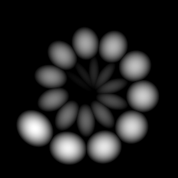

# Splatter Circular

<table>
<tr style="border: 0;">
<td style="border: 0;" valign="top">

{width="128px"}

{width="128px"}

## Splatter Circular (Color)

**En:** *Generadores De Texturas**/Patrones*

**Complejo**

</td>
<td style="border: 0;" valign="top">

## Descripción

Splatter Circular genera un patrón basado en anillo con varios controles. Puede utilizar formas predefinidas o entradas personalizadas. Es similar a [Tile Generator](../../../../../../compositing-graphs/nodes-reference-for-com/node-library/texture-generators/patterns/tile-generator/tile-generator.md), pero con una ubicación circular en lugar de una cuadrícula.

Esto resulta útil para colocar formas de forma circular con varias opciones de aleatorización.

## Parámetros

### Entradas

Ambas entradas son opcionales.

* **Entrada de imagen de motivo 1-6**: *Entrada en escala de grises (entrada de color)*\
  Sólo Splatter Circular: Imagen de motivo personalizado, utilizada cuando el parámetro &quot;Motivo&quot; se define en &quot;Entrada de imagen&quot;.
* **Fondo**: *Entrada en escala de grises (entrada de color)*

### Parámetros

* **Cantidad de patrón**: *1 - 64*\
  Cantidad de mosaicos de motivo que se deben colocar en un anillo.
* **Aleatorio de cantidad de patrón**: *0.0 - 1.0*\
  Aleatorización de la cantidad de patrones a colocar. Se recomienda utilizarlo con una cantidad de anillo superior a 1.
* **Nivel De Patrón Aleatorio Mínimo**: *1 - 10* Establece la cantidad mínima de patrones para la aleatorización.
* **Cantidad de anillo**: *1 - 10*\
  Establece el número de anillos que se van a rellenar. Los anillos siempre se colocan dentro del exterior, y el espacio uniformemente.
* **Expansión no cuadrada**: *Falso/Verdadero*\
  Permite la compensación de aplastamiento y estiramiento con proporciones no cuadradas.
* **Patrón**
  * **Patrón**: *Entrada De Imagen, Cuadrado, Disco, Paraboloide, Campana, Gaussiano, Espina, Pirámide, Ladrillo, Gradación, Ondas, Media Campana, Campana Cortada, Media Luna, Cápsula, Cono*\
    Selecciona la forma de motivo que se va a utilizar.
  * **Número de entrada de patrón**: *1 - 6* Establece el número de entradas de imagen diferentes que se deben usar. Solo está disponible cuando *Image Input* está seleccionado arriba.
  * **Distribución De Entrada De Patrón**: *Aleatorio, Por número de patrón, Por número de anillo* Establece cómo se eligen las entradas de varios patrones. Aleatorio significa que se elige uno aleatorio, Número de patrón significa que se colocan en una secuencia de bucle, Por números de anillo significa que cada anillo tiene uno diferente en la secuencia.
  * **Filtrado de entrada de imagen**: *Bilineal + Mipmaps, Bilineal, Más Cercano*
  * **Específico del patrón**: *0.0 - 1.0*\
    Permite cambiar la forma del motivo seleccionado. El efecto depende del patrón seleccionado.
  * **Aleatorio de simetría**: *0.0 - 1.0*\
    Define el número de mosaicos que se deben voltear o reflejar aleatoriamente según el comportamiento siguiente.
  * **Modo aleatorio de simetría**: *Horizontal + Vertical, Horizontal, Vertical* Determina el comportamiento de reflejo de la simetría.
* **Posición**
  * **Radio**: *0.0 - 1.0*\
    Define el radio desde el centro en el que se colocan los motivos.
  * **Aleatorio de radio**: *0.0 - 1.0* Aleatoriza el radio de cada mosaico de motivo.
  * **Multiplicador de radio de anillo**: *0.0 - 1.0*\
    Afecta al espaciado de varios anillos.
  * **Ángulo aleatorio**: *0.0 - 1.0* Aleatoriza el ángulo de cada patrón. Una cantidad mayor significa más rotación.
  * **Factor de espiral**: *0.0 - 1.0*\
    Convierte los anillos en espirales, donde cada azulejo se coloca en un radio ligeramente creciente.
  * **Difusión**: *0.0 - 2.0* Define la cantidad de vueltas que hace un anillo. Esto puede aumentarse más allá de sus límites.
  * **Desplazamiento en la dirección**: *0.0 - 1.0*\
    Desplaza cada motivo fuera del centro a lo largo de su ángulo. El efecto depende en gran medida del ángulo aleatorio, o se parece a un multiplicador para el radio.
  * **Desplazamiento global**: *0.0 - 1.0*\
    Traduce toda la forma.
* **Tamaño**
  * **Patrones de conexión**: *Falso/Verdadero* Hace que la longitud de los mosaicos del motivo dependa del radio, lo que significa que cada forma debe tocar la anterior y la siguiente.
  * **Tamaño (conectado)**: *0.0 - 1.0*\
    Cambia el tamaño de cada patrón globalmente. Cuando está conectado, es relativo al radio total.
  * **Aleatorio de tamaño**: *0.0 - 1.0*\
    Aleatoriza el tamaño de cada motivo de forma individual.
  * **Escala**: *0.0 - 2.0*\
    Ajusta uniformemente cada patrón.
  * **Escala aleatoria**: *0.0 - 1.0*\
    Aleatoriza la escala uniforme.
  * **Escalar por número de patrón**: *0.0 - 1.0* Hace que la escala del patrón dependa de la posición a lo largo del anillo.
  * **Invertir número de patrón**: *Falso/Verdadero*\
    Si se utiliza con la opción anterior, se puede invertir la escala de pequeña a grande y viceversa.
  * **Escalar por número de anillo**: *0.0 - 1.0* Hace que la escala dependa del número de anillo.
  * **Invertir número de anillo**: *Falso/Verdadero* Si se usa con la opción anterior, puede invertir la escala de pequeño a grande y viceversa.
* **Rotación**
  * **Rotación de motivo**: *0.0 - 1.0* Rota cada patrón uniformemente.
  * **Aleatorio de rotación de motivo**: *0.0 - 1.0*\
    Aleatoriza la rotación de patrones.
  * **Tabla dinámica de rotación de motivo**: *Centro, Mín. X, Máx. X, Mín. Y, Máx. Y*\
    Define la posición del punto de giro alrededor del cual se giran los motivos de forma individual.
  * **Orientación central**: *Falso/Verdadero*\
    Gira cada motivo de forma que mire hacia el centro del anillo. Al desactivarla, se les aplica la misma orientación, lo que puede producir efectos no deseados con Desplazamiento en la dirección.
  * **Rotación de anillo**: *0.0 - 1.0* Gira todo el anillo alrededor del centro.
  * **Rotación aleatoria de anillo**: *0.0 - 1.0* Aleatoriza la rotación por anillo.
  * **Desplazamiento de rotación de anillo**: *0.0 - 1.0*\
    Desplaza la rotación por anillo.
* **Color**
  * **Color**: *(Valor de escala de grises)*Color que se multiplicará por el patrón seleccionado.
  * **Aleatorio de luminancia**: *0.0 - 1.0* Aleatoriza el color o la luminancia de cada mosaico de motivo.
  * **Luminancia Por Escala**: *0.0 - 1.0* hace que la luminancia dependa de la escala de patrón individual.
  * **Luminancia por número de patrón**: *0.0 - 1.0* Hace que la luminancia dependa de la secuencia del patrón. Se puede utilizar, por ejemplo, con espirales.
  * **Invertir número de patrón**: *Falso/Verdadero* Invierte la opción anterior.
  * **Luminancia por número de anillo**: *0.0 - 1.0* Hace que la luminancia dependa de la secuencia de anillos.
  * **Invertir número de anillo**: *Falso/Verdadero* Invierte la opción anterior.
  * **Máscara aleatoria**: *0.0 - 1.0* Oculta patrones al azar.
  * **Color de fondo**: *(Valor de escala de grises)*Cambia el color de fondo sólido.
  * **Modo De Fusión**: *Agregar, Máx, Agregar Sub* Establece cómo se mezclan los patrones superpuestos.
  * **Opacidad global**: *0.0 - 1.0* Establece la opacidad global de todo el resultado.

## Imágenes de ejemplo

</td>
</tr>
</table>
