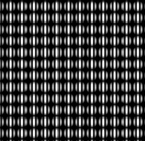

# Salpicadura

<table>
<tr style="border: 0;">
<td style="border: 0;" valign="top">

## Salpicadura (color)

**En:** *Generadores De Texturas**/Patrones*

**Complejo**

</td>
<td style="border: 0;" valign="top">

## Descripción

Splatter es un generador de patrones destinado a la colocación aleatoria de una entrada de mapa. Tiene muchos controles para la colocación de patrones geométricos y su uso es más sencillo que [Tile Generator](../../../../../../compositing-graphs/nodes-reference-for-com/node-library/texture-generators/patterns/tile-generator/tile-generator.md). Este último puede lograr resultados similares, pero es mucho más complejo.

La salpicadura funciona bien para conseguir rápidamente algunas formas estampadas, sin necesidad de demasiadas modificaciones.

Tenga en cuenta que los parámetros predeterminados de Splatter no son aleatorios: es necesario ajustar algunos de ellos para obtener la aleatorización (principalmente parámetros de trastorno). También tenga en cuenta que Splatter requiere una entrada de mapa para funcionar.

## Parámetros

* **Ancho del tamaño del patrón**: *0.0 - 1000.0* Número de patrones para usar en el eje X.
* **Height de tamaño de motivo**: *0.0 - 1000.0* Número de patrones para usar en el eje Y.
* **Rotación**: *-360.0 - 360.0* Gira cada patrón en una cantidad definida.
* **Variación de rotación**: *0.0 - 360.0* Introduce una rotación aleatoria para cada forma independiente.
* **Zoom**: *100.0 - 10000.0* Aumenta el resultado final. Tenga en cuenta que esto rompe la baldosa!
* **Ganancia**: *0.0 - 10.0* Ajusta la ganancia de fusión de cada patrón. Hace que destaquen más.
* **panorámica X**: *-100.0 - 100.0* Panorama el resultado completo en el eje X.
* **panorámica Y**: *-100.0 - 100.0* Panorama el resultado completo en el eje Y.
* **Trastorno**: *0.0 - 100.0*\
  Cambia formas aleatoriamente.
* **Número de cuadrícula**: *0 - 8* Pasa por diferentes tamaños de cuadrícula para ajustar la escala de resultados. Mantiene el azulejo.
* **Ángulo de desorden**: *0.0 - 360.0* Controla el ángulo de desplazamiento del desorden.
* **Aleatorio de trastorno**: *Falso/Verdadero* Aleatoriza el ángulo de desorden, agregando mucho más caos.
* **Tamaño de patrón**: *5 - 12*
* **Variación de tamaño**: *0.0 - 100.0* Introduce una escala aleatoria para cada forma.
* **Filtrado de entrada de imagen (Motor > v4 únicamente)**: *Bilineal + Mipmaps, Bilineal, Más cercano* Qué filtro aplicar a la imagen de entrada.
* **Nivel De Salida Mínimo**: *0.0 - 1.0* Ajuste de nivel mínimo de salida.
* **Nivel de salida máx.**: *0.0 - 1.0* Ajuste de nivel máximo saliente.
* **Color de fondo**: *(Valor de escala de grises)*Define el color de fondo sólido.
* **Variación de luminancia**: *0.0 - 1.0 (Solo versión en escala de grises)*Introduce la variación de luminancia.
* **Variación de color**: *0.0 - 1.0 (Solo versión de color)*Introduce la variación de color.

## Imágenes de ejemplo

</td>
</tr>
</table>
