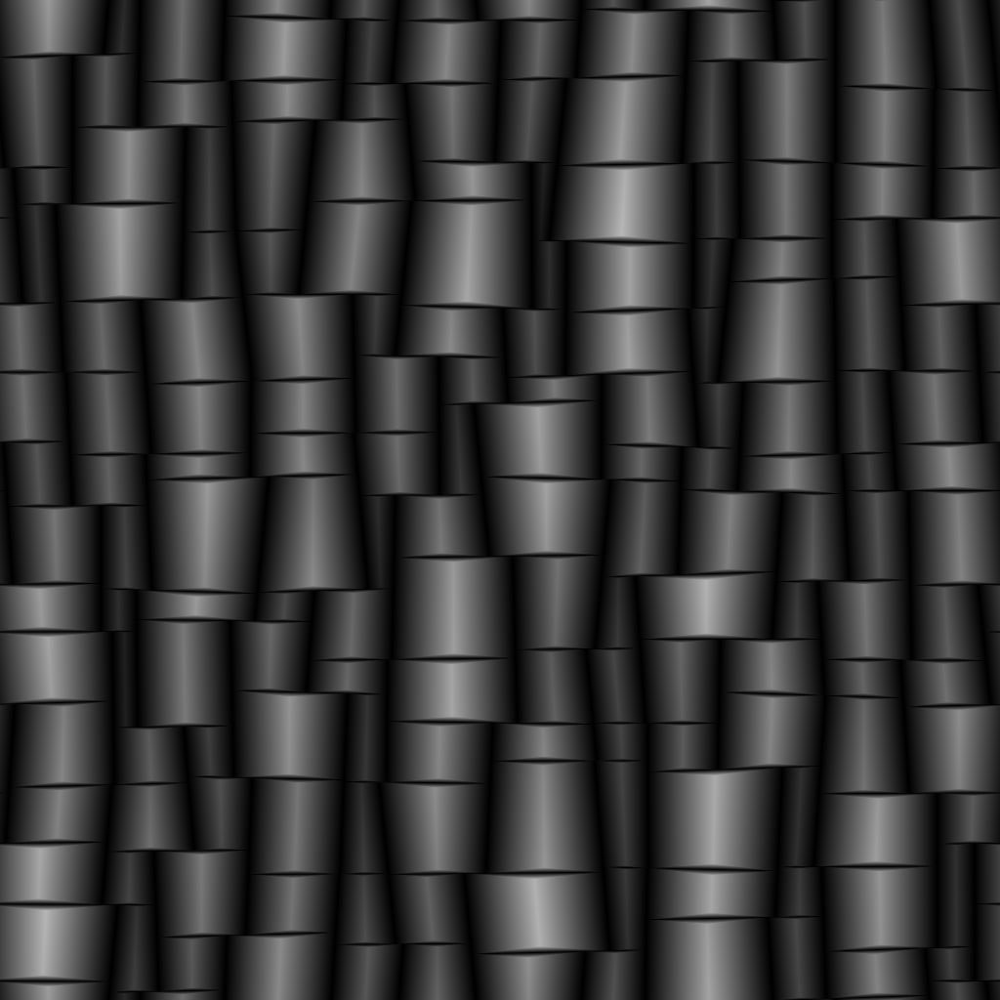

# Azulejo aleatorio 2

<table>
<tr style="border: 0;">
<td width="41.60%" style="border: 0;" valign="top">

{width="200px"}

**En:** *Generadores De Texturas* */Patrones*

**Complejo**

</td>
<td width="58.30%" style="border: 0;" valign="top">

## Descripción

El nodo **Tile Random 2** genera mosaicos adyacentes de tamaños aleatorios y proporciones de height a ancho.

La cuadrícula se puede retocar *inclinando* aleatoriamente los lados de las formas para romper los ángulos.

Las formas se pueden ajustar con opciones para *escalar*, *biselar*, *redondear las esquinas* y *rotar*.

Estos ajustes se pueden controlar mediante *mapas de entrada*.

Una salida dedicada le permite introducir los **UV** de la forma en el **Flood Fill a (...)** para aplicar variaciones adicionales.

</td>
</tr>
</table>

## Parámetros

### Entradas

* **Mapa de tamaño aleatorio** *Escala de grises*\
  Imagen de entrada de escala de grises que controla la escala aleatoria de las formas.\
  Su impacto se controla mediante el parámetro **Random Size Input Map Multiplier**.
* **Mapa de inclinación aleatoria** *Escala de grises* Imagen de entrada de escala de grises que controla la inclinación aleatoria de las formas.\
  Su impacto se controla mediante el parámetro **Multiplicador de mapa de entrada de inclinación aleatoria**.
* **Mapa de radio de vértices redondos** *Escala de grises*\
  Imagen de entrada de escala de grises que controla el radio de las esquinas redondeadas de las formas.\
  Su impacto está controlado por el mapa de entrada de radio de las esquinas redondeadas mult.**&#x200B;** parámetro.
* **Mapa de distancia biselado** *Escala de grises*\
  Imagen de entrada de escala de grises que controla el biselado de las formas.\
  Su impacto está controlado por el **Mapa de entrada de distancia biselada Mult.** parámetro.
* **Mapa de máscara** *Escala de grises*\
  Imagen de entrada de escala de grises que controla el enmascaramiento de las formas.\
  Su impacto se controla mediante los parámetros **Inicio de entrada de mapa de máscara** y **Fin de entrada de mapa de máscara**.

### Parámetros

* **Cantidad X** *Entero*\
  Número de celdas en el eje **X**.
* **Cantidad Y** *Entero*\
  Número de celdas en el eje **Y**.
* Tamaño
  * **Multiplicador de tamaño aleatorio** *Float*\
    Aplica un ajuste *global* a la intensidad de la escala aleatoria.
  * **Multiplicador de mapa de entrada de tamaño aleatorio** *Float*\
    Ajusta la intensidad de la escala aleatoria utilizando los valores *muestreados* de la entrada **Random Size Map**.
  * **Tamaño Aleatorio X** *Float*\
    Ajusta la intensidad de la escala aleatoria en el eje **X** *solo*.
  * **Tamaño aleatorio Y** *Float*\
    Ajusta la intensidad de la escala aleatoria en el eje **Y** *solo*.
  * **Distribución de tamaño aleatorio** *Entero*\
    Controla el método de distribución de valores de escala aleatoria:
    * *Uniforme*: la escala aleatoria se aplica de la *misma manera* en todas las celdas
    * *Ruido azul*: la escala aleatoria está *ajustada* con un patrón de ruido azul
* Aspecto de forma - Transformar
  * **Thickness intersticial** *Flotante* Ajusta el thickness del espacio entre las formas. Es *igual para todas las formas*.
  * **Multiplicador de posición aleatoria** *Float*\
    Aplica un desplazamiento de posición aleatorio a la forma hasta que *cumpla con el borde de su celda*.
  * **Radio de vértices redondeados** *Flotante* Ajusta el *radio* de los vértices redondeados de las formas. Un valor de **0** significa que no se aplica ningún redondeo.\
    *Nota*: Este efecto no se puede aplicar cuando el parámetro **Habilitar control de bisel por eje** está establecido en *True*.
  * **Mapa de entrada de radio de vértices redondeados múltiple.** *Flotante* Ajusta la intensidad con la que el mapa de entrada **Mapa de radio de vértices redondeados** afecta al radio de los vértices redondeados.\
    El mapa actúa como un multiplicador *por píxel* para el parámetro **Radio de vértices redondeados**.\
    *Nota*: Este efecto no se puede aplicar cuando el parámetro **Habilitar control de bisel por eje** está establecido en *True*.
  * **Multiplicador de escala** *Float*\
    Ajusta el tamaño de cada forma como proporción del área *de su celda*.
  * **Aleatorio de escala** *Flotante* Ajusta la intensidad con la que se aplica una escala aleatoria a *cada forma*.
  * **Rotation** *Float* Rota formas en sus celdas moviendo cada *esquina* a su *vecino* a lo largo del borde de la celda.\
    Este método hace que se aplique cierta cantidad de *distorsión* y *escala* a la forma en sus rotaciones.
  * **Aleatorio de rotación** *Flotante* Ajusta la intensidad según la cual se aplica una cantidad aleatoria de rotación a cada forma.\
    El método de rotación se describe en el parámetro **Rotation**.
  * **Posiciones aleatorias de los vértices** *Flotar* Distorsiona las formas aplicando una cantidad aleatoria de *desplazamiento* a cada uno de sus *vértices* a lo largo del borde de su celda.
* Inclinación
  * **Multiplicador de inclinación aleatoria** *Float*\
    Aplica un ajuste *global* a la intensidad de la inclinación aleatoria.
  * **Multiplicador de mapa de entrada de inclinación aleatoria** *Float*\
    Ajusta la intensidad de la inclinación aleatoria utilizando los valores *muestreados* de la entrada **Mapa de inclinación aleatoria**.
  * **Inclinación Aleatoria X** *Flotante*\
    Ajusta la intensidad de la inclinación aleatoria\
    en el eje **X** *solo*.
  * **Inclinación aleatoria Y** *Float*\
    Ajusta la intensidad de la inclinación aleatoria\
    en el eje **Y** *solo*.
  * **Distribución de inclinación aleatoria** *Entero*\
    Controla el método de distribución de valores de inclinación aleatorios:
    * *Uniforme*: la inclinación aleatoria se aplica de la *misma manera* en todas las celdas
    * *Ruido azul*: la inclinación aleatoria está *ajustada* mediante un patrón de ruido azul
* Bisel
  * **Modo de distancia biselada** *Entero*\
    Establece el método de *obtención de la distancia* por la que se deben biselar las formas:
    * *Relativo al tamaño de cuadrícula*: Las formas están biseladas según la *proporción especificada de su tamaño de cuadrícula*- *Relativa al tamaño de la forma*: Las formas están biseladas según la *proporción especificada de su tamaño*
    * *Relativo al tamaño de imagen*: Las formas están biseladas según la *proporción de la imagen* especificada
  * **Multiplicador de distancia biselada** *Flotador*\
    Aplica un ajuste *global* a la distancia del biselado.
  * **Mapa de entrada de distancia biselada múltiple.** *Flotador*\
    Ajusta la distancia del biselado usando el mapa de entrada **Mapa de distancia de bisel** como multiplicador *por píxel*.
  * **Curva redondeada biselada** *Flotante*\
    Ajusta la intensidad del redondeo aplicado al ángulo de biselado para que sea más *convexo*.
  * **Habilitar control biselado por eje** *Boolean*\
    Cuando *True*, el biselado se puede aplicar y ajustar *por separado* en los ejes **X** e **Y**.\
    *Nota*: Esto *cancela* el efecto **Vértices redondeados**.
  * **Distancia biselada X** *Flotante*\
    Ajusta la distancia del biselado en el eje **X** *solo*. Esta distancia depende del valor del parámetro **Modo de distancia biselada**.\
    *Nota*: Este parámetro solo está disponible cuando el parámetro **Habilitar control de bisel por eje** está establecido en *True*.
  * **Distancia biselada Y** *Flotante*\
    Ajusta la distancia del biselado en el eje **Y** *solo*. Esta distancia depende del valor del parámetro **Modo de distancia biselada**.\
    *Nota*: Este parámetro solo está disponible cuando el parámetro **Habilitar control de bisel por eje** está establecido en *True*.
* Máscara
  * **Inversión aleatoria de máscara** *Boolean*\
    Invierte la máscara aleatoria de las formas.
  * **Inicio aleatorio de máscara** *Flotante*\
    Para una determinada **Raíz aleatoria**, se aplica una máscara pseudoaleatoria siguiendo un *orden específico* de una forma inicial a una forma final. Este parámetro te permite *desplazar el índice* de la forma *start*.\
    *Nota*: Esto determina un límite de un *intervalo de valores* para enmascaramiento. Por lo tanto, el valor puede ser *mayor* que el valor **Final aleatorio de máscara**.
  * **Final aleatorio de máscara** *Float* Para una **Raíz aleatoria** determinada, se aplica una máscara seudoaleatoria siguiendo un *orden específico* de una forma inicial a una forma final. Este parámetro le permite *desplazar el índice* de la forma *end*.\
    *Nota*: Esto determina un límite de un *intervalo de valores* para enmascaramiento. Por lo tanto, el valor puede ser *mayor* que el valor de **Inicio aleatorio de máscara**.
  * **Invertir máscara por área de celda** *Boolean*\
    Invierte el enmascaramiento de las formas por el área de sus celdas.
  * **Inicio de máscara por área de celda** *Flotante*\
    Ajusta el umbral de área de la celda *mínimo* para enmascarar formas.\
    *Nota*: Esto determina un límite de un *intervalo de valores* para enmascaramiento. Por lo tanto, el valor puede ser *mayor* que el valor **Máscara por extremo del área de celda**.
  * **Enmascarar por extremo de área de celda** *Flotar* Ajusta el umbral de área de la celda *max* para enmascarar formas.\
    *Nota*: Esto determina un límite de un *intervalo de valores* para enmascaramiento. Por lo tanto, el valor puede ser *inferior* al valor **Máscara por inicio del área de celdas**.
  * **Inversión De Entrada De Mapa De Máscara** *Booleano*\
    Invierte el enmascaramiento de formas mediante el mapa de entrada **Mapa de máscara**.
  * **Inicio de entrada de mapa de máscara** *Float*\
    Ajusta el umbral de *valor mínimo de escala de grises* en el mapa de entrada **Mapa de máscara** para enmascarar formas.\
    *Nota*: Esto determina un límite de un *intervalo de valores* para enmascaramiento. Por lo tanto, el valor puede ser *mayor* que el valor **Final de entrada de mapa de máscara**.
  * **Fin de entrada de mapa de máscara** *Flotante* Ajusta el umbral del *valor máximo de escala de grises* en el mapa de entrada de **mapa de máscara** para enmascarar formas.\
    *Nota*: Esto determina un límite de un *intervalo de valores* para enmascaramiento. Por lo tanto, el valor puede ser *inferior* al valor de **Inicio de entrada de mapa de máscara**.

## Imágenes de ejemplo

<table>
<tr style="border: 0;">
<td style="border: 0;" valign="top">

{width="256px"}

</td>
<td style="border: 0;" valign="top">

{width="256px"}

</td>
<td style="border: 0;" valign="top">

{width="256px"}

</td>
<td style="border: 0;" valign="top">

{width="512px"}

</td>
<td style="border: 0;" valign="top">

{width="512px"}

</td>
<td style="border: 0;" valign="top">

{width="512px"}

</td>
<td style="border: 0;" valign="top">

{width="340px"}

</td>
</tr>
</table>
