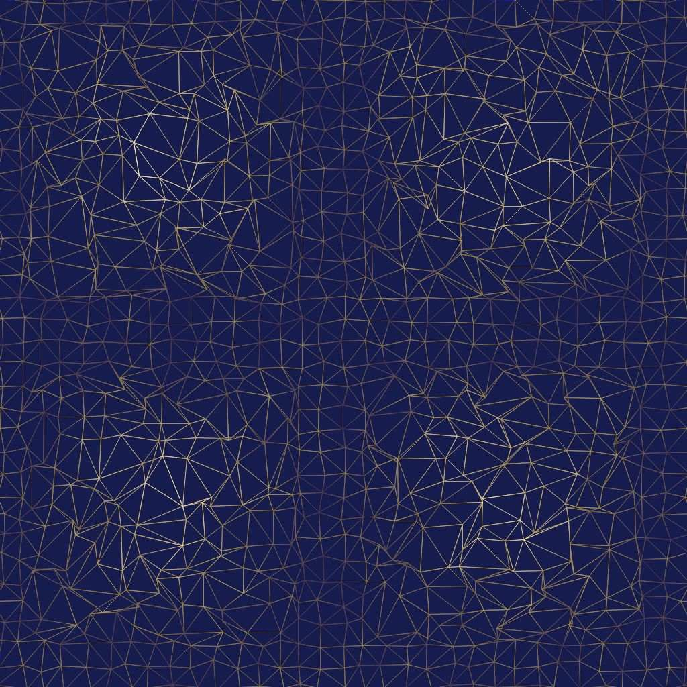
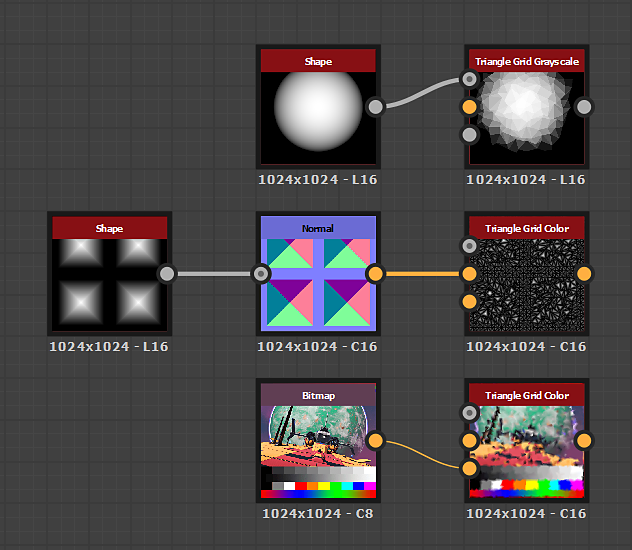

# Triangle Grid

<table>
<tr style="border: 0;">
<td width="41.60%" style="border: 0;" valign="top">

{width="200px"}

{width="200px"}

<b>En:</b> Generadores de Textura > Patrones

</td>
<td width="58.30%" style="border: 0;" valign="top">

## Descripción

El nodo **Triangle Grid** genera una representación en escala de grises de una *superficie triangulada* a partir de *vértices* en el espacio 3D, mediante una proyección ortográfica de Z hacia abajo.

El parámetro **Salida de color** le permite seleccionar los datos utilizados para la representación, lo que da como resultado varios estilos visuales.\
Es posible ajustar las *posiciones* de los vértices, lo que afecta a la malla generada.

</td>
</tr>
</table>

## Entradas

|  |  |
|:---|:---|
| <b>Height</b> <i>Escala de grises</i> PRINCIPAL | Entrada de imagen de escala de grises utilizada para asignar el *height*, es decir, la posición Z, de los vértices.    La influencia de esta entrada se controla mediante el parámetro &#39;Multiplicador de entrada de Height&#39;. |
| <b>Mapa de vectores</b> <i>Color</i> | La entrada de imagen de color utilizada para asignar el *desplazamiento* de los vértices en los ejes X e Y.    Los desplazamientos X/Y se asignan a los canales R/G de la imagen respectivamente.    La influencia de esta entrada se controla mediante el parámetro &quot;Desplazamiento de mapa de vectores&quot;. |
| <b>Entrada de color</b> <i>Color</i> | La entrada de imagen de color utilizada para asignar el *color* de los vértices, segmentos o triángulos.    Esta entrada se utiliza cuando el parámetro &#39;Color Source&#39; se establece en &#39;Color Input&#39;. |

## Salidas

|  |  |
|:---|:---|
| <b>Salida</b> <i>Color</i> | La imagen de salida. |

## Parámetros

|  |  |
|:---|:---|
| <b>Salida de color</b> *Entero* | Método de representación de la superficie triangulada:<ul data-preserve-html="true"> <li data-preserve-html="true"><b>Por vértice:</b> se asigna un color a cada vértice y se interpola en la superficie del triángulo</li> <li data-preserve-html="true"><b>Por triángulo:</b> se asigna un color plano a cada triángulo</li> <li data-preserve-html="true"><b>Línea fina</b><b>:</b> aplica un contorno a los segmentos entre los vértices</li> <li data-preserve-html="true"><b>Distancia al borde</b><b>:</b> representa la distancia al segmento más cercano en cada triángulo</li> <li data-preserve-html="true"><b>Centro</b><b>:</b> procesa la distancia normalizada al centro de barras de cada triángulo</li> </ul> |
| <b>Triangulación</b> *Entero* | Establece el método de triangulación para la superficie, es decir, qué *par de vértices opuestos* de un cuadrado se deben conectar:<ul data-preserve-html="true"> <li data-preserve-html="true"><b>Automático:</b> selecciona automáticamente el par de vértices que dan como resultado triángulos <i>que miran lo menos posible</i> desde la cámara  <b>45°:</b> conecta vértices opuestos dando como resultado una línea <i>girada 45 grados</i> con respecto al eje X-derecho</li> <li data-preserve-html="true"><b>-45°:</b> conecta vértices opuestos dando como resultado una línea <i>girada -45 grados</i> con respecto al eje X-derecho</li> <li data-preserve-html="true"><b>Quincux horizontal:</b> alterna la orientación de triangulación <i>cada dos filas</i> de vértices</li> <li data-preserve-html="true"><b>Quincux vertical:</b> alterna la orientación de triangulación <i>cada dos columnas</i> de vértices  </li> </ul> |
| <b>Cantidad X</b> *Entero* | Cantidad de vértices generados en el eje X. |
| <b>Importe Y</b> *Entero* | Cantidad de vértices generados en el eje Y. |
| <b>Multiplicador de posición aleatoria</b> *Flotador* | Ajusta la intensidad del efecto de deformación principal. |
| <b>Posición aleatoria</b> *Float2* | Ajusta la intensidad del desplazamiento aleatorio aplicado a las posiciones X e Y de cada vértice, en relación con el *tamaño de su celda* en la cuadrícula.   Este desplazamiento *apila* con los parámetros <b>Desplazamiento de Quincux</b> y <b>Desplazamiento de mapa de vectores</b>. |
| <b>Desplazamiento de mapa vectorial</b> *Flotador* | Ajusta la cantidad de desplazamiento *global* aplicada a cada vértice usando los valores *muestreados* de la entrada <b>Vector Map</b>.    Este desplazamiento *apila* con los parámetros <b>Random Position</b> y <b>Quincux Offset</b>. |
| <b>Desplazamiento Quincux X</b> *Flotador* | Aplica la cantidad especificada de desplazamiento a *cada dos filas* de vértices, con relación al *tamaño de su celda* en la cuadrícula.   Este desplazamiento *apila* con los parámetros <b>Posición aleatoria</b> y <b>Desplazamiento de mapa de vectores</b>. |
| <b>Desplazamiento Y Quincux</b> *Flotador* | Aplica la cantidad especificada de desplazamiento a *cada dos columnas* de vértices, con relación al *tamaño de su celda* en la cuadrícula.    Este desplazamiento *apila* con los parámetros <b>Posición aleatoria</b> y <b>Desplazamiento de mapa de vectores</b>. |
| <b>Rotación</b> *Flotador* | Aplica la cantidad de rotación *especificada* a cada vértice alrededor de su *posición base*, es decir, su posición *antes de que se aplique el desplazamiento aleatorio y el desplazamiento*.    Esta rotación *apila* con el parámetro <b>Desorden de rotación</b>. |
| <b>Trastorno de rotación</b> *Flotador* | Aplica una cantidad de rotación *aleatoria* a cada vértice alrededor de su *posición base*, es decir, su posición *antes de que se aplique el desplazamiento aleatorio y el desplazamiento*.    Esta rotación *apila* con el parámetro <b>Rotation</b>. |
| <b>Multiplicador de entrada de Height</b> *Flotador* | Ajusta la posición Z de cada vértice con los valores *muestreados* de la entrada <b>Height</b>.    Este desplazamiento *apila* con el parámetro <b>Aleatorio de Height</b>. |
| <b>Aleatorio de Height</b> *Flotador* | Aplica un desplazamiento aleatorio a la posición Z de cada vértice.  Este desplazamiento *apila* con el parámetro <b>Multiplicador de entrada de Height</b>. |
| <b>Modo de fusión</b> *Entero* | Establece el método de fusión de los valores de *triángulos superpuestos*. El modo le permite seleccionar *qué* de los triángulos deben ser visibles: <ul data-preserve-html="true"> <li data-preserve-html="true"><b>Texto Mín.:</b></li> <li data-preserve-html="true"><b>Máximo:</b> Texto</li> <li data-preserve-html="true"><b>Prueba de Profundidad</b>: Texto</li> <li data-preserve-html="true"><b>Mezcla de Alpha:</b> Texto</li> </ul>Nota: Los modos de fusión disponibles dependen del valor del parámetro <b>Salida de color</b>. |
| <b>Origen de color</b> *Entero* *Disponible cuando el parámetro &#39;Salida de color&#39; está establecido en &#39;Por vértice&#39;, &#39;Por triángulo&#39; o &#39;Línea fina&#39;.* | Establece el método para *adquirir el color*, es decir, la luminancia, que se debe asignar al vértice, triángulo o segmento, según el modo <b>Salida de color</b> seleccionado:<ul data-preserve-html="true"> <li data-preserve-html="true"><b>Height</b><b>:</b> usa el height del vértice como luminancia</li> <li data-preserve-html="true"><b>Aleatorio</b><b>:</b> usa un valor de luminancia aleatorio</li> <li data-preserve-html="true"><b>Entrada de color</b><b>:</b> usa el valor muestreado de la entrada <b style="">Color Input</b></li> </ul> |
| <b>Opacidad de origen de color</b> *Float* *Disponible cuando el parámetro &#39;Color Output&#39; está establecido en &#39;Thin Line&#39;.* | Controla el *reemplazo* del valor <b>Color de línea</b> con los valores resultantes del <b>Origen de color</b> seleccionado.   Nota: Cuando este valor se establece en 1, el parámetro <b>Line Color</b> no tiene ningún impacto. |
| <b>Thickness Distancia al borde</b> *Float* *Disponible cuando el parámetro &#39;Color Output&#39; está establecido en &#39;Distance to Edge&#39;.* | Define el thickness del degradado de distancia. Un valor más bajo genera un degradado *más corto*. |
| <b>Color de línea</b> *Float/Float4* *Disponible cuando el parámetro &#39;Salida de color&#39; está establecido en &#39;Línea fina&#39;.* | El valor de luminancia de los segmentos.   Nota: Cuando el valor <b>Opacidad de origen de color</b> se establece en 1, este parámetro no tiene ningún impacto. |
| <b>Color de fondo</b> *Float/Float4* *Disponible cuando el parámetro &#39;Salida de color&#39; está establecido en &#39;Línea fina&#39;.* | El valor de luminancia del fondo visible entre los segmentos.   Nota: Cuando el <b>Modo de fusión</b> está establecido en *Máx.*, el fondo anulará los segmentos en los que sea *más brillante*, como se esperaba. |
| <b>Modo de inicialización de color aleatorio</b> *Entero* *Disponible cuando el parámetro &#39;Salida de color&#39; está establecido en &#39;Por vértice&#39;, &#39;Por triángulo&#39; o &#39;Línea fina&#39; y el parámetro &#39;Origen de color&#39; está establecido en &#39;Aleatorio&#39;.* | El método de adquisición de la semilla utilizado en la distribución de color pseudoaleatorio:<ul data-preserve-html="true"> <li data-preserve-html="true"><b>Raíz aleatoria global</b><b>:</b> hereda la semilla del gráfico del nodo</li> <li data-preserve-html="true"><b>Raíz manual</b><b>:</b> usa una semilla discreta personalizada</li> </ul> |
| <b>Raíz de color aleatoria</b> *Entero* *Disponible cuando el parámetro &#39;Random Color Seed Mode&#39; está establecido en &#39;Manual Seed&#39; y el parámetro &#39;Color Source&#39; está establecido en &#39;Random&#39;.* | El valor semilla discreto utilizado en la distribución de color pseudoaleatoria. |
| <b>Expansión no cuadrada</b> *Booleano* | Permite la compensación de aplastamiento y estiramiento con proporciones no cuadradas. |

## Ejemplos

<table>
<tr style="border: 0;">
<td style="border: 0;" valign="top">

{zoomable="yes"}

</td>
<td style="border: 0;" valign="top">

{zoomable="yes"}

</td>
<td style="border: 0;" valign="top">

{zoomable="yes"}

</td>
</tr>
</table>

<table>
<tr style="border: 0;">
<td style="border: 0;" valign="top">

{zoomable="yes"}

</td>
<td style="border: 0;" valign="top">

{zoomable="yes"}

</td>
<td style="border: 0;" valign="top">

{zoomable="yes"}

</td>
</tr>
</table>

<table>
<tr style="border: 0;">
<td style="border: 0;" valign="top">

{zoomable="yes"}

</td>
<td style="border: 0;" valign="top">

{zoomable="yes"}

</td>
</tr>
</table>
