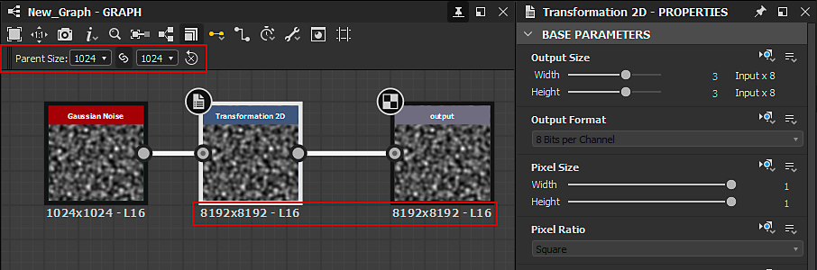

# Tamaño de salida

Es el primero de los <b>parámetros base</b> de un gráfico y, junto con el <b>formato de salida</b> (o profundidad de bits), es fundamental para entenderlo bien, ya que tiene un gran impacto en el resultado de un gráfico, tanto en Designer como en otras aplicaciones como un archivo [publicado de Substance 3D Asset (SBSAR)](../publishing-asset-files/publishing-substance-3d-asset-files-sbsar.md).

>[!TIP]
>
> Se recomienda encarecidamente adquirir un buen conocimiento de la herencia [en los gráficos de Substance](../../compositing-graphs/inheritance-compositing/inheritance-in-substance-compositing-graphs.md) como base para utilizar la propiedad Tamaño de salida de manera eficaz.

>[!NOTE]
>
> Use el botón de bloqueo  para que el valor de Height *coincida* con el valor de ancho.

<table>
<tr style="border: 0;">
<td width="100.00%" style="border: 0;" valign="top">

## Potencia de 2 valores

El parámetro Tamaño de salida determina la resolución de la salida *texture* por un gráfico o nodo.

Textura que es un objeto en el cálculo gráfico sujeto a algunas restricciones impuestas por la forma en que el hardware de procesamiento gráfico realiza sus cálculos. Una de estas restricciones es que la textura debe representar una imagen cuyo número de píxeles en X e Y es una *potencia de dos*.

</td>
<td width="33.33%" style="border: 0;" valign="top">

| Potencia de 2 | Píxeles |
| --- | --- |
| 7 | 128 |
| 8 | 256 |
| 9 | 512 |
| 10 | 1024 |
| 11 | 2048 |
| 12 | 4096 |
| 13 | 8192 |

</td>
</tr>
</table>

La propiedad Tamaño de salida utiliza *pasos logarítmicos* para asignar fácilmente aumentos de potencias de dos (por ejemplo, 256, 512, 1024, ...) a una *escala lineal* (por ejemplo, 8, 9, 10, ...). Esto significa que aumentar o reducir el valor de Tamaño de salida en X o Y 1 es similar a multiplicar o dividir la resolución actual por 2.

Esto también se aplica cuando el valor Tamaño de salida está controlado por una [función](../../function-graphs/function-graphs.md), donde la función debe generar los valores logarítmicos de destino (relativos o absolutos) en lugar de la resolución de destino.

>[!IMPORTANT]
>
> Aumentar o reducir la resolución tanto en X como en Y multiplica o divide el recuento de píxeles por *4*, lo que tiene un impacto significativo en el *rendimiento* y el *espacio de memoria* de un gráfico.\
> Por lo tanto, recomendamos encarecidamente usar la *resolución más baja* que realmente se necesita para obtener el resultado deseado. Mantener las resoluciones bajo control es una de nuestras [directrices de optimización del rendimiento](../../best-practices/performance-optimization/performance-optimization-guidelines.md).

>[!NOTE]
>
> En [Gráficos de funciones](../../function-graphs/function-graphs.md), las `$size` y `$sizelog2` [variables del sistema](../../function-graphs/variables/system-variables/system-variables.md) devuelven un valor Float2 que coincide con la resolución actual del nodo o gráfico como un número de píxeles sin formato o potencia de dos respectivamente.\
> Por ejemplo, para una imagen 1024\*512, `$size` devuelve `(1024,512)` mientras que `$sizelog2` devuelve `(10,9)`.

## Tamaño relativo

Cuando la propiedad Tamaño de salida usa un valor *Relativo a...* [método de herencia](../../compositing-graphs/inheritance-compositing/inheritance-in-substance-compositing-graphs.md), su valor se expresa como modificador *relativo al valor logarítmico heredado*.

Los modificadores relativos al intervalo de resolución heredado van de -12 a +12 en una escala logarítmica, siendo el valor predeterminado 0. Esto significa que cada paso por encima o por debajo da como resultado la duplicación o reducción a la mitad de la resolución. La tabla de la derecha proporciona un ejemplo de cómo cambia la resolución relativa en una dimensión para un valor heredado de 9 (es decir, 512 = 2^9) y 11 (es decir, 2048 = 2^11):

Observe que por encima de 8196, el tamaño es *limitado*. Este límite se controla mediante la configuración <b>Límite de tamaño de cocción</b> en la sección <b>General</b> de [Preferencias](../../interface/preferences-window/preferences-window.md). Tenga en cuenta que trabajar con resoluciones muy grandes conlleva un coste de rendimiento proporcional y un espacio de memoria exponencial. Además, los límites en el procesamiento de gráficos establecen un límite máximo del tamaño máximo de una textura.

| -5 | -4 | -3 | -2 | -1 | 0 | +1 | +2 | +3 | +4 | +5 |
| --- | --- | --- | --- | --- | --- | --- | --- | --- | --- | --- |
| 16 | 32 | 64 | 128 | 256 | <b>512</b> | 1024 | 2048 | 4096 | 8196 | 8196 |
| 64 | 128 | 256 | 512 | 1024 | <b>2048</b> | 4096 | 8196 | 8196 | 8196 | 8196 |

>[!NOTE]
>
> Por debajo de 16, la resolución está *no* limitada, pero no se recomienda bajar, ya que no hay mejoras de rendimiento por debajo de ese umbral. Por el contrario, el rendimiento en realidad *disminuye* debido a la implementación específica del <b>motor del Substance</b>. Por lo tanto, utilice 16x16 como resolución mínima general en los gráficos del Substance.

## Cambio del método de herencia

En la mayoría de los casos, el [método de herencia](../../compositing-graphs/inheritance-compositing/inheritance-in-substance-compositing-graphs.md) predeterminado para la propiedad Tamaño de salida es el siguiente, dependiendo del elemento:

* Gráfico: *Relativo al primario*
* Nodo: *Relativo a la entrada*: en este caso se utilizan los valores heredados por la [entrada principal](../../compositing-graphs/inheritance-compositing/inheritance-in-substance-compositing-graphs.md) del nodo
* Nodo [Bitmap](../../compositing-graphs/nodes-reference-for-com/atomic-nodes/bitmap/bitmap.md): *Absolute*: consulta la página [Recurso de mapa de bits](../../resources/bitmap-resource/bitmap-resource.md) y las [directrices de optimización del rendimiento](../../best-practices/performance-optimization/performance-optimization-guidelines.md) para saber por qué

Para mostrar las propiedades de un nodo o gráfico, haga clic en ese elemento y, a continuación, en el panel [Propiedades](../../interface/properties/properties.md), busque la propiedad <b>Tamaño de salida</b> en la sección <b>Parámetros base</b>. Haga clic en el menú desplegable del método de herencia y seleccione el método de herencia deseado.

{width="512px"}

## Problemas de ejemplo

Si es un nuevo usuario de [Adobe Substance 3D Designer](https://www.adobe.com/es/products/substance3d-designer.html), puede tener algunos problemas comunes. A continuación, enumeraremos algunos ejemplos, junto con soluciones.

+++Problema 1
** Problema**

El valor **Tamaño principal** está *atenuado* y el gráfico usa una resolución no deseada de 256\*256.

En las propiedades del gráfico, el método de herencia de la propiedad Tamaño de salida se estableció en *Absolute*, lo que detiene la herencia en favor de un valor arbitrario.

** Solución**

Establezca el método de herencia para el tamaño de salida del gráfico en *Relativo al principal*.

+++

+++Problema 2
** Problema**

Arriba se muestra un caso en el que la salida de un gráfico produce una resolución diferente (512\*512) a la establecida en el principal (1024\* 1024), a pesar de que el gráfico se haya establecido en *Relativo al principal*.

El problema se debe al nodo [Bitmap](../../compositing-graphs/nodes-reference-for-com/atomic-nodes/bitmap/bitmap.md). De forma predeterminada, usa el método de herencia *Absolute* y eligió 512\*512 como resolución basada en el [recurso de mapa de bits](../../resources/bitmap-resource/bitmap-resource.md). El nodo conectado a él se establece en *Relativo a la entrada*, por lo que hereda su tamaño de salida del nodo Bitmap.

** Solución**

Establezca el método de herencia del tamaño de salida del nodo Bitmap en *Relativo al principal*, lo que resolverá el problema más adelante en la cadena.

+++

+++Problema 3
** Problema**

En la parte superior se muestra un problema por el que la resolución salta mucho más allá de la mitad de la cadena, lo que da como resultado una resolución de salida mucho mayor que la definida por el principal.

El problema se debe a un modificador relativo de 3 en el nodo [Transformación 2D](../../compositing-graphs/nodes-reference-for-com/atomic-nodes/transformation-2d/transformation-2d.md), lo que hace que el resultado sea 8 veces mayor.

** Solución**

Establezca los modificadores relativos de Anchura y Height en 0, lo que no provocará ninguna ampliación.

+++
