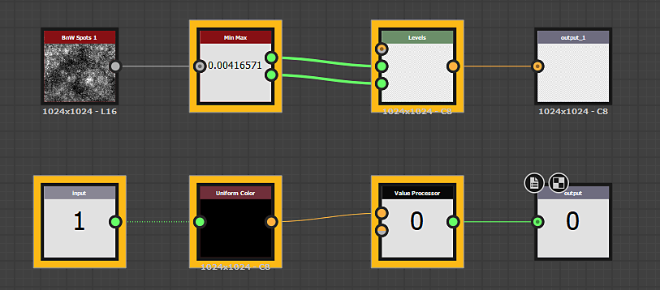

# Valores en gráficos de Substance

Desde la presentación de [Substance 3D Designer](https://www.adobe.com/es/products/substance3d-designer.html) Engine v7 en la versión 2019.1.0, ahora es posible procesar valores en el gráfico del Substance y [no solo en las funciones](../../function-graphs/function-graphs.md). Los datos de valor son los mismos datos utilizados en funciones (enteros, flotantes y booleanos, entre otros), lo que los diferencia claramente de los datos de imagen en color o escala de grises, que representan valores de píxeles para toda una imagen. Específicamente, al mencionar datos Values, esto significa *Entero 1, Entero 2, Entero 3 y Entero 4, Flotante 1, Flotante 2, Flotante 3 y Flotante 4 y Booleano*. Cada uno tiene un código de colores distinto y la mayoría no se intercambian entre sí.

Hay algunos casos de uso para esto, como:

* Devolver y procesar datos que no son de imagen, como propiedades de material de un solo valor o metadatos adicionales. Por ejemplo, el valor IOR de un material.
* Optimización de cálculos de gráficos que no necesitan calcularse por píxel (una alternativa al [procesador de píxeles](../../compositing-graphs/nodes-reference-for-com/atomic-nodes/pixel-processor/pixel-processor.md)). Por ejemplo, un color sólido aleatorio.
* Vinculación de propiedades de un nodo a otro mediante el procesamiento de datos de imagen en valores. Por ejemplo, los valores Mínimo y Máximo de una imagen para ajustar Niveles.

## Novedades y nodos Value

Dos nuevos nodos atómicos funcionan con valores:

|  |  |
| --- | --- |
| 

  <b>[Procesador de valor](../../compositing-graphs/nodes-reference-for-com/atomic-nodes/value-processor/value-processor.md)</b> | El [Procesador de valores](../../compositing-graphs/nodes-reference-for-com/atomic-nodes/value-processor/value-processor.md) toma Cualquier número de entradas de escala de grises o de color y le permite devolver un solo valor de los cálculos basados en estas entradas. |
| 

  **[Entrada de valor](../../compositing-graphs/nodes-reference-for-com/atomic-nodes/input/input.md)** | La [Entrada de valor](../../compositing-graphs/nodes-reference-for-com/atomic-nodes/input/input.md) le permite crear una ranura de entrada en subgráficos que se define explícitamente como un valor. |

Además, otros nodos se ocupan de ellos de una manera específica:

El [nodo de salida](../../compositing-graphs/nodes-reference-for-com/atomic-nodes/output/output.md) se ajusta automáticamente para convertirse en un valor de salida si se conecta a él una conexión de valor, como lo hacía antes con la escala de grises y el color.

{width="512px"}

Hay una nueva pestaña en cada nodo ([Atomic](../../compositing-graphs/nodes-reference-for-com/atomic-nodes/atomic-nodes.md) y [Library](../../compositing-graphs/nodes-reference-for-com/node-library/node-library.md)/Instance) que te permite definir entradas de Value.

## Uso de valores

El uso de valores es ligeramente diferente del trabajo de gráfica normal del Substance:

Las conexiones de valores solo se pueden realizar desde un [procesador Value](../../compositing-graphs/nodes-reference-for-com/atomic-nodes/value-processor/value-processor.md), desde una [entrada Value](../../compositing-graphs/nodes-reference-for-com/atomic-nodes/input/input.md) o desde un [subgráfico](../../compositing-graphs/creating-compositing-gra/graph-instances-sub-gra/graph-instances-sub-graphs.md). Eso significa que un procesador de valores es la única forma de crear una conexión de valor desde cero, no hay un nodo de &quot;valor estático&quot; o algo similar. En su lugar, cree un procesador de valores, coloque un valor estático y establézcalo como salida para obtener el mismo resultado.

El procesador de valores solo puede devolver un único valor; si desea devolver varios valores, o conjuntos o grupos de valores, deberá crear un [subgráfico](../../compositing-graphs/creating-compositing-gra/graph-instances-sub-gra/graph-instances-sub-graphs.md).

Para resaltar dónde se exponen o se usan los valores, cualquier nodo que tenga entradas de valor o salidas de valor se resalta con un borde amarillo grueso:

