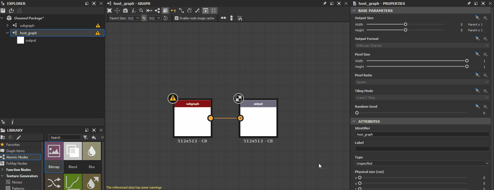

# Advertencias en los gráficos de Substance

Esta página muestra mensajes de advertencias y errores que pueden activar [gráficos de Substance](../../compositing-graphs/substance-compositing-graphs.md) en Substance 3D Designer, y ofrece pasos comunes de solución de problemas para cada uno.

Las advertencias se muestran en la información sobre herramientas del icono de advertencia para el recurso de gráfico en el panel [Explorador](../../interface/the-explorer-window/the-explorer-window.md), así como en la esquina inferior izquierda de la [vista de gráfico](../../interface/the-graph-view/the-graph-view.md) si el gráfico está cargado.

##  No se ha definido ningún nodo de salida

El gráfico no tiene un nodo [Output](../../compositing-graphs/nodes-reference-for-com/atomic-nodes/output/output.md).

** Solución**

Agregue uno o más nodos [Output](../../compositing-graphs/nodes-reference-for-com/atomic-nodes/output/output.md) al gráfico y conéctele el resultado del último nodo de una secuencia.

>[!NOTE]
>
> Las plantillas de gráficos disponibles en el cuadro de diálogo [Nuevo gráfico](../creating-compositing-gra/creating-a-substance-compositing-graph.md) tienen nodos de salida preestablecidos listos para usarse.

{width="512px"}

###  La función del parámetro *[x]* tiene algunas advertencias

El [gráfico de funciones](../../function-graphs/function-graphs.md) aplicado al parámetro especificado del nodo especificado tiene al menos una advertencia.\
El parámetro node se especifica entre corchetes después de la etiqueta del nodo, siguiendo la plantilla Node[Parameter].

E.g. Color uniforme[Color de salida], Procesador de píxeles[Función por píxel]

** Solución**

Localice el nodo que emite la advertencia por su etiqueta e insignia de advertencia en la [vista Gráfica](../../interface/the-graph-view/the-graph-view.md) y, a continuación, selecciónelo para mostrar sus propiedades en el panel [Propiedades](../../interface/properties/properties.md). Busque el parámetro que emite la advertencia y abra su función haciendo clic en el botón **Editar función**.

A continuación, evalúe las advertencias que aparecen en la esquina inferior izquierda de la vista de gráfico y resuelva los problemas. Puede consultar la página [Advertencias en gráficos de funciones](../../function-graphs/warnings-function-graphs/warnings-in-function-graphs.md) para obtener información sobre advertencias de solución de problemas en gráficos de funciones.

###  Los datos a los que se hace referencia tienen algunas advertencias

El recurso al que hace referencia un nodo tiene una o más advertencias. Estos son algunos nodos que hacen referencia a un recurso:

* Un nodo [graph instance](../../compositing-graphs/creating-compositing-gra/graph-instances-sub-gra/graph-instances-sub-graphs.md) hace referencia a un gráfico
* Un nodo [Bitmap](../../compositing-graphs/nodes-reference-for-com/atomic-nodes/bitmap/bitmap.md) hace referencia a un [recurso Bitmap](../../resources/bitmap-resource/bitmap-resource.md)
* Un nodo [SVG](../../compositing-graphs/nodes-reference-for-com/atomic-nodes/svg/svg.md) hace referencia a un [recurso SVG](../../resources/vector-graphics-svg-res/vector-graphics-svg-resource.md)
* Un nodo [Text](../../compositing-graphs/nodes-reference-for-com/atomic-nodes/text/text.md) hace referencia a un [recurso Font](../../resources/font-resource/font-resource.md)

** Solución**

En el panel [Explorador](../../interface/the-explorer-window/the-explorer-window.md), busque el recurso al que se hace referencia y solucione todas las advertencias provocadas por el recurso:

* Para gráficos, consulte otros elementos de esta página
* Para cualquier otro tipo de recurso, consulte la página [Advertencias de las dependencias](../../resources/warnings-from-dep/warnings-from-dependencies.md)

### No se encontró el recurso de referencia 

No se encontró el recurso al que hace referencia un nodo en la ruta guardada en el archivo [Substance 3D](https://www.adobe.com/es/products/substance3d/3d-augmented-reality.html) (SBS). Estos son algunos nodos que hacen referencia a un recurso:

* Un nodo [graph instance](../../compositing-graphs/creating-compositing-gra/graph-instances-sub-gra/graph-instances-sub-graphs.md) hace referencia a un gráfico
* Un nodo [Bitmap](../../compositing-graphs/nodes-reference-for-com/atomic-nodes/bitmap/bitmap.md) hace referencia a un [recurso Bitmap](../../resources/bitmap-resource/bitmap-resource.md)
* Un nodo [SVG](../../compositing-graphs/nodes-reference-for-com/atomic-nodes/svg/svg.md) hace referencia a un [recurso SVG](../../resources/vector-graphics-svg-res/vector-graphics-svg-resource.md)
* Un nodo [Text](../../compositing-graphs/nodes-reference-for-com/atomic-nodes/text/text.md) hace referencia a un [recurso Font](../../resources/font-resource/font-resource.md)

** Solución**

Para nodos [graph instance](../../compositing-graphs/creating-compositing-gra/graph-instances-sub-gra/graph-instances-sub-graphs.md)

Compruebe que el gráfico de origen existe en el paquete ubicado en la ruta guardada en su atributo **Package**.\
Si no es así, elimine el nodo de instancia y sustitúyalo por un nodo de instancia que haga referencia a un paquete válido. Como alternativa, puede volver a crear el paquete y el gráfico al que hace referencia el nodo de la instancia y luego volver a cargar el paquete host haciendo clic en RMB en él en el panel [Explorador](../../interface/the-explorer-window/the-explorer-window.md) y seleccionando la opción **Volver a cargar** en el menú contextual.

Para los nodos [Bitmap](../../compositing-graphs/nodes-reference-for-com/atomic-nodes/bitmap/bitmap.md), [SVG](../../compositing-graphs/nodes-reference-for-com/atomic-nodes/svg/svg.md) o [Texto](../../compositing-graphs/nodes-reference-for-com/atomic-nodes/text/text.md)

Busque los recursos a los que se hace referencia en el panel Explorador y compruebe que existen en la ubicación guardada en su atributo **Ruta de archivo**.\
Si no lo hacen, haga clic en RMB en el elemento de recurso en el Explorador y seleccione **Reubicar...Opción** en el menú contextual para establecer un nuevo archivo de destino válido para ese recurso.

###  El nodo de texto usa una fuente no válida

Un nodo [Text](../../compositing-graphs/nodes-reference-for-com/atomic-nodes/text/text.md) hace referencia a una fuente que no se puede cargar o analizar correctamente.

<b> Solución</b>

Seleccione el nodo [Text](../../compositing-graphs/nodes-reference-for-com/atomic-nodes/text/text.md) y tome nota del valor de su propiedad <b>Font</b>. Busca el archivo de origen de esa fuente en tu sistema y asegúrate de que esté *en buen estado*, por ejemplo, usándola en otra aplicación como un editor de texto. Reemplace la fuente por un archivo de fuente saludable según sea necesario o cambie el nodo Texto a otra fuente.
