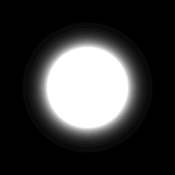
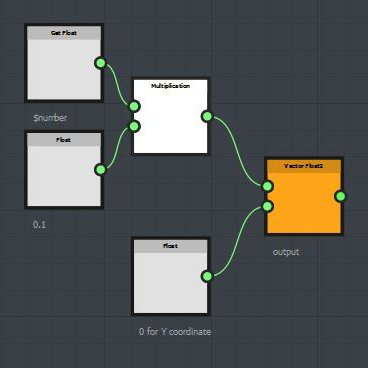

# Variable Iterar y $number

El nodo Iteración procesará los nodos conectados a la salida derecha durante el tiempo especificado por el valor Iteraciones.

| 

 | 1 iteración: el motivo gaussiano se procesa una vez |
| --- | --- |
| 

 | 10 iteraciones: el motivo gaussiano se procesa 10 veces en el mismo lugar |

Cuando se utiliza un nodo de iteración, se puede utilizar la variable $number para obtener el valor de iteración actual. $number es un valor flotante que comienza en 0.

<table>
<tr style="border: 0;">
<td style="border: 0;" valign="top">

{width="300px"}

</td>
<td style="border: 0;" valign="top">

{width="300px"}

</td>
</tr>
</table>

Esta función, definida en el parámetro Desplazamiento de patrón, se ejecutará 10 veces, una por cada patrón.

El primer patrón tiene un valor $number igual a 0 y, a continuación, se procesa en la coordenada (0, 0). El segundo patrón tiene un valor de $number igual a 1 y, a continuación, se procesa en la coordenada (0,1, 0) (1 x 0,1 = 0,1) y así sucesivamente para los patrones siguientes.

Ejemplo de descarga: [iterate\_node.sbs](https://helpx.adobe.com/content/dam/help/en/substance-3d/documentation/sddoc/files/102400023/102367299/1/1423458106000/iterate-node.sbs)
