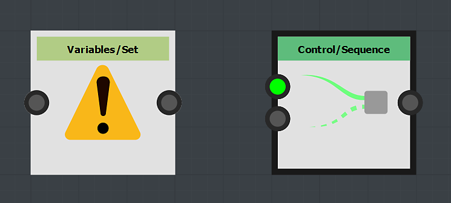
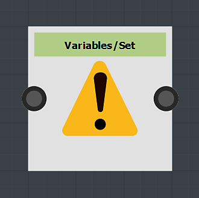

# Uso de los nodos Set/Sequence

Esta página describe los nodos **Set** y **Sequence**, y proporciona un caso de uso de ejemplo en el contexto de **FX-Maps**.

<table>
<tr style="border: 0;">
<td style="border: 0;" valign="top">

## Información general

Al trabajar con funciones en <b>FX-Maps</b>, ocasionalmente se encontrará en situaciones en las que desea generar un valor a partir del *[gráfico de funciones de Substance](../../../../function-graphs/the-function-graph/the-function-graph.md)* de un parámetro, para que pueda *usarlo en otro.* Sin embargo, de forma predeterminada, un gráfico de funciones de Substance solo genera *un* valor: el que controla el parámetro relacionado.

</td>
<td style="border: 0;" valign="top">

</td>
</tr>
</table>

En este caso, puedes usar la combinación de nodos <b>Set</b> y <b>Sequence</b>, que te permitirán controlar variables a través de una o varias funciones.

Este proceso consta de dos pasos:

1. El nodo <b>Set</b> te permitirá crear una nueva variable para que puedas llamarla a otro lugar y asignarle un valor.
1. El nodo <b>Sequence</b> se usa para ejecutar la lógica en el paso 1 en su totalidad, *antes de ejecutar otra rama* del gráfico, por ejemplo, la lógica que realmente interviene en la salida del valor esperado para el gráfico actual

<table>
<tr style="border: 0;">
<td width="100.00%" style="border: 0;" valign="top">

## El nodo Set

El nodo <b>Set</b> le permite establecer una nueva variable y asignarle el tipo y el valor conectados a la *entrada* del nodo.

El usuario introduce el *nombre* de la variable en las propiedades del nodo.

De forma predeterminada, la variable establecida por este nodo es *solo* accesible dentro del ámbito del *elemento principal* de este gráfico de funciones del Substance, por ejemplo, el nodo que aloja el parámetro definido por la función.

</td>
<td width="25.00%" style="border: 0;" valign="top">

</td>
</tr>
</table>

<table>
<tr style="border: 0;">
<td style="border: 0;" valign="top">

En este ejemplo, el nombre de variable se ha establecido en **`myVariable`** y su valor es **1**.

</td>
<td style="border: 0;" valign="top">

</td>
</tr>
</table>

<table>
<tr style="border: 0;">
<td width="100.00%" style="border: 0;" valign="top">

## El nodo Secuencia

El nodo <b>Sequence</b> le da control sobre el *flujo de ejecución* de los gráficos de funciones de Substance, asegurándose de que la *primera rama se ejecute completamente antes de la segunda rama*.

El resultado de la *segunda rama* se pasa a continuación al resultado del nodo.

</td>
<td width="25.00%" style="border: 0;" valign="top">

</td>
</tr>
</table>

<table>
<tr style="border: 0;">
<td style="border: 0;" valign="top">

En este ejemplo, el nodo <b>Sequence</b> se establece como el resultado del gráfico. El resultado de la función es, por lo tanto, el valor <b>0.5</b> generado por el nodo <b>Flotante</b>.

Sin embargo, antes de que esto suceda, la variable `<b>myVariable</b>` se establece con un valor flotante de <b>1.0</b>. Esta variable se puede usar *en otro lugar* en el contexto del nodo.

</td>
<td style="border: 0;" valign="top">

</td>
</tr>
</table>

Los nodos **Sequence** se pueden *encadenar* para controlar el flujo de ejecución del gráfico.

Por ejemplo, puede *establecer* una variable primero, *actualizar* su valor en un punto posterior y luego *leer* su valor final, mientras se asegura de que estas acciones se produzcan *en un orden específico*.

## Visibilidad variable

Tenga en cuenta que una variable declarada *no* está accesible desde cualquier lugar.\
Aunque se puede tener acceso a una variable declarada en un nivel primario en los niveles secundarios, lo contrario es *not true*.

Por lo tanto, las variables establecidas en el nodo son *no* accesibles en el nivel de gráfico, mientras que se puede tener acceso a las variables establecidas en el nivel de gráfico *en las funciones de parámetros de su nodo.*

Por ejemplo, esta regla está en el centro de *exponer un parámetro*, ya que exponer implica realmente estos pasos:

1. Creación de un parámetro de entrada de gráfico
1. Acceso a él en el gráfico de funciones del Substance del parámetro
1. Establecer su valor como salida de la función

Vamos a construir un pequeño ejemplo: imagine que deseamos que el valor <b>Rotación</b> de un nodo <b>Quadrant</b> se vea influenciado por el valor <b>Color/Luminosidad</b>: cuanto más brillante sea la luminosidad, más rotación tendrá.

<table>
<tr style="border: 0;">
<td style="border: 0;" valign="top">

Lo que haremos es hacer todo el cálculo en la función de parámetro <b>Color/Luminosidad</b>. Este parámetro se calculará *first*, por lo que cualquier variable establecida en él estará disponible para los demás parámetros del nodo.

</td>
<td style="border: 0;" valign="top">

</td>
</tr>
</table>

<table>
<tr style="border: 0;">
<td style="border: 0;" valign="top">

Nuestra función va a ser simple: la luminosidad será un valor aleatorio entre **0** y **1**, este valor se almacenará en la variable `myRotation` y, a continuación, establecemos el valor como salida de la función.

Esto significa que el valor del parámetro **Color/Luminosidad** será aleatorio *y* se almacenará en la variable `myRotation`.

Tenga en cuenta que la propiedad **Position** ya está definida por un valor aleatorio y que se utiliza un nodo **Iterate** para obtener varios patrones colocados aleatoriamente.

</td>
<td style="border: 0;" valign="top">

</td>
</tr>
</table>

<table>
<tr style="border: 0;">
<td style="border: 0;" valign="top">

Ahora que la variable `myRotation` existe y tiene un valor, vamos a tener acceso al gráfico de funciones de Substance de la propiedad <b>Pattern Rotation</b>.

</td>
<td style="border: 0;" valign="top">

</td>
</tr>
</table>

<table>
<tr style="border: 0;">
<td width="100.00%" style="border: 0;" valign="top">

En la función, leemos el valor del parámetro `myRotation` usando un nodo **Get Float** - sabemos que la variable contiene un valor float - y lo configuramos como el resultado de la función.

</td>
<td width="25.00%" style="border: 0;" valign="top">

</td>
</tr>
</table>

La luminosidad ahora también controla la rotación.

