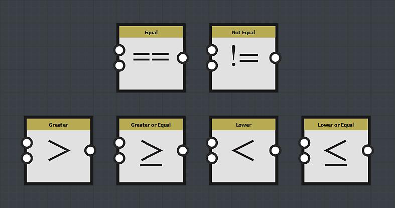

# Nodos de comparación

Los nodos de comparación comparan el resultado de la entrada superior con el resultado de la entrada inferior.

Devuelve True o False, dependiendo del resultado de la comparación:

