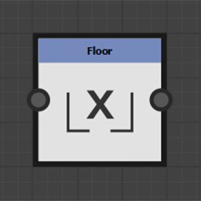

# Nodos de función

Los nodos Function transforman el valor de entrada de acuerdo con la función matemática que representan.

Aunque sus conectores de entrada no suelen estar escritos, no admiten todos los tipos de valor.

## Lista de nodos

+++Pow

Devuelve la primera entrada elevada a la potencia de la segunda entrada: <b>X^Y</b>.

+++

+++2Pow

Devuelve 2 a la potencia de su valor de entrada: <b>2^X</b>.

+++

+++Raíz cuadrada

Devuelve la raíz cuadrada de su valor de entrada: <b>√X</b>.

+++

+++Exponencial

Devuelve el valor exponencial de su valor de entrada: <b>e^X</b>

<b>e</b> es aproximadamente igual a 2,7182818.

+++

+++Logaritmo

Devuelve el logaritmo natural de su valor de entrada: <b>ln(X)</b>.

+++

+++Base logarítmica 2

Devuelve el logaritmo base 2 de su valor de entrada: <b>log2(X)</b>.

+++

+++Absoluto

Devuelve el valor absoluto de su entrada: <b>abs(X)</b>.

+++

+++Techo

Redondea su valor de entrada hacia arriba. Devuelve el valor entero más pequeño no menos que X: <b>ceil(X)</b>.

+++

+++Límite mínimo

Redondea su valor de entrada hacia abajo. Devuelve el mayor valor entero no mayor que X: <b>floor(X)</b>.

+++

+++Interpolación lineal

Devuelve la interpolación lineal entre dos valores en función de un valor flotante: <b>(1 - X)\*A + X\*B</b>.

+++

+++Mínimo

Devuelve el valor más bajo de los dos valores de entrada: <b>min(A, B)</b>.

+++

+++Máximo

Devuelve el mayor de los dos valores de entrada: <b>max(A, B)</b>.

+++

+++Coseno

Devuelve el coseno de su valor de entrada en radianes: <b>cos(X)</b>.

+++

+++Seno

Devuelve el seno de su valor de entrada en radianes: <b>sin(X)</b>.

+++

+++Tangente

Devuelve la tangente de su valor de entrada en radianes: <b>tan(X)</b>.

+++

+++Arco tangente 2

Devuelve el ángulo entre el vector 2D de entrada y la horizontal.

Es el recíproco de la función <b>Cartesian</b>.

No es necesario cambiar el componente X e Y del vector de entrada como en la función <b>atan2</b> habitual.

+++

+++Cartesiano

Convierte las coordenadas polares en coordenadas cartesianas.

Es el recíproco de la función <b>Arc tangent 2 </b>: <b>Longitud \* Float2(cos(Ángulo), sin(Ángulo).</b>

Las coordenadas polares son una distancia desde el origen y un ángulo en radianes desde la horizontal.

+++

+++Aleatorio

Devuelve un valor aleatorio entre 0 y el valor de entrada <b>X</b>.

+++
