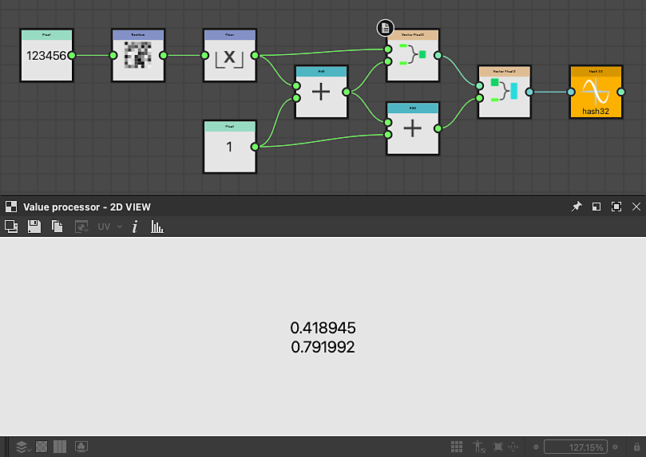

# Funciones Hash

<table>
<tr style="border: 0;">
<td width="33.33%" style="border: 0;" valign="top">

{width="200px"}

<b>En:</b> Funciones > Aleatorio

</td>
<td width="100.00%" style="border: 0;" valign="top">

## Descripción

Calcula un valor pseudoaleatorio entre 0 y 1, basado en un valor de entrada utilizado como semilla.

El número del título muestra el tipo de valor de entrada y salida. Por ejemplo: Hash 23 toma un valor float2 como entrada y emite un valor float3.

</td>
</tr>
</table>

Cuando un nodo Hash genera un valor de varios componentes, cada componente tiene un valor pseudoaleatorio diferente.

Versiones disponibles, con su tipo de entrada y tipo de salida:

<table>
<tr style="border: 0;">
<td style="border: 0;" valign="top">

<b>Hash 11:</b> Float → Float

<b>Hash 14:</b> Float → Float4

<b>Hash 21:</b> Float2 → Float

<b>Hash 22:</b> Float2 → Float2

</td>
<td style="border: 0;" valign="top">

<b>Hash 24:</b> Float2 → Float4

<b>Hash31:</b> Float3 → Float

<b>Hash 32:</b> Float3 → Float2

</td>
</tr>
</table>

## Conectores de entrada

|  |  |
| --- | --- |
| <b>Entrada</b> | Valor utilizado como semilla para calcular la salida pseudoaleatoria. |

## Ejemplos

<table>
<tr style="border: 0;">
<td style="border: 0;" valign="top">

{zoomable="yes"}

</td>
<td style="border: 0;" valign="top">

{zoomable="yes"}

</td>
</tr>
</table>
