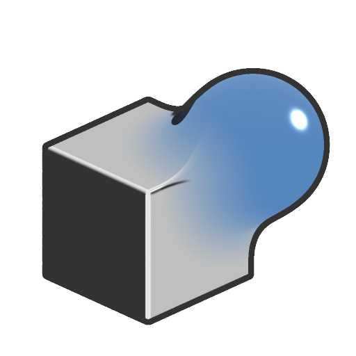

# Unión suave

<table>
<tr style="border: 0;">
<td width="33.33%" style="border: 0;" valign="top">

<b>En:</b> Función SDF > Operador

</td>
<td width="100.00%" style="border: 0;" valign="top">

## Descripción

Devuelve los volúmenes agregados de dos formas SDF, con suavizado ajustable de los bordes de su intersección.

</td>
</tr>
</table>

>[!INFO]
> 
> Para obtener más información sobre conceptos y flujos de trabajo que implican Funciones SDF, vaya a la página dedicada: [Trabajando con Funciones SDF](../../working-with-sdf-functions.md)

## Entradas

|  |  |
| :--- | :--- |
| <b>SDF 1</b> *Flotante* | La primera forma de SDF. |
| <b>SDF 2</b> *Flotante* | La segunda forma SDF. |
| <b>Smoothness</b> *Flotante* | El radio de suavizado, comenzando por los bordes de la intersección.  <i>Valor predeterminado: 0</i>  <i>Nota:</i> pueden aparecer bordes duros donde se cruzan los radios de suavizado. |
