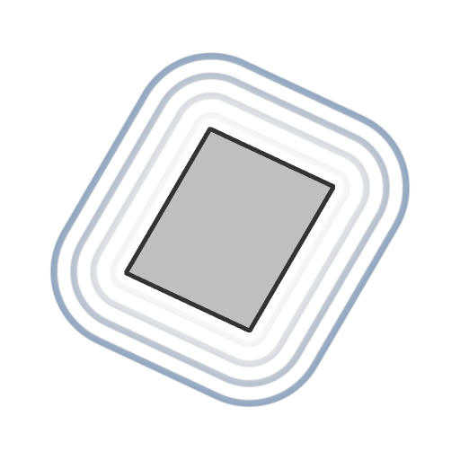

# Plano

<table>
<tr style="border: 0;">
<td width="33.33%" style="border: 0;" valign="top">

<b>En:</b> Función SDF > Primitiva

</td>
<td width="100.00%" style="border: 0;" valign="top">

## Descripción

Una Función SDF para un plano de orientación, posición y tamaño ajustables.

</td>
</tr>
</table>

>[!INFO]
> 
> Para obtener más información sobre conceptos y flujos de trabajo que implican Funciones SDF, vaya a la página dedicada: [Trabajando con Funciones SDF](../../working-with-sdf-functions.md)

## Entradas

|  |  |
| :--- | :--- |
| <b>Normal</b> *Float3* | El espacio del mundo vector normal del plano, que controla su orientación. El vector está normalizado.  <i>Valor predeterminado: (0, 0, 1)</i> |
| <b>Tamaño</b> *Float2* | El tamaño del plano en X e Y.  <i>Valor predeterminado: (1, 1)</i> |
| <b>Thickness</b> *Flotador* | El thickness del plano, aplicado en todas las direcciones. El plano se redondea al aumentar el thickness.  <i>Valor predeterminado: 0</i> |
| <b>Posición central</b> *Float3* | Posición del espacio de entorno del giro del plano.  <i>Valor predeterminado: (0, 0, 0)</i> |
| <b>P</b> *Float3* | La posición espacial mundial transformada. Utilice esta entrada para aplicar transformaciones adicionales mediante los nodos <b>Desplazamiento P</b> y <b>Rotar P</b>.  <i>Valor predeterminado: La posición espacial mundial sin transformar.</i> |
