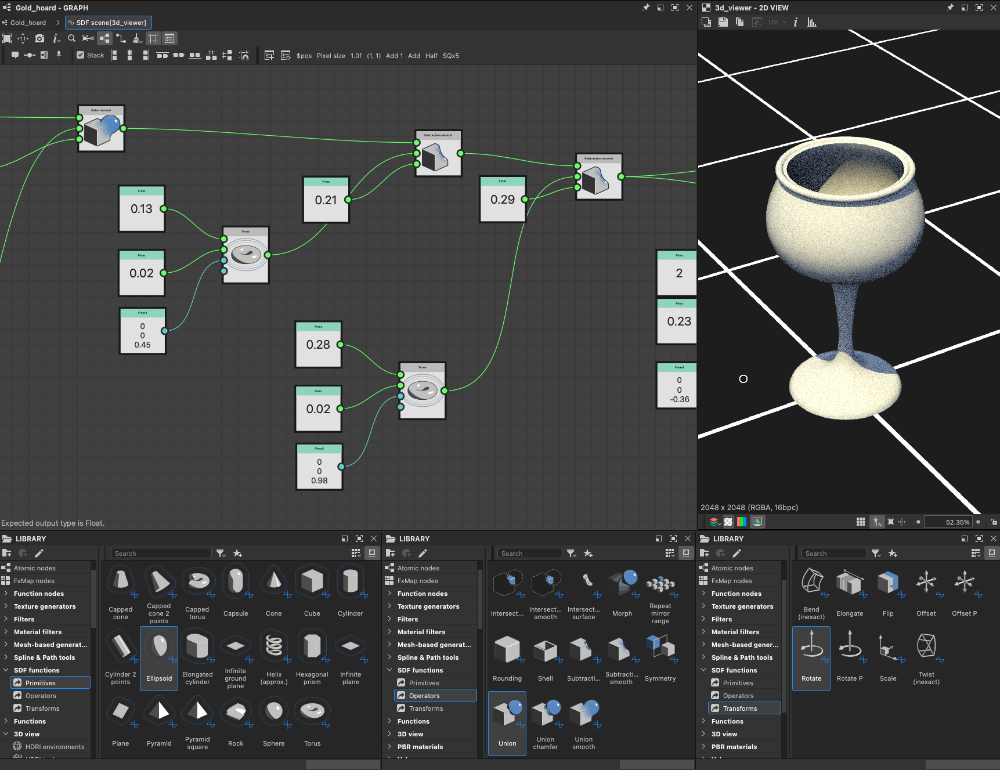

# Trabajar con Funciones SDF

En la versión 16.0.0, Substance 3D Designer introdujo un potente conjunto de nodos para crear Funciones SDF, que se pueden utilizar para crear y manipular formas 3D de procedimiento.

Las Funciones SDF son Substance de funciones que combinan nodos SDF disponibles en el conjunto de herramientas y se aplican a parámetros específicos en nodos que admiten Funciones SDF.

Como punto de partida, tenga en cuenta que el flujo de trabajo básico tiene este aspecto:

1. Crea una Función SDF en un nodo [3D viewer](../../../../compositing-graphs/nodes-reference-for-com/node-library/filters/effects/3d-viewer/3d-viewer.md) para visualizar el resultado.
2. Copie el gráfico de funciones final (o [instanciarlo](../../../../glossary/glossary.md#instance-node)) en el parámetro de Función SDF de un nodo que admita Funciones SDF, como [Shape splatter v2](../../../../compositing-graphs/nodes-reference-for-com/node-library/texture-generators/patterns/shape-splatter-v2/shape-splatter-v2.md).

## ¿Qué es una Función SDF?

<table style="border: none">
    <tr style="border: 0">
        <td style="border: 0; vertical-align: top">
            
Al igual que las funciones matemáticas se pueden trazar en 2D como curvas, se pueden trazar en 3D como superficies.

Un campo de distancia firmado es una función matemática que define una superficie en el espacio 3D calculando la distancia desde cualquier punto del espacio hasta el punto más cercano de la superficie.

Vamos a desglosar el nombre 'campo de distancia firmado' para entenderlo mejor:<ul><li><b>Firmado</b> significa que la función devuelve un valor positivo si el punto está fuera/delante de la superficie, un valor negativo si el punto está dentro/detrás de la superficie y cero si el punto está exactamente en la superficie.</li><li><b>Distancia</b> se refiere al hecho de que la función calcula la distancia desde cualquier punto en el espacio hasta el punto *más cercano* de la superficie.</li><li><b>Campo</b> significa que la función describe un campo de valores, ya que cada punto del espacio tiene un valor correspondiente que representa su distancia a la superficie más cercana.</li></ul>

        </td>
        <td style="border: 0; width: 33%; vertical-align: top">
            
        </td>
    </tr>
</table>

Estas funciones tienen muchas aplicaciones en gráficos de ordenador, como superficies de dibujo, fundición de sombras, enmascaramiento de contornos, detección de colisión y más.

En Substance 3D Designer, las Funciones SDF se utilizan para crear y manipular formas 3D de forma procedimental.

### Resultado y uso previsto de una Función SDF

Los nodos de Función SDF generan un único valor flotante: la distancia firmada a la superficie más cercana.

Sin embargo, hay más para ellos: internamente obtienen y establecen los valores de las variables que los nodos host necesitan definir y/o conocer para manipular y dibujar las formas resultantes.

Esto significa que estos nodos deben usarse en el contexto de nodos que *admiten Funciones SDF* porque conoce estas variables y las integra de forma nativa.

Los nodos incluyen [Shape splatter v2](../../../../compositing-graphs/nodes-reference-for-com/node-library/texture-generators/patterns/shape-splatter-v2/shape-splatter-v2.md) y [3D viewer](../../../../compositing-graphs/nodes-reference-for-com/node-library/filters/effects/3d-viewer/3d-viewer.md).

### Gráfico de funciones del Substance

Los nodos de Función SDF están pensados para utilizarse en gráficas de funciones de Substance dedicadas y, por lo tanto, solo están disponibles en ese tipo de gráfica.
Los parámetros de nodo que se deben expresar como una función utilizan un botón &#39;Editar función&#39;.

Lo que necesita saber sobre las gráficas de funciones de Substance:
* De forma similar a los gráficos de Substance, los conectores de nodos son *especializados*, lo que significa que solo se pueden conectar a otros conectores de *color coincidente* [que representen su tipo](../../function-nodes-overview/function-nodes-overview.md#color-coding).
* Los nodos no tienen parámetros, solo pueden tener entradas. (Con algunas excepciones específicas)
* El gráfico tiene un único nodo de salida. Haga clic con el botón secundario en un nodo y seleccione `Set as output` para designarlo como nodo de salida.
* Del mismo modo que los Substance, hay *nodos atómicos*, los bloques de creación base, y *nodos de instancia* que representan otros gráficos de funciones de Substance.
* Hay operadores independientes (algebraicos, lógicos y de comparación) que le permiten realizar operaciones en los valores del gráfico; sin embargo, los nodos SDF tienen [sus propios operadores](#operators)

+++ Ejemplo de un gráfico de funciones que define una Función SDF

+++

## Introducción

Para crear Funciones SDF, primero tenemos que visualizarlas para poder entender el efecto de los nodos y parámetros que estamos ajustando.

El nodo [3D viewer](../../../../compositing-graphs/nodes-reference-for-com/node-library/filters/effects/3d-viewer/3d-viewer.md) tiene un modo dedicado para visualizar formas creadas con Funciones SDF: Establezca el parámetro <b>Scene type</b> del nodo en `SDF function` y haga clic en el botón **Editar función** para abrir el gráfico de funciones que alojará la propia Función SDF.

El nodo ofrece características específicas para visualizar aspectos de la Función SDF que nos permitirán construirlos de manera más intuitiva y eficiente, como un marco delimitador y aislamientos.

El nodo [Cielo/sol físico](../../../../compositing-graphs/nodes-reference-for-com/node-library/3d-view-library/hdri-tools/physical-sun-sky/physical-sun-sky.md) se puede usar para configurar rápidamente la iluminación del entorno en el visor 3D.

>[!TIP]
> 
> <table style="border: none"><tr style="border: none"><td style="border: none; vertical-align: top">
Todos los nodos de Función SDF, así como sus conectores de entrada, tienen información sobre herramientas que le permitirá saber más sobre su propósito y cómo utilizarlos.

¡Asegúrate de echarles un vistazo!
</td><td style="border: none; width: 33%; vertical-align: top"></td></tr></table>

### Configuración de valores de nodo

Al igual que con todos los nodos de las gráficas de funciones del Substance, los nodos de Función SDF no tienen parámetros, sino sólo conectores de entrada que se utilizan como parámetros.

Para establecer el valor de esas entradas, puede usar [nodos constantes](../../atomic-function-nodes/constant-nodes/constant-nodes.md) como **Float**, **Float3** y **Integer3**.\
Puede crearlos de la forma habitual a través del menú de nodos, o puede arrastrar una nueva conexión desde los conectores para beneficiarse de una lista filtrada de nodos de tipos coincidentes.

La mayoría de los conectores de entrada de nodos de Función SDF tienen un valor predeterminado, que se muestra en la información sobre herramientas.

>[!TIP]
> 
> <table style="border: none"><tr style="border: none"><td style="border: none; vertical-align: top">
Si no necesita mantener algunos valores visibles en todo momento, acople nodos con la clave <code>D</code> para ahorrar espacio y desordenar el gráfico.

También puede utilizar comentarios para realizar un seguimiento de los valores.
</td><td style="border: none; width: 67%; vertical-align: top"></td></tr></table>

### El marco delimitador

<table style="border: none">
    <tr style="border: none">
        <td style="border: none; vertical-align: top">
            
El marco delimitador es un cuadro en el espacio 3D que define los <i>límites</i> en los que se evalúa y dibuja la Función SDF en el nodo <a href="../../../../compositing-graphs/nodes-reference-for-com/node-library/texture-generators/patterns/shape-splatter-v2/shape-splatter-v2.md">Shape splatter v2</a>.

Si el marco delimitador es demasiado pequeño, se pueden recortar partes de la forma. Si es demasiado grande, puede provocar cálculos innecesarios y tiempos de procesamiento más largos.

El parámetro <b>Marco delimitador</b> le permite habilitar la visualización del marco delimitador. A continuación, puede ajustar el tamaño del marco delimitador cambiando los valores del parámetro <b>Tamaño de marco delimitador</b>.

Usa el parámetro <b>Colorear fuera del fotograma</b> para visualizar las áreas fuera del fotograma delimitador en rojo brillante para que puedas ajustar el fotograma en consecuencia.

        </td>
        <td style="border: none; width: 33%; vertical-align: top">
            
        </td>
    </tr>
</table>

### Aislamientos

<table style="border: none">
    <tr style="border: none">
        <td style="border: none; vertical-align: top">
            
Dado que transformar formas implica en realidad *transformar el espacio* en el que se dibujan, el resultado de los nodos utilizados después de algunas transformaciones puede ser sorprendente. En esos casos, es útil visualizar el espacio en sí, y eso se puede hacer <i>visualizando el campo de distancia</i> de la forma.

Para ello, el nodo del visor 3D utiliza <i>isolines</i>, que son líneas de contorno repetidas que representan una distancia determinada de la superficie de la forma. El parámetro <b>SDF isolines</b> habilita esa visualización. Las isolíneas se dibujan en un plano horizontal situado en el height especificado por el parámetro <b>posición de las isolíneas SDF</b>.

Ver cómo se deforman las isolíneas por las transformaciones aplicadas a la forma puede ayudar a comprender cómo se transforma la propia forma y ajustar los parámetros de los nodos en consecuencia.

        </td>
        <td style="border: none; width: 33%; vertical-align: top">
            
        </td>
    </tr>
</table>

## categorías de nodos de Función SDF

Los nodos de Funciones SDF se clasifican en la biblioteca en función de su función y propósito.

Puede crear tantas vistas de biblioteca como sea necesario para organizar el espacio de trabajo de forma que el conjunto de herramientas Funciones SDF se organice por categoría, manteniendo todo a mano. Vaya a la vista **Windows > Nueva biblioteca** para agregar vistas independientes independientes de la biblioteca.

+++ Espacio de trabajo de ejemplo

+++

### Primitivos

Los bloques de construcción base de las Funciones SDF, que le permiten crear formas básicas como esferas, cajas, cilindros y más.

+++ Nodos

[Cono cerrado](./sdf-functions-primitives/3d-sdf-capped-cone/3d-sdf-capped-cone.md)\
[Cono cerrado (2 puntos)](././sdf-functions-primitives/3d-sdf-capped-cone-2-points/3d-sdf-capped-cone-2-points.md)\
[Toro limitado](./sdf-functions-primitives/3d-sdf-capped-torus/3d-sdf-capped-torus.md)\
[Cápsula](./sdf-functions-primitives/3d-sdf-capsule/3d-sdf-capsule.md)\
[Cono](./sdf-functions-primitives/3d-sdf-cone/3d-sdf-cone.md)\
[Cubo](./sdf-functions-primitives/3d-sdf-cube/3d-sdf-cube.md)\
[Cilindro](./sdf-functions-primitives/3d-sdf-cylinder/3d-sdf-cylinder.md)\
[Cilindro (2 puntos)](./sdf-functions-primitives/3d-sdf-cylinder-2-points/3d-sdf-cylinder-2-points.md)\
[Elipsoid](./sdf-functions-primitives/3d-sdf-ellipsoid/3d-sdf-ellipsoid.md)\
[Cilindro alargado](./sdf-functions-primitives/3d-sdf-elongated-cylinder/3d-sdf-elongated-cylinder.md)\
[Plano de tierra](./sdf-functions-primitives/3d-sdf-ground-plane/3d-sdf-ground-plane.md)\
[Hélice](./sdf-functions-primitives/3d-sdf-helix/3d-sdf-helix.md)\
[Prisma hexagonal](./sdf-functions-primitives/3d-sdf-hexagonal-prism/3d-sdf-hexagonal-prism.md)\
[Plano infinito](./sdf-functions-primitives/3d-sdf-infinite-plane/3d-sdf-infinite-plane.md)\
[Plano](./sdf-functions-primitives/3d-sdf-plane/3d-sdf-plane.md)\
[Pirámide](./sdf-functions-primitives/3d-sdf-pyramid/3d-sdf-pyramid.md)\
[Cuadrado piramidal](./sdf-functions-primitives/3d-sdf-pyramid-square/3d-sdf-pyramid-square.md)\
[Roca](./sdf-functions-primitives/3d-sdf-rock/3d-sdf-rock.md)\
[Esfera](./sdf-functions-primitives/3d-sdf-sphere/3d-sdf-sphere.md)\
[Recorrido](./sdf-functions-primitives/3d-sdf-torus/3d-sdf-torus.md)

+++

### Operadores

Estos nodos permiten combinar y modificar formas creadas con formas simples. Entre ellos se incluyen:
* Operadores **booleanos rectos** como [Union](sdf-functions-operators/3d-sdf-op-union/3d-sdf-op-union.md), [Intersection](sdf-functions-operators/3d-sdf-op-intersection/3d-sdf-op-intersection.md) y [Subtraction](sdf-functions-operators/3d-sdf-op-subtraction/3d-sdf-op-subtraction.md) que te permiten combinar formas de varias maneras.
* **Deformando operadores booleanos** como [Rounding](sdf-functions-operators/3d-sdf-op-rounding/3d-sdf-op-rounding.md) y [Morph](sdf-functions-operators/3d-sdf-op-morph/3d-sdf-op-morph.md) que te permiten combinar formas con un efecto de fusión.
* **Otros operadores** especializados, como [Shell](sdf-functions-operators/3d-sdf-op-shell/3d-sdf-op-shell.md) y [Symmetry](sdf-functions-operators/3d-sdf-op-symmetry/3d-sdf-op-symmetry.md), que permiten modificar o duplicar una forma.

+++ Nodos

[Intersección](./sdf-functions-operators/3d-sdf-op-intersection/3d-sdf-op-intersection.md)\
[Intersección suave](./sdf-functions-operators/3d-sdf-op-intersection-smooth/3d-sdf-op-intersection-smooth.md)\
[Superficie de intersección](./sdf-functions-operators/3d-sdf-op-intersection-surface/3d-sdf-op-intersection-surface.md)\
[Cambiar](./sdf-functions-operators/3d-sdf-op-morph/3d-sdf-op-morph.md)\
[Duplicado de repetición](./sdf-functions-operators/3d-sdf-op-repeat-mirror/3d-sdf-op-repeat-mirror.md)\
[Redondeo](./sdf-functions-operators/3d-sdf-op-rounding/3d-sdf-op-rounding.md)\
[Shell](./sdf-functions-operators/3d-sdf-op-shell/3d-sdf-op-shell.md)\
[Resta](./sdf-functions-operators/3d-sdf-op-subtraction/3d-sdf-op-subtraction.md)\
[Sustracción suave](./sdf-functions-operators/3d-sdf-op-subtraction-smooth/3d-sdf-op-subtraction-smooth.md)\
[Simetría](./sdf-functions-operators/3d-sdf-op-symmetry/3d-sdf-op-symmetry.md)\
[Unión](./sdf-functions-operators/3d-sdf-op-union/3d-sdf-op-union.md)\
[Chaflán de unión](./sdf-functions-operators/3d-sdf-op-union-chamfer/3d-sdf-op-union-chamfer.md)\
[Unión suave](./sdf-functions-operators/3d-sdf-op-union-smooth/3d-sdf-op-union-smooth.md)

+++

### Transformaciones

Las formas se pueden transformar de diversas maneras, como ser [traducidas](sdf-functions-transforms/3d-sdf-transform-offset/3d-sdf-transform-offset.md), [rotadas](sdf-functions-transforms/3d-sdf-transform-rotate/3d-sdf-transform-rotate.md), [escaladas](sdf-functions-transforms/3d-sdf-transform-scale/3d-sdf-transform-scale.md), [retorcidas](sdf-functions-transforms/3d-sdf-transform-twist/3d-sdf-transform-twist.md) y más.
Estos nodos permiten realizar estas transformaciones *transformando el espacio en sí* en el que se definen las superficies.

Ese espacio se conoce como `P`; vaya a la siguiente sección para obtener más información sobre lo que significa y cómo funciona la transformación del espacio.

+++ Nodos

[Doblar](./sdf-functions-transforms/3d-sdf-transform-bend/3d-sdf-transform-bend.md)\
[Extender](./sdf-functions-transforms/3d-sdf-transform-elongate/3d-sdf-transform-elongate.md)\
[Voltear](./sdf-functions-transforms/3d-sdf-transform-flip/3d-sdf-transform-flip.md)\
[Desplazamiento](./sdf-functions-transforms/3d-sdf-transform-offset/3d-sdf-transform-offset.md)\
[Desplazamiento P](./sdf-functions-transforms/3d-sdf-transform-offset-p/3d-sdf-transform-offset-p.md)\
[Rotar](./sdf-functions-transforms/3d-sdf-transform-rotate/3d-sdf-transform-rotate.md)\
[Rotar P](./sdf-functions-transforms/3d-sdf-transform-rotate-p/3d-sdf-transform-rotate-p.md)\
[Escala](./sdf-functions-transforms/3d-sdf-transform-scale/3d-sdf-transform-scale.md)\
[Giro](./sdf-functions-transforms/3d-sdf-transform-twist/3d-sdf-transform-twist.md)

+++

### Material

La gestión de materiales básica está disponible para las formas creadas mediante Funciones SDF.

Puede definir atributos de material básicos: color, rugosidad y metalidad, que se utilizarán para la visualización directa en el nodo del visualizador 3D o como base para el trabajo de materiales en los nodos Shape splatter v2.\
También puede asignar identificadores de material a diferentes partes de una forma para separarlas.

Obtenga más información sobre las aplicaciones de estos nodos [debajo](#material-id).

+++ Nodos

* [Definir ID de material](./sdf-functions-material/set-id/set-id.md)
* [Establecer material](./sdf-functions-material/set-material/set-material.md)
* [Definir color](./sdf-functions-material/set-color/set-color.md)
* [Establecer el metal](./sdf-functions-material/set-metalness/set-metalness.md)
* [Definir rugosidad](./sdf-functions-material/set-roughness/set-roughness.md)

+++

## La entrada &#39;P&#39;

Cuando aplicamos una transformación a una forma, como un desplazamiento o un giro, transformamos el espacio en el que está definida la forma.

Si queremos que una transformación se propague a otras formas (por ejemplo, si queremos rotar varias formas de la misma forma), tenemos que asegurarnos de que todas utilicen el mismo espacio transformado.

Un espacio transformado se comparte entre nodos mediante su entrada `P` dedicada, que puede encontrar en la mayoría de los nodos SDF.\
La &#39;P&#39; significa posición **P** del espacio mundial: Vector 3D que representa las coordenadas de un punto en el espacio mundial.

Los nodos [Offset P](sdf-functions-transforms/3d-sdf-transform-offset-p/3d-sdf-transform-offset-p.md) y [Rotate P](sdf-functions-transforms/3d-sdf-transform-rotate-p/3d-sdf-transform-rotate-p.md) transforman el espacio y te permiten propagar esa transformación a todos los nodos que deberían heredarlo.\
Por ejemplo, varias formas se pueden girar juntas conectando su entrada `P` al mismo nodo Rotar P.

Esto no es meramente una cuestión de conveniencia, es asegurarse de que los nodos SDF trabajan con las mismas posiciones en el espacio.

A continuación se muestra un ejemplo:

Se repite una esfera para visualizar el espacio como una cuadrícula 3D. *repitiendo el espacio*.\
Sin un `P` compartido, el cilindro doblado utiliza el espacio repetido utilizado por la esfera.\
Con un `P` compartido, las formas se pueden definir correctamente en un espacio rotado compartido.

## Uso de Funciones SDF en los nodos &quot;Shape splatter v2&quot;

Una vez que haya completado una Función SDF en el contexto del nodo del visor 3D, puede copiar toda la función y pegarla en el nodo [Shape splatter v2](../../../../compositing-graphs/nodes-reference-for-com/node-library/texture-generators/patterns/shape-splatter-v2/shape-splatter-v2.md) para utilizarla como generador de formas para ese nodo.

Establezca el parámetro **Shape type** en `SDF function`, vaya al parámetro **Pattern Función SDF** y haga clic en el botón **Edit function** para abrir el gráfico de funciones del parámetro.
A continuación, puede pegar la función copiada desde el nodo del visor 3D en ese gráfico. (¡No olvide volver a configurar el nodo de salida del gráfico de funciones!)

Asegúrate de ajustar el parámetro **tamaño de fotograma delimitador de SDF** para que coincida con el [fotograma delimitador](#the-bounding-frame) que estabas utilizando en el nodo del visor 3D y asegúrate de que la forma se dibuja correctamente.

\
*Shape splatter v2 con un **tipo de forma**establecido en `SDF function`. Observe que el **tamaño de fotograma delimitador SDF**se ajustó para ajustarse a la forma.*

>[!TIP]
> 
> Para reutilizar fácilmente una Función SDF, cópiela en un nuevo gráfico de funciones de Substance y utilícelo como **nodo de instancia** tanto en el visor 3D como en los nodos Shape splatter v2.
> 
> Esto proporciona varias ventajas:
> * Cualquier actualización que realice en la función se reflejará en ambos nodos sin necesidad de volver a copiarla y pegarla. Se trata de una gran mejora de la calidad de vida de las formas complejas.
> * El gráfico puede tener un nombre descriptivo que será visible en los nodos de instancia, lo que hará que el uso de su propia biblioteca de formas SDF sea mucho más manejable y sus gráficos más legibles.
> * Puede crear entradas para el gráfico de funciones que puede usar con nodos [Get](../../atomic-function-nodes/get-nodes/get-nodes.md). Estas entradas se expondrán como conectores de entrada en el nodo de instancia y le permitirán modificar fácilmente sus formas.

### ID de material

Una forma SDF puede tener asignado un ID de material, que es un valor entero que se puede usar para diferenciar partes de la forma y asignarles diferentes materiales en los nodos [3D viewer](../../../../compositing-graphs/nodes-reference-for-com/node-library/filters/effects/3d-viewer/3d-viewer.md) y [Shape splatter v2](../../../../compositing-graphs/nodes-reference-for-com/node-library/texture-generators/patterns/shape-splatter-v2/shape-splatter-v2.md).

Tenga en cuenta que las superficies con diferentes ID de material se dividen con una arista definida en las formas mezcladas, como se puede ver en el ejemplo siguiente.

Use el nodo [Set material ID](./sdf-functions-material/set-id/set-id.md) después de la parte de una forma que desee etiquetar con un identificador de material específico y use un nodo de constante [Integer](../../atomic-function-nodes/constant-nodes/constant-nodes.md) para establecer el valor de identificador de material deseado.\
En el nodo del visor 3D, establezca el parámetro **Output** en `Material ID` para visualizar los identificadores de material de las formas.

\
*A la derecha, la salida de dos nodos del visor 3D se componen para mostrar la forma (izquierda) y sus identificadores de material (derecha) para ilustrar cómo, en formas mezcladas, los materiales se interpolan mientras se dividen los identificadores de material.*

Los ID de material se pueden aprovechar mediante nodos de complemento Shape splatter v2:
* Los nodos [Shape Splatter v2 mapper](../../../../compositing-graphs/nodes-reference-for-com/node-library/texture-generators/patterns/shape-splatter-v2-mapper-color/shape-splatter-v2-mapper-color.md) pueden usar estos identificadores de material para asignar patrones diferentes.
* [La salpicadura de forma v2 para enmascarar](../../../../compositing-graphs/nodes-reference-for-com/node-library/texture-generators/patterns/shape-splatter-v2-to-mask/shape-splatter-v2-to-mask.md) puede enmascarar parte de las formas según su identificador de material.

<table style="border: none; margin-top: 32px">
    <tr style="border: 0">
        <td style="border: 0; width: 33%">
            <i>ID de material utilizados para la asignación de color en el color del asignador de salpicaduras de formas v2</i>
        </td>
        <td style="border: 0; width: 33%">
            <i>Id. de material utilizados para la asignación triplanar en el color del asignador de salpicaduras de formas v2</i>
        </td>
        <td style="border: 0; width: 33%">
             <i>Id. de material usados para enmascarar en Forma salpicada v2 para enmascarar</i>
        </td>
    </tr>
</table>

### Color, rugosidad y metalidad

Los nodos [Set color](./sdf-functions-material/set-color/set-color.md), [Set roughness](./sdf-functions-material/set-roughness/set-roughness.md) y [Set metalness](./sdf-functions-material/set-metalness/set-metalness.md) le permiten definir estos atributos de material para las formas de la Función SDF.

Luego, al usar esa Función SDF como un tipo de forma en el nodo [Shape splatter v2](../../../../compositing-graphs/nodes-reference-for-com/node-library/texture-generators/patterns/shape-splatter-v2/shape-splatter-v2.md), estos atributos de material estarán disponibles como mapas en las salidas **SDF color**, **SDF roughness** y **SDF metalness** del nodo. Estos mapas pueden servir como base para trabajos de materiales más complejos utilizando otros nodos.

Tenga en cuenta que, a diferencia de los ID de material, los valores se *interpolan* en las formas mezcladas como un degradado, como se puede ver en los ejemplos siguientes.

<table style="border: none; margin-top: 32px">
    <tr style="border: 0">
        <td style="border: 0; width: 33%">
            <i>Salida de color SDF</i>
        </td>
        <td style="border: 0; width: 33%">
             <i>Salida de rugosidad SDF</i>
        </td>
        <td style="border: 0; width: 33%">
            <i>Salida de metal SDF</i>
        </td>
    </tr>
</table>

### Muestra de material

<table style="border: none">
    <tr style="border: none">
        <td style="border: none; vertical-align: top">
            
La <b>muestra de material</a> de <a href="../../../../compositing-graphs/creating-compositing-gra/material-samples/material-samples.md">Rusty bolt</b> está disponible para saltar a las Funciones SDF aplicadas en el contexto del nodo Shape splatter v2.

El gráfico se organiza y se anota para guiarle a través de su estructura, configuración de nodos y configuración de Funciones SDF.

También es <i>totalmente editable</i>, por lo que se puede usar como espacio aislado para obtener una comprensión más práctica de las herramientas de salpicaduras de formas v2 y Funciones SDF. Puedes crear tantos gráficos de muestra como quieras, así que siéntete libre de jugar.

        </td>
        <td style="border: none; width: 20%; vertical-align: top; text-align: right">
            
        </td>
    </tr>
</table>
