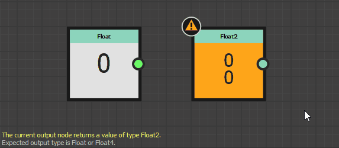

# Advertencias en los gráficos de funciones

Esta página muestra mensajes de advertencias y errores que pueden activarse mediante [gráficos de funciones](../../function-graphs/function-graphs.md) en Substance 3D Designer, y ofrece pasos comunes de solución de problemas para cada uno.

Las advertencias se muestran en la información sobre herramientas del icono de advertencia para el recurso de gráfico en el panel [Explorador](../../interface/the-explorer-window/the-explorer-window.md), así como en la esquina inferior izquierda de la [vista de gráfico](../../interface/the-graph-view/the-graph-view.md) si el gráfico está cargado.\
Si la función está *aplicada a un parámetro* en un [Substance grafica](../../compositing-graphs/substance-compositing-graphs.md), cualquier advertencia dará como resultado la advertencia &quot;*La función del parámetro [x] tiene algunos errores*&quot; que se provocan para ese parámetro.

##  No se ha definido ningún nodo de salida

La función no tiene ningún nodo de salida definido.

<table>
<tr style="border: 0;">
<td width="58.30%" style="border: 0;" valign="top">

** Solución**

Seleccione cualquier nodo del gráfico que genere un valor cuyo tipo coincida con el tipo esperado para esta función, si lo hubiera, y luego haga clic en RMB y seleccione la opción **Establecer como nodo de salida** en el menú contextual.\
El nodo de salida de un gráfico de funciones tiene el color *naranja*.

>[!NOTE]
>
> Si una función tiene un tipo de valor de salida esperado, una nota en la esquina inferior izquierda de [Graph view](../../interface/the-graph-view/the-graph-view.md) le permite conocer ese tipo.

</td>
<td width="41.60%" style="border: 0;" valign="top">

</td>
</tr>
</table>

###  El nodo de salida actual devuelve un valor de tipo *x*

El nodo de salida de la función devuelve un valor cuyo tipo no coincide con el tipo de valor de salida esperado para esa función.

<table>
<tr style="border: 0;">
<td width="58.30%" style="border: 0;" valign="top">

** Solución**

Seleccione cualquier nodo del gráfico que genere un valor cuyo tipo coincida con el tipo esperado para esta función, haga clic en RMB y seleccione la opción **Establecer como nodo de salida** en el menú contextual.\
El nodo de salida de un gráfico de funciones tiene el color *naranja*.

>[!NOTE]
>
> Si una función tiene un tipo de valor de salida esperado, una nota en la esquina inferior izquierda de [Graph view](../../interface/the-graph-view/the-graph-view.md) le permite conocer ese tipo.

</td>
<td width="41.60%" style="border: 0;" valign="top">

</td>
</tr>
</table>

###  Algunos nodos Get no tienen un nombre de variable

Uno o más nodos [Get](../../function-graphs/nodes-reference-for-fun/atomic-function-nodes/get-nodes/get-nodes.md) tienen sus <b>Get...La propiedad </b> se deja en blanco, por lo tanto no hace referencia a ninguna variable.

<table>
<tr style="border: 0;">
<td width="58.30%" style="border: 0;" valign="top">

** Solución**

Escriba una cadena que coincida con el nombre de una variable *disponible en el ámbito de la función* en **Obtener...Propiedad** de nodos Get que generan esta advertencia.

>[!NOTE]
>
> La cadena de entrada es *y se muestra en el nodo*, lo que facilita la búsqueda de nodos con valores en blanco.

</td>
<td width="41.60%" style="border: 0;" valign="top">

</td>
</tr>
</table>

###  Algunos nodos Set no tienen un nombre de variable

Uno o varios nodos [Set](../../function-graphs/fxmaps/using-functions-in-fxmaps/using-the-set-sequence/using-the-set-sequence-nodes.md) tienen su propiedad **Set** en blanco, por lo que no hacen referencia a ninguna variable.

<table>
<tr style="border: 0;">
<td width="58.30%" style="border: 0;" valign="top">

** Solución**

Escriba cualquier cadena en la propiedad **Set** de nodos Set que generen esta advertencia.

>[!NOTE]
>
> La cadena de entrada es *y se muestra en el nodo*, lo que facilita la búsqueda de nodos con valores en blanco.

>[!NOTE]
>
> Si la cadena *not* coincide con cualquier variable disponible en el ámbito de la función, se crea una *nueva variable* dentro de ese ámbito y se le asigna el nombre de la cadena.

</td>
<td width="41.60%" style="border: 0;" valign="top">

</td>
</tr>
</table>
