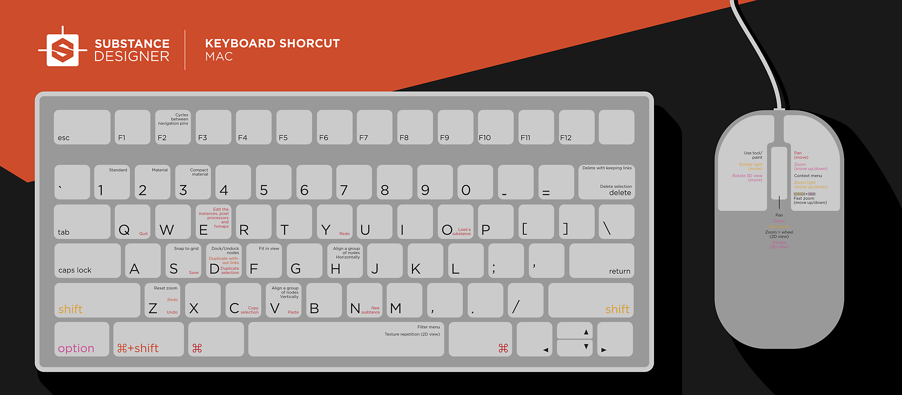

# Mét. abrev.

En esta página encontrará una descripción general de todos los métodos abreviados de Substance 3D Designer.

## Tabla de contenido

[Mapas clave](#keymaps)

[Listas de accesos directos](#shortcuts-lists)

## Mapas clave

**Windows**

{zoomable="yes"}

**macOS**

{zoomable="yes"}

## Listas de accesos directos

### Global

| Acción | Windows | macOS |
| --- | --- | --- |
| [Nuevo gráfico de Substance](../../compositing-graphs/creating-compositing-gra/creating-a-substance-compositing-graph.md) | Ctrl + N | ⌘ + N |
| Cargar paquete | Ctrl + O | ⌘ + O |
| Cerrar los paquetes seleccionados | Ctrl + F4 | ⌘ + W |
| Guardar paquete | Ctrl + S | ⌘ + S |
| Deshacer | Ctrl + Z | ⌘ + Z |
| Rehacer | Ctrl + Y | ⌘ + Y |

### Vista de gráfico

<b>Ventana</b>

| Acción | Windows | macOS |
| --- | --- | --- |
| Zoom | RatónRueda Alt + RMB + Arrastrar | MouseWheel ⌥ + RMB + Arrastrar |
| Zoom rápido | ⇧ + MouseWheel ⇧ + Alt + RMB + Arrastrar | ⇧ + MouseWheel ⇧ + ⌥ + RMB + Arrastrar |
| Panorámica | MMB + Arrastrar Ctrl + RMB + Arrastrar | MMB + Arrastrar ⌘ + RMB + Arrastrar |
| Restablecer zoom | Z | Z |
| Encajar en la vista | F | F |
| Copiar | Ctrl + C | ⌘ + C |
| Pegar | Ctrl + V | ⌘ + V |
| Menú contextual | RMB | RMB |
| Menú Nodo | Barra espaciadora | Barra espaciadora |
| Recorrer [ubicaciones de exploración](../../interface/the-graph-view/graph-items/graph-items.md) | F2 | F2 |

<b>Modos de creación de vínculos</b>

>[!NOTE]
>
> Obtenga información sobre los modos de creación de vínculos en [esta página](../../interface/the-graph-view/link-creation-modes/link-creation-modes.md) de esta documentación.

| Modo | Windows | macOS |
| --- | --- | --- |
| Estándar | 1 | 1 |
| Material | 2 | 2 |
| Material compacto | 3 | 3 |

<b>Cuando se selecciona un objeto en el gráfico</b>

| Acción | Windows | macOS |
| --- | --- | --- |
| Copiar selección | Ctrl + C | ⌘ + C |
| Duplicar selección | Ctrl + D | ⌘ + D |
| Duplicar sin vínculos | Ctrl + ⇧ + D | ⌘ + ⇧ + D |
| Eliminar selección | Eliminar | Eliminar |
| Eliminar selección y conservar vínculos | ⌫ | ⌫ |
| Acoplar/desacoplar nodo | D | D |
| Desactivar nodos | ⇧ + D | ⇧ + D |

### Vista 2D

| Acción | Windows | macOS |
| --- | --- | --- |
| Zoom | RatónRueda Alt + RMB + Arrastrar | MouseWheel ⌥ + RMB + Arrastrar |
| Zoom rápido | ⇧ + MouseWheel ⇧ + Alt + RMB + Arrastrar | ⇧ + MouseWheel ⇧ + ⌥ + RMB + Arrastrar |
| Panorámica | MMB + Arrastrar Ctrl + RMB + Arrastrar | MMB + Arrastrar ⌘ + RMB + Arrastrar |
| Restablecer a una escala del 100 % | Z | Z |
| Encajar en la vista | F | F |
| Alternar la visualización en mosaico | Barra espaciadora | Barra espaciadora |

### Vista 3D

| Acción | Windows | macOS |
| --- | --- | --- |
| Cámara dolly (panorámica hacia delante/hacia atrás) | RatónRueda Alt + RMB + Arrastrar | MouseWheel ⌥ + RMB + Arrastrar |
| Cámara orbital | LMB + Arrastrar | LMB + Arrastrar |
| Cámara de camión y pedestal (panorámica lateral y vertical) | MMB + Arrastrar Ctrl + RMB + Arrastrar | MMB + Arrastrar ⌘ + RMB + Arrastrar |
| Rotar entorno | Ctrl + ⇧ + RMB | Ctrl + ⇧ + RMB |
| Cambiar temporalmente a los controles de Luz de punto 1 | ⇧ (mantener) | ⇧ (mantener) |
| Luz de punto de órbita 1 | LMB + Arrastrar | LMB + Arrastrar |
| Luz Dolly Point 1 | RMB + Arrastrar | RMB + Arrastrar |
