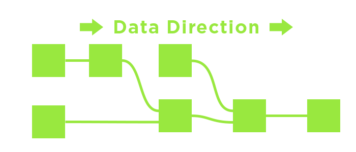
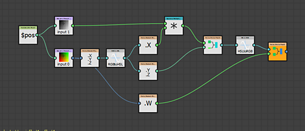

# Descripción general del flujo de trabajo

Substance 3D Designer es un editor basado en nodos. Esto significa que casi todos los tipos de proyecto o recurso implicarán colocar nodos (bloques de creación) y conectarlos para crear una cadena de operaciones (un gráfico). Esta página explica el concepto de flujos de trabajo basados en nodos y proporciona un resumen de los 3 tipos principales de gráficos que puede crear en Designer.

{zoomable="yes"}

## Flujo de trabajo basado en nodos

Trabajar en Designer es diferente a otros programas de edición de imágenes en 2D como Photoshop. En lugar de realizar una acción manualmente (como ajustar la saturación yendo a una opción de menú y cambiando un regulador), <b>creas los pasos lógicos</b> de editar o crear tu imagen. Esto sucede al construir una red de pequeños bloques de construcción llamados &#39;nodos&#39;. Los datos de la imagen viajan de <b> de izquierda a derecha</b> a través de los bloques de creación, conectados mediante vínculos que determinan la ruta de la información. Cada nodo, si está conectado, contribuirá a los resultados finales.

La principal ventaja es que el flujo de trabajo se convierte en <b>no lineal</b>. A diferencia de las acciones realizadas manualmente que entran en una pila de historial, siempre puede intercambiar o modificar un nodo en cualquier momento. Si decides que tu primer ajuste de Contraste, que afectó al resultado de tu imagen hasta el final, fue demasiado, puedes volver atrás y ajustarlo o incluso recortarlo por completo, sin perder todo el trabajo que realizaste después.

## Flujo de trabajo de instancia de gráfico

La creación de instancias de gráficos es un proceso clave en Designer. Le permite crear sus propios nodos tomando cualquier tamaño o tipo de gráfico y empaquetándolo como nuevo bloque de creación de nodos. Estos tipos de nodos se denominan &quot;Instancias de gráficos&quot;. Esto le permite ser mucho más eficiente, ahorrar tiempo y compartir el trabajo con otros. ¿Ha desarrollado una gran técnica para el desgaste de los bordes, por ejemplo? Cree una instancia de gráfico a partir de ella y reutilícela, compártala con la comunidad o con su equipo.

Para obtener más información sobre las instancias de gráficos en [gráficos de Substance](../../compositing-graphs/substance-compositing-graphs.md), hay una [sección dedicada](../../compositing-graphs/creating-compositing-gra/graph-instances-sub-gra/graph-instances-sub-graphs.md) sobre ellas en la documentación.

{zoomable="yes"}

## Parámetros personalizados

Cualquier nodo de su cadena de operaciones tendrá algún tipo de control: botones, reguladores, ajustes que puede modificar para influir en el resultado final. Si creas un subgráfico o quieres exportar tu archivo de Substance a otra aplicación, puedes crear tu propio &quot;panel de control&quot; para tus archivos, lo que permite a cualquiera que use el gráfico modificarlo con un panel de control completamente único, lo que expone un sinfín de posibilidades. [Descubre el concepto general de parámetros personalizados aquí](../../compositing-graphs/compositing-graph-key-con/substance-compositing-graph-key-concepts.md), o usa más información en profundidad y [empieza a exponer parámetros](../../compositing-graphs/manage-parameters/exposing-a-parameter/exposing-a-parameter.md).

## Tipos de gráficos

A continuación puede encontrar un resumen de los tres tipos de gráficos que puede editar en Substance 3D Designer, así como un enlace a la sección pertinente de la documentación.

<table>
<tr style="border: 0;">
<td style="border: 0; width: 20%; vertical-align: top">

{width="120px"}

</td>
<td style="border: 0; vertical-align: top">

### Gráficos de Substance

[Los gráficos de Substance](https://substance3d.adobe.com/) son el tipo principal de gráfico creado en Substance 3D Designer. Su propósito es <b>generar y procesar datos de imágenes 2D</b> que no estén restringidos a una resolución, color o forma establecidos. Se han concebido como herramientas de generación y procesamiento de imágenes extremadamente versátiles, no solo como resultados estáticos preconfigurados.

Los resultados pueden ser en forma de un simple patrón en blanco y negro, un filtro que solo se ejecuta en otras imágenes y no genera contenido por sí mismo, o incluso un material procedimental completo con múltiples canales.

Los gráficos de Substance son [el tipo de gráfico más ampliamente admitido](../../getting-started/overview/overview.md), y se pueden exportar y usar en una gran variedad de flujos de trabajo diferentes.

</td>
</tr>
</table>

#### Ejemplos

A continuación, puede encontrar algunos ejemplos típicos de casos de uso comunes.

+++ Forma simple

{width="512px" zoomable="yes"}

Se crea una forma de máscara simple para una pegatina generando [un fragmento de texto](../../compositing-graphs/nodes-reference-for-com/atomic-nodes/text/text.md) y una [forma de disco](../../compositing-graphs/nodes-reference-for-com/node-library/texture-generators/patterns/shape/shape.md), [extrayendo el borde](../../compositing-graphs/nodes-reference-for-com/node-library/filters/effects/edge-detect/edge-detect.md) del disco y finalmente [fusionándolos](../../compositing-graphs/nodes-reference-for-com/atomic-nodes/blend/blend.md) antes de establecerlos como [salida](../../compositing-graphs/nodes-reference-for-com/atomic-nodes/output/output.md) final.

El texto con el número o el thickness del borde se puede exponer externamente para que sea un gráfico más dinámico.

+++

+++ Filtro de ajuste

{width="512px" zoomable="yes"}

Un gráfico de filtros toma un mapa de normales como [entrada](../../compositing-graphs/nodes-reference-for-com/atomic-nodes/input-color/input-color.md) (con una vista previa personalizada), [lo convierte en curvatura](../../compositing-graphs/nodes-reference-for-com/node-library/filters/effects/curvature-smooth/curvature-smooth.md) y, a continuación, [ajusta el contraste](../../compositing-graphs/nodes-reference-for-com/node-library/filters/adjustments/histogram-scan/histogram-scan.md) para crear una máscara de bordes convexos como [salida](../../compositing-graphs/nodes-reference-for-com/atomic-nodes/output/output.md) final.

Los valores de contraste establecidos en el histograma pueden ser expuestos, haciendo de este un filtro simple pero útil en combinación con la ranura de entrada dinámica.

+++

+++ Material completo

{width="512px" zoomable="yes"}

Un gráfico más complicado [fusiona dos Materiales base](../../compositing-graphs/nodes-reference-for-com/node-library/material-filters/blending-material/material-blend/material-blend.md). Un [Material base](../../compositing-graphs/nodes-reference-for-com/node-library/material-filters/pbr-utilities/base-material/base-material.md) se mantiene simple, el otro usa algunas entradas personalizadas para agregar interés. Se utiliza una máscara para determinar cuál de los dos materiales aparece en qué lugar antes de definirse como [salidas](../../compositing-graphs/nodes-reference-for-com/atomic-nodes/output/output.md) finales.

Este ejemplo utiliza [Modos de creación de vínculos](../../interface/the-graph-view/link-creation-modes/link-creation-modes.md) para simplificar el uso de varios vínculos.

+++

<table>
<tr style="border: 0;">
<td style="border: 0; width: 20%; vertical-align: top">

{width="120px"}

</td>
<td style="border: 0; vertical-align: top">

### Gráficas de funciones de Substance

Las funciones <b>procesan valores únicos</b> (enteros, flotantes, vectores) en lugar de datos de imagen (conjuntos completos de píxeles). Las funciones también son gráficos con redes de nodos, pero los [nodos utilizados](../../function-graphs/nodes-reference-for-fun/function-nodes-overview/function-nodes-overview.md) y la interfaz son diferentes de los [gráficos de Substance normales](../../compositing-graphs/substance-compositing-graphs.md). El flujo de trabajo se basa completamente en <b>operaciones matemáticas</b> y no muestra miniaturas de vista previa de imágenes, lo que lo convierte en una forma <b>mucho más avanzada de trabajar</b> con Substance 3D Designer.

Las funciones se pueden usar en muchos contextos diferentes, los principales son para modificar el comportamiento de [un parámetro expuesto](../../compositing-graphs/manage-parameters/exposing-a-parameter/exposing-a-parameter.md), para crear el comportamiento de [Procesadores de píxeles](../../compositing-graphs/nodes-reference-for-com/atomic-nodes/pixel-processor/pixel-processor.md) o [FX-Maps](../../compositing-graphs/nodes-reference-for-com/atomic-nodes/fx-map/fx-map.md) y para usar [valores](../../compositing-graphs/values-compositing-graphs/values-in-substance-compositing-graphs.md) en un gráfico de Substance.

</td>
</tr>
</table>

#### Ejemplos

A continuación se muestran algunos ejemplos de casos prácticos habituales para gráficas de funciones de Substance.

+++ Función simple

{width="256px" zoomable="yes"}

Una función simple en el contexto de un parámetro expuesto. Obtiene un valor flotante de entrada denominado &quot;Intensity&quot; (Intensidad) que se determina para ir de 0 a 1 (un rango fácil de entender) y lo reasigna a un rango establecido de 0,1 a 0,8. Eso significa que si el usuario establece Intensity en 0, internamente se utilizará 0.1, si la interfaz de usuario se establece en 1, se utilizará 0.8 y cualquier valor intermedio se interpolará linealmente. Este tipo de función se suele usar cuando se [exponen parámetros](../../compositing-graphs/manage-parameters/exposing-a-parameter/exposing-a-parameter.md), pero se usan funciones personalizadas.

Esta función también se puede escribir como *lerp(0.1, 0.8, Intensity)* en un pseudocódigo similar a HLSL o GLSL.

+++

+++ Función avanzada

{width="512px" zoomable="yes"}

Esta función avanzada muestra el funcionamiento interno de un [procesador de píxeles](../../compositing-graphs/nodes-reference-for-com/atomic-nodes/pixel-processor/pixel-processor.md) destinado a ajustar el tono de una entrada de mapa de color en función de la intensidad de una segunda entrada de máscara de escala de grises.

Muestrea ambas entradas con la variable del sistema &quot;$pos&quot; y, a continuación, despoja al Alpha, convierte el valor de color en HSL y modifica el componente Hue multiplicándolo por el valor de escala de grises muestreado. A continuación, vuelve a montar el vector, convierte el HSL de nuevo en el RGB y vuelve a incorporar el Alpha para la salida final.

en pseudo-código esta sería una función mucho más complicada que no cabría en una sola línea.

+++
